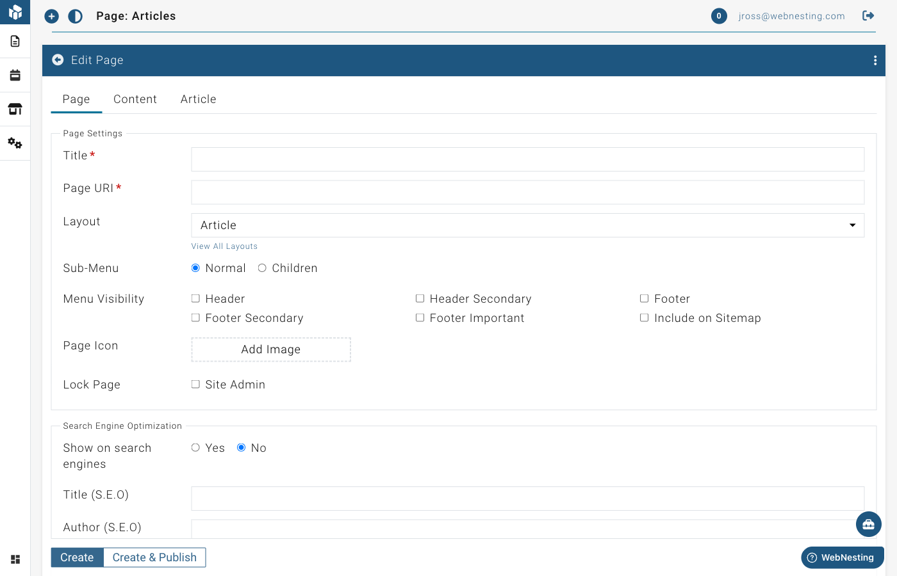

# Articles and Blog Posts

**Last verified:** 2026-09-02 5:09pm

The Articles module gives your website a full blog and news section. Use it to share company updates, how-to guides, industry news, or anything else you want to write about. Articles are one of the best ways to keep your website fresh and attract new visitors.

---

## What the Articles Module Is

Think of the Articles module as your own built-in blogging tool. Once you turn it on, you get everything you need to write, organize, and publish blog posts or news articles -- all without leaving your WebNesting dashboard.

Each article you create gets its own page on your website, complete with a title, featured image, and the full article text. Each article automatically gets a URL based on its title. You can customize the URL slug when creating or editing the article. Your visitors can browse all your articles in one place, or you can display them on any page of your site.

The Articles module costs $5/month. Each article also counts as a page for billing purposes.

---

## How to Enable the Articles Module

Before you can start writing articles, you need to turn on the Articles module.

1. Log in to your WebNesting dashboard.
2. In the site menu, open **Settings** and click **Modules**.
3. Find **Article** in the list of available modules.
4. Click the **Enable** button next to it.
5. The module will activate right away.

Once enabled, you will see a new **Article** section appear in your dashboard sidebar. This is where you will create and manage all your articles.

> **Tip:** Enabling the Articles module takes just a few seconds. There is no setup or configuration needed -- you can start writing your first article immediately.

---

## Creating a New Article

Ready to write your first post? Here is how to create a new article.

1. Click **Article** in the left sidebar of your dashboard.
2. Click the **Create A New Article** button at the top of the page.
3. You will see the article editor with several fields to fill in.

### Setting the Title

The title is the first thing your readers will see. It appears at the top of the article page and in any article lists on your site.

1. Find the **Title** field at the top of the article editor. The title is set on the article's page -- it is the page title that appears at the top.
2. Type a clear, descriptive title for your article.
3. Keep it concise but informative. For example, "5 Ways to Improve Your Morning Routine" is better than "Blog Post #7."

### Choosing the Article Type

You can categorize your article by type. This helps organize your content and can affect how search engines understand your posts.

1. Look for the **Article Type** dropdown in the Article Settings section.
2. Choose one of the following:
   - **Article** -- A general article or post.
   - **News Article** -- A news story or current events piece.
   - **Blog Posting** -- A personal or informal blog entry.

> **Tip:** If you are not sure which type to choose, "Article" works well as a general-purpose option.

### Writing the Content

Your article has two text areas for content:

**Preview text** -- This is a short summary or teaser of your article. It shows up in article lists and search results to give readers a quick idea of what the article is about. Keep it to a sentence or two.

1. Find the **Preview** field.
2. Write a brief summary of your article. This is what visitors see before they click to read the full post.

**Full article** -- This is the main body of your article where you write everything you want to say.

1. Find the **Article** field.
2. Use the text editor to write your content. You can format text with bold, italics, headings, bullet points, links, and more.

The text editor works like a simple word processor. Highlight text and use the toolbar buttons to format it.

### Adding a Featured Image

A featured image appears at the top of your article and in article lists. It is the main visual that represents your post.

1. Find the **Image** section in the article editor.
2. Click to open the media picker.
3. Choose an image from your File Manager, or upload a new one.
4. The image will be attached to your article.

> **Tip:** Choose an eye-catching image that relates to your article's topic. Articles with images get more clicks and look more professional in lists.

### Setting an Author

You can credit any of your team members as the author of an article.

1. Look for the **Author** dropdown in the Article Settings section.
2. Choose the person from the list. It shows everyone on your team who has access to this website -- invite someone under **Team** first if the person you want is not listed.

### Setting the Publish Status

Every article starts as a draft, which means only you can see it. When you are ready for the world to see it, you publish it.

- **Draft** -- The article is saved but not visible to your website visitors. Use this while you are still working on it.
- **Published** -- The article is live on your website and anyone can read it.

To change the status:

1. Look for the publish or draft toggle on the article editor page.
2. Switch between draft and published as needed.
3. Save your changes.

> **Tip:** Write your article as a draft first. Review it, check for typos, and make sure the images look right. Then publish it when everything is ready.

---

## Editing an Existing Article

Need to fix a typo or update your content? Editing is easy.

1. Click **Article** in the left sidebar.
2. Find the article you want to update in the list.
3. Click on the article to open it in the editor.
4. Make your changes to any field -- title, content, image, or type.
5. Save your changes.

Your updates will appear on your live website right away (if the article is published).

---

## Viewing All Your Articles

Your article list gives you an overview of everything you have written.

1. Click **Article** in the left sidebar.
2. You will see a list of all your articles.
3. Each article shows key details like its title, type, status, and when it was created.

Articles are grouped by type (Article, News Article, Blog Posting) so you can quickly scan through different categories of content.

---

## Searching and Filtering Articles

When you have many articles, finding a specific one is simple.

### Searching

1. Go to the **Article** section.
2. Use the **Search** bar at the top of the article list.
3. Type a word or phrase from the article's title or content.
4. The list will update to show matching articles.

### Filtering

1. Look for filter options near the top of the list.
2. Filter by article type to see only blog posts, news articles, or general articles.
3. Filter by status to see only drafts or only published articles.

---

## Deleting Articles and Restoring Deleted Ones

### Deleting an Article

If you no longer need an article, you can delete it.

1. Go to the **Article** section.
2. Find the article you want to remove.
3. Click the **Delete** option next to the article.
4. Confirm that you want to delete it.

The article will be removed from your article list and will no longer appear on your website.

### Restoring a Deleted Article

Changed your mind? You can bring back deleted articles.

1. In the **Article** section, look for a **Deleted** or **Trash** view.
2. Find the article you want to recover.
3. Click **Restore**.
4. The article will return to your article list.

> **Tip:** Deleted articles are moved to the trash and can be restored within 30 days.

---

## Displaying Articles on Your Site

Creating articles in your dashboard is just the first step. To show them to your visitors, you need to add article components to your pages using the Website Builder.

### Adding an Article List to a Page

An Article List shows a collection of your articles on a page -- perfect for a blog page, news page, or homepage section.

1. Open the page where you want to display articles in the **Website Builder**.
2. Open the component panel.
3. Look for **Article List** under the **Module Driven Items** group.
4. Drag the Article List component onto your page.
5. The component will automatically display your published articles with their titles, preview text, featured images, and links to read more.
6. Save your page.

Your visitors will see a list of your articles with a preview of each one. They can click "More Info" to read the full article.

### Adding an Article Detail to a Page

An Article Detail component displays the full content of a single article. This is used on individual article pages -- the pages that open when a visitor clicks on an article from the list.

1. Open the article's individual page in the **Website Builder**.
2. Open the component panel.
3. Look for **Article Detail** under the **Module Driven Items** group.
4. Drag the Article Detail component onto the page.
5. The component will display the full article title, featured image, and complete article text.
6. Save your page.

> **Tip:** When you create an article, it can be linked to its own page automatically. The Article Detail component pulls in all the content from that article, so you do not need to copy and paste anything.

---

## Tips for Writing Engaging Blog Content

Here are some practical tips to help your articles connect with readers and attract more visitors to your site.

### Write for Your Audience

Think about who will be reading your articles. Use language they understand and topics they care about. If you run a bakery, write about baking tips -- not technical jargon.

### Use Clear, Descriptive Titles

Your title is what makes someone decide to read your article or skip it. Make it specific and interesting. "How to Choose the Right Running Shoes for Your Feet" is more compelling than "Running Shoes."

### Keep Paragraphs Short

Long walls of text are hard to read on screens. Break your content into short paragraphs of two to three sentences. Use headings to organize different sections.

### Add Images

Articles with images are more engaging and easier to scan. Add relevant photos, diagrams, or graphics throughout your post.

### Write Regularly

Consistency matters more than frequency. Whether you publish once a week or once a month, stick to a schedule. Regular new content helps with search engine rankings and gives your visitors a reason to come back.

### Include a Call to Action

At the end of each article, tell your readers what to do next. "Contact us to learn more," "Browse our products," or "Read our next article" -- give them a clear next step.

> **Tip:** Do not worry about making every article perfect. It is better to publish something good and improve over time than to wait forever for the perfect post. You can always go back and edit articles later.
