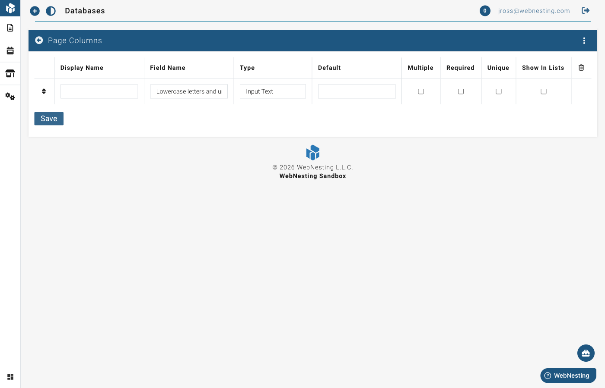

# Custom Data Tables

**Last verified:** 2026-08-31 12:10pm

Custom data tables let you store and organize any kind of information on your website. Think of them like spreadsheets -- you create a table, set up columns for the information you want to track, and then add rows of data. That data can then be displayed on your website however you like.

This is one of the most flexible features in WebNesting. While modules like Articles and Events give you ready-made tools for specific content types, custom data tables let you create your own content types for anything you can imagine.

---

## What Are Custom Data Tables?

Imagine you need a "Team Members" section on your website. You want to show each person's name, photo, job title, and a short bio. A custom data table lets you create exactly that:

- You create a table called "Team Member."
- You add columns for Name, Photo, Job Title, and Bio.
- You add a row for each person on your team.
- You display the data on your website using the builder.

That is it. No coding, no complicated setup. Just a simple table of information that shows up on your site.

Custom data tables work the same way for any type of structured information -- testimonials, FAQs, portfolio items, partner logos, service descriptions, and more.

---

## When Would You Use a Custom Data Table?

Use a custom data table whenever you have a collection of similar items that you want to display on your website. Here are some common examples:

- **Team members** -- Name, photo, job title, bio
- **Testimonials** -- Customer quote, customer name, star rating
- **Frequently asked questions** -- Question, answer
- **Portfolio items** -- Project image, title, description, link
- **Partner or client logos** -- Logo image, company name, website link
- **Service listings** -- Service name, description, price
- **Locations** -- Location name, address, phone number, hours
- **Awards or certifications** -- Award name, date, description, image

If your content fits a repeating pattern (the same set of details for each item), a custom data table is the right tool.

> **Tip:** Ask yourself: "Do I have a list of things that all share the same type of information?" If yes, that is a great candidate for a custom data table.

---

## Creating a New Data Table

Here is how to set up a custom data table from scratch.

### Step 1 -- Go to the Database Section

1. Log in to your WebNesting dashboard.
2. In the site menu, open **Settings** and click **Database Tables**.
3. Click to open it. You will see a list of all existing data tables.

### Step 2 -- Create a New Table

1. Click the **Create A New Table** button.
2. Give your table a **Name**. This is how the table will appear in your dashboard. Use a clear, descriptive name like "Team Member," "Testimonial," or "FAQ."
3. Give it a **Display Name**. This is the human-friendly name that appears in menus and lists.
4. Save your new table.

> **Tip:** Use a singular name for your table (like "Team Member" instead of "Team Members"). WebNesting will handle the plural form automatically where needed.

### Step 3 -- Add Columns

Columns define what information each entry in your table will hold. Think of columns as the headers in a spreadsheet -- they describe what goes in each cell.

1. After creating your table, you will see the table editor with a section for columns.
2. Click to add a new column.
3. For each column, fill in:
   - **Display Name** -- The label for this column. This is what you will see when adding or editing entries. For example, "Full Name" or "Job Title."
   - **Field Name** -- An internal name used by the system. This is generated automatically from the display name. It uses lowercase letters and underscores (like `full_name` or `job_title`).
   - **Type** -- What kind of information this column holds (see the section below for details).
4. You can also set some optional settings for each column:
   - **Required** -- Check this if every entry must have a value in this column.
   - **Unique** -- Check this if no two entries should have the same value in this column (for example, an email address). If you mark a column as Unique, the system will prevent you from saving an entry with a duplicate value in that column.
   - **Show in List** -- Check this if you want this column to appear in the list view of your entries.
5. Repeat for each column you need.
6. Save your table when you are done adding columns.

---

## Column Types Explained

When you add a column to your table, you choose a type that tells WebNesting what kind of information it will hold. Here is what each type means, in plain language:

### Text Types

**Input Text**
For short pieces of text like a name, title, email address, or phone number. This gives you a single line of text to type in.

*Use it for:* Names, job titles, email addresses, short labels, URLs.

**Textarea**
For longer text that might be several lines, but does not need fancy formatting. This gives you a bigger text box.

*Use it for:* Short descriptions, notes, addresses.

**Text Editor**
For rich, formatted text. This gives you a full text editor with formatting tools -- bold, italics, headings, bullet points, links, and more.

*Use it for:* Biographies, detailed descriptions, article content, answers to FAQ questions.

**Markdown Editor**
For text written in Markdown format. This is a lightweight way to format text using simple symbols.

*Use it for:* Technical content, documentation-style entries.

### Number

**Number**
For any numeric value -- quantities, prices, ratings, years, percentages, or any other number.

*Use it for:* Prices, star ratings, order numbers, quantities, years of experience.

### Date and Time Types

**Date**
For a calendar date (without a specific time).

*Use it for:* Birth dates, anniversary dates, project deadlines.

**Date Time**
For a date that includes a specific time.

*Use it for:* Event start times, appointment times, publication dates with times.

**Time**
For a time of day without a date.

*Use it for:* Opening hours, class times.

**Year**
For just a year.

*Use it for:* Founding year, graduation year.

### Image

**Image**
For a photo or graphic. When you add an entry, you will be able to pick an image from your File Manager.

*Use it for:* Team member photos, product images, portfolio thumbnails, logos.

### Relationship (Related Table)

**Related Table**
For connecting entries in one table to entries in another table. This is how you link related information together.

For example, if you have a "Team Member" table and a "Department" table, you could add a Related Table column to Team Member that points to Department. Then each team member could be assigned to a department.

*Use it for:* Connecting entries across different tables (team members to departments, products to categories, articles to authors).

When you choose this type, you will also select:
- **Which table** to connect to.
- **The direction** of the relationship:
  - **Has** means this table owns related entries. For example, a "Departments" table *has* team members.
  - **Belongs to** means entries in this table are owned by another table. For example, a "Team Members" table *belongs to* a department.
  - In most cases, add the relationship on the "child" table (the one with many entries) using "Belongs to", pointing to the "parent" table (the one with fewer entries).

> **Tip:** You do not need to use relationships right away. Start with simple columns like text, number, and image. You can always add relationship columns later as your content grows more complex.

---

## Adding Entries to Your Table

Once your table and columns are set up, you can start adding data. Each entry is like a row in your spreadsheet.

1. Go to the section for your custom data table in the left sidebar. (After creating a table, it appears as its own menu item.)
2. Click the **Create A New [Table Name]** button (for example, **Create A New Team Member**).
3. Fill in the fields for each column you set up. For example, if your table has columns for Name, Photo, and Bio, you will see a form with fields for each one.
4. Save your entry.

Repeat this for each item you want to add.

> **Tip:** You do not have to fill in every field right away. Required fields must be completed, but optional fields can be left blank and filled in later.

---

## Editing and Deleting Entries

### Editing an Entry

1. Go to your custom data table section in the sidebar.
2. Find the entry you want to update in the list.
3. Click on it to open the editor.
4. Make your changes.
5. Save.

### Deleting an Entry

1. Go to your custom data table section.
2. Find the entry you want to remove.
3. Click the **Delete** option.
4. Confirm that you want to delete it.

### Restoring a Deleted Entry

1. Look for a **Deleted** or **Trash** view in your data table section.
2. Find the entry you want to recover.
3. Click **Restore**.
4. The entry will return to your list.

> **Tip:** Deleting an entry removes it from your website. If the entry is currently displayed on a page, it will disappear from that page. Double-check before deleting.

---

## Displaying Your Custom Data on Your Site

After you have added entries to your table, you can display them on any page of your website using the Website Builder.

1. Open the page where you want to show your custom data in the **Website Builder**.
2. Create a **Widget** that connects to your custom data table. Widgets let you design how your data is displayed (as cards, lists, grids, etc.).
3. In the Widget settings, connect it to your custom data table by selecting the **Module**, **Type**, and configuring the **Limit** and **Pagination** options.
4. Add the widget to your page from the **My Widgets** section in the component palette.
5. Save your page.

The widget will automatically display the entries from your table on the page, using the layout and design you configured.

> **Tip:** See the [Widgets guide](../website-builder/widgets.md) for detailed instructions on creating widgets that display your custom data.

---

## Tips and Real-World Examples

Here are some practical examples of how to set up common custom data tables. Use these as a starting point and adjust them to fit your needs.

### Team Members Table

Display your team on an "About Us" or "Our Team" page.

**Columns to create:**
- **Name** (Input Text) -- The person's full name.
- **Photo** (Image) -- A professional headshot.
- **Job Title** (Input Text) -- Their role at the company.
- **Bio** (Text Editor) -- A short paragraph about them.

**How to use it:** Add an entry for each team member. Display the table on your "About" page so visitors can see who they will be working with.

---

### Testimonials Table

Show quotes from happy customers to build trust with new visitors.

**Columns to create:**
- **Quote** (Textarea) -- What the customer said.
- **Author** (Input Text) -- The customer's name.
- **Rating** (Number) -- A star rating from 1 to 5.

**How to use it:** Add an entry for each testimonial you have received. Display them on your homepage, a dedicated "Testimonials" page, or alongside relevant product or service pages.

> **Tip:** Ask your best customers for a testimonial. Most people are happy to give one if you ask -- especially if you have done good work for them.

---

### FAQ Table

Answer common questions so visitors can find answers without contacting you.

**Columns to create:**
- **Question** (Input Text) -- The question people often ask.
- **Answer** (Text Editor) -- A clear, helpful answer.

**How to use it:** Add your most frequently asked questions as entries. Display them on a "FAQ" page or at the bottom of relevant service pages. This saves you time answering the same questions over and over.

---

### Portfolio Table

Showcase your best work to impress potential clients.

**Columns to create:**
- **Image** (Image) -- A photo or screenshot of the project.
- **Title** (Input Text) -- The name of the project.
- **Description** (Text Editor) -- What the project was about and what you did.
- **Link** (Input Text) -- A web address where people can see the project (optional).

**How to use it:** Add an entry for each project you want to highlight. Display them on a "Portfolio" or "Our Work" page with a grid or card layout.

---

### Services Table

List all the services you offer in one organized place.

**Columns to create:**
- **Service Name** (Input Text) -- The name of the service.
- **Description** (Text Editor) -- What the service includes.
- **Price** (Number) -- The cost of the service (optional).

**How to use it:** Add an entry for each service. Display them on your "Services" page so visitors can quickly see everything you offer and how much it costs.

---

## Getting the Most Out of Custom Data Tables

Here are a few final tips to help you use custom data tables effectively.

### Start Simple

You do not need to create every column you can think of right away. Start with the essential information and add more columns later if needed.

### Use Clear Names

Give your tables and columns names that make sense to anyone on your team. "Team Member" is better than "TM_Data." "Job Title" is better than "Field_3."

### Keep Data Consistent

When entering data, try to be consistent. If one team member's title is "Marketing Manager" and another's is "marketing manager," they will not group or sort the same way. Pick a format and stick with it.

### Review Before Publishing

After adding entries and placing them on a page, preview the page to make sure everything looks right. Check that images appear correctly, text is not cut off, and the layout looks good on both desktop and mobile.

> **Tip:** Custom data tables are one of the most powerful features in WebNesting. Once you get comfortable with them, you will find they can replace many different tools and plugins. Any time you need a structured collection of information on your site, a custom data table is the answer.
