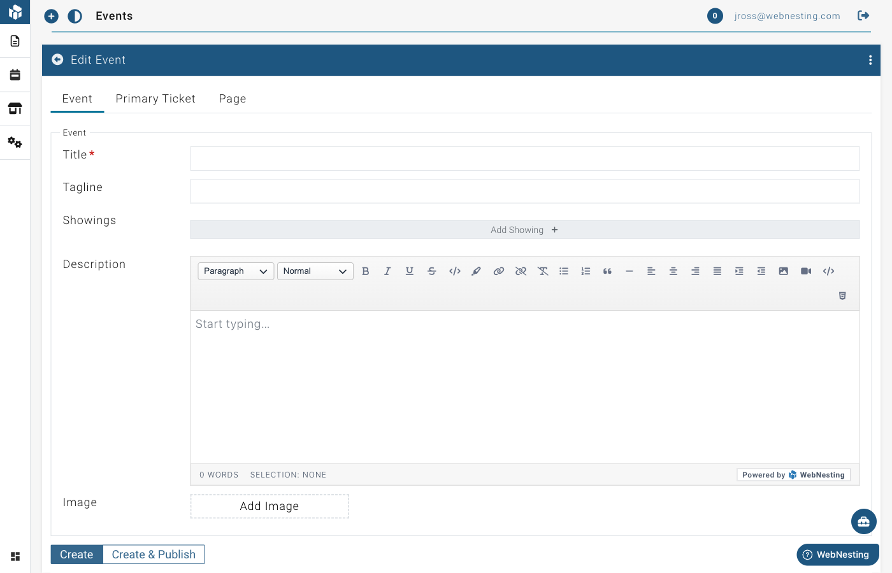

# Events

**Last verified:** 2026-08-31 12:10pm

The Events module lets you create and manage event listings on your website. Whether you host workshops, classes, concerts, conferences, or community meetups, this module gives you the tools to promote your events and share all the important details with your visitors.

---

## What the Events Module Is

The Events module is an event management system built right into your website. When you turn it on, you can create event listings that include everything your visitors need to know -- the event title, description, dates and times, images, and even ticket information.

Events appear on your website just like any other page, but with all the extra details that make event pages useful: dates, times, and links to tickets. Past events are automatically sorted below upcoming events in your event listings. Visitors will see upcoming events first.

The Events module costs $5/month.

---

## How to Enable the Events Module

Before you can start creating events, you need to turn on the module.

1. Log in to your WebNesting dashboard.
2. In the site menu, open **Settings** and click **Modules**.
3. Find **Event** in the list of available modules.
4. Click the **Enable** button next to it.
5. The module will activate right away.

Once enabled, you will see a new **Event** section appear in your dashboard sidebar. You are ready to start creating events.

> **Tip:** The Events module includes showings (multiple dates/times) and ticketing at no extra cost. Everything you need to manage events is included.

---

## Creating a New Event

Here is how to create an event listing for your website.

1. Click **Event** in the left sidebar of your dashboard.
2. Click the **Create A New Event** button at the top of the page.
3. You will see the event editor with several sections to fill in.

### Event Title

The title is the name of your event. It appears at the top of the event page and in any event lists on your site.

1. Find the **Title** field.
2. Type a clear name for your event. For example, "Summer Art Workshop" or "Annual Charity Gala."

### Event Tagline

The tagline is a short, catchy phrase that appears alongside your event title.

1. Find the **Tagline** field.
2. Write a brief one-liner that captures what your event is about. For example, "Learn watercolor painting in a relaxed, beginner-friendly setting."

> **Tip:** A good tagline gives people a quick reason to be interested. Think of it as your event's elevator pitch.

### Event Description

The description is where you share all the details about your event.

1. Find the **Description** field.
2. Use the text editor to write a full description of your event.
3. Include information like:
   - What the event is about
   - Who it is for
   - What attendees will experience or learn
   - Any requirements (such as what to bring or age restrictions)
   - Parking or transportation information

The text editor lets you format your description with headings, bold text, bullet points, links, and more.

### Featured Image

A featured image represents your event visually. It appears on the event page and in event lists.

1. Find the **Image** section in the event editor.
2. Click to open the media picker.
3. Choose an image from your File Manager, or upload a new one.
4. The image will be attached to your event.

> **Tip:** Use a high-quality photo that gives people a feel for your event. A photo from a past event, the venue, or the activity itself works great.

### Publish Status

Like articles, events have a draft and published status.

- **Draft** -- The event is saved but not visible on your website. Use this while you are still finalizing details.
- **Published** -- The event is live and visible to your visitors.

To change the status:

1. Look for the publish or draft toggle on the event editor page.
2. Switch between draft and published.
3. Save your changes.

---

## Managing Event Showings

A showing is a specific date and time when your event takes place. Many events happen more than once -- for example, a workshop that runs every Saturday for a month, or a performance with matinee and evening shows. Showings let you list all of these dates and times under a single event.

### Adding a Showing

1. Open the event you want to add a showing to.
2. Look for the **Showings** section in the event editor.
3. Click to add a new showing.
4. Fill in the details:
   - **Date and Time** -- Choose the date and time the event takes place.
   - **All Day** -- Select "Yes" if the event runs all day and does not have a specific start time. Select "No" if there is a set start time. When you toggle "All Day" to Yes, the time fields are hidden and the event shows only the date.
5. Save your event.

### Adding Multiple Showings

You can add as many showings as you need. Just repeat the steps above for each date and time.

For example, if your "Holiday Craft Fair" runs on December 10, 11, and 12, you would create three showings -- one for each date.

### Editing a Showing

1. Open the event.
2. Find the showing you want to change in the Showings section.
3. Update the date, time, or all-day setting.
4. Save your event.

### Removing a Showing

1. Open the event.
2. Find the showing you want to remove.
3. Click the delete option next to it.
4. Save your event.

> **Tip:** Showings are what help your visitors see when your event is happening at a glance. Even if your event only happens once, add a showing so the date and time appear on your event page.

---

## Managing Tickets

If your event requires tickets or registration, you can set up ticket information directly within your event. Tickets can be attached to the event as a whole or to individual showings.

### Adding a Ticket

1. Open the event you want to add tickets to.
2. Look for the **Primary Ticket** section (or navigate to the Tickets area within a showing).
3. Click to add a new ticket.
4. Fill in the ticket details:
   - **Title** -- The name of the ticket type. For example, "General Admission," "VIP Pass," or "Early Bird."
   - **Description** -- A short explanation of what the ticket includes.
   - **On Sale Start** -- The date and time when tickets become available for purchase.
   - **On Sale End** -- The date and time when ticket sales close.
   - **Link** -- A web address where visitors can buy the ticket (such as a link to an external ticketing service).
   - **Image** -- An optional image for the ticket.
5. Save your event.

### Multiple Ticket Types

You can create more than one ticket type for an event. This is useful when you offer different levels of access or pricing. For example:

- General Admission -- $25
- VIP with Meet and Greet -- $75
- Student Discount -- $15

### Editing and Removing Tickets

1. Open the event.
2. Find the ticket you want to change or remove.
3. Edit the details or click the delete option.
4. Save your event.

> **Tip:** Even if your event is free, you can still add a ticket with a title like "Free Registration" and include a link to an RSVP page. This makes it easy for visitors to sign up.

---

## Editing and Deleting Events

### Editing an Event

1. Click **Event** in the left sidebar.
2. Find the event you want to update in the list.
3. Click on the event to open it in the editor.
4. Make your changes to any field -- title, description, showings, tickets, or image.
5. Save your changes.

### Deleting an Event

1. Go to the **Event** section.
2. Find the event you want to remove.
3. Click the **Delete** option next to the event.
4. Confirm that you want to delete it.

### Restoring a Deleted Event

1. In the **Event** section, look for a **Deleted** or **Trash** view.
2. Find the event you want to recover.
3. Click **Restore**.
4. The event will return to your event list.

> **Tip:** If an event has already passed, you do not need to delete it. Past events can be useful for your visitors to see, showing that you are active and have a history of hosting events.

---

## Displaying Events on Your Site

To show your events to visitors, you add event components to your pages using the Website Builder.

### Adding an Event List to a Page

An Event List displays a collection of your events -- perfect for an "Events" or "What's On" page.

1. Open the page where you want to display events in the **Website Builder**.
2. Open the component panel.
3. Look for **Event List** under the **Module Driven Items** group.
4. Drag the Event List component onto your page.
5. The component will automatically display your published events with their titles, dates, images, and links to read more.
6. Save your page.

Visitors will see a card-style layout of your events. Each card shows the event title, date, a preview image, and a link to the full event page.

### Adding an Event Detail to a Page

An Event Detail component shows the full information for a single event. This is used on the individual event page that opens when a visitor clicks an event from the list.

1. Open the event's individual page in the **Website Builder**.
2. Open the component panel.
3. Look for **Event Detail** under the **Module Driven Items** group.
4. Drag the Event Detail component onto the page.
5. The component will display the full event title and description.
6. Save your page.

> **Tip:** Your event list and event detail pages work together. The list shows all your events in summary form, and each event links to its own detail page with the full information.

---

## Tips for Promoting Events on Your Website

### Include All the Important Details

Make sure every event has a clear title, a detailed description, and accurate dates and times. Visitors should be able to find everything they need to know without leaving your site.

### Use Eye-Catching Images

A strong image can make the difference between someone clicking on your event or scrolling past it. Use a photo from a previous event, a promotional graphic, or a high-quality image of the venue.

### Keep Events Up to Date

Remove or unpublish events after they have passed (or let them stay as a record). Make sure upcoming events always have accurate information, especially dates, times, and ticket links.

### Link to Your Events Page

Make it easy for visitors to find your events. Add a link to your events page in your site's main navigation menu so it is always visible.

### Share on Social Media

After publishing an event on your website, share the link on your social media channels. Drive traffic to your event page where visitors can get all the details and find ticket links.

### Add Events Early

Give people time to plan. Publish your events as far in advance as possible. The earlier your event is listed, the more time people have to see it, share it, and make plans to attend.

> **Tip:** Even if you do not have all the details finalized, you can publish an event with the information you have and update it later. Getting it on your site early is better than waiting for every last detail to be confirmed.
