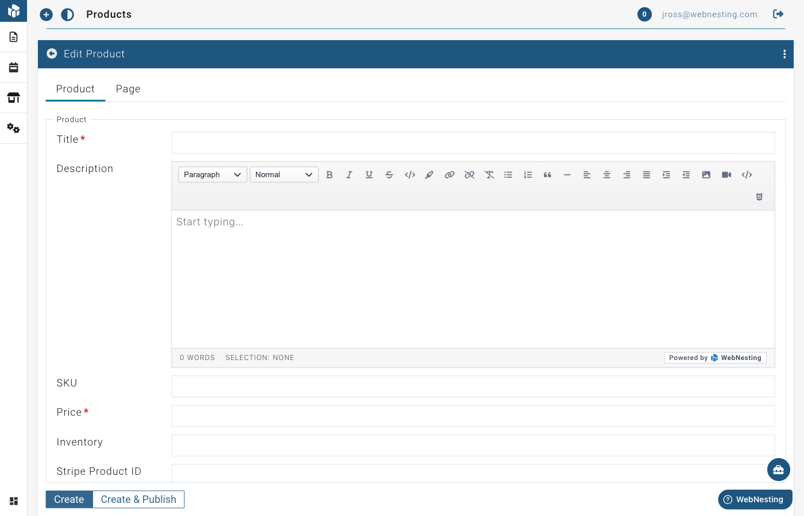

# Products and E-Commerce

**Last verified:** 2026-05-11 9:00am

The E-Commerce module turns your WebNesting website into an online store. You can list products, manage orders, and give your customers a place to browse and buy -- all from the same dashboard you use to manage the rest of your site.

---

## What the E-Commerce Module Includes

When you enable E-Commerce, you get three connected tools:

- **Products** -- Create product listings with titles, descriptions, prices, images, and inventory tracking.
- **Orders** -- View and manage orders that come in from your customers.
- **Store** -- Configure your store settings, including payment processing.

Together, these tools give you everything you need to sell products through your website.

---

## How to Enable E-Commerce

Before you can start selling, you need to turn on the E-Commerce module.

1. Log in to your WebNesting dashboard.
2. Click **Modules** in the left sidebar.
3. Find **Store** in the list of available modules.
4. Click the **Enable** button next to it.
5. The module will activate right away.

Once enabled, you will see a new **Store** section appear in your dashboard sidebar, with links to manage Products and Orders.

> **Tip:** The E-Commerce module uses Stripe for payment processing. You will need to set up your Stripe account before you can accept payments. See the "Setting Up Stripe" section below for step-by-step instructions.

The Store module costs $20/month.

---

## Managing Products

Products are the items you are selling. Each product gets its own listing with all the details your customers need.

### Creating a New Product

1. In the left sidebar, find the **Store** section and click **Product**.
2. Click the **Create A New Product** button at the top of the page.
3. Fill in the product details.

Here is what each field is for:

**Title** (required)
The name of your product. This is what customers will see. For example, "Handmade Ceramic Mug" or "Premium Yoga Mat."

**Description**
A detailed description of the product. Tell your customers what it is, what makes it special, what it is made of, dimensions, and any other relevant details. Use the text editor to format your description with headings, bullet points, and bold text.

**Price** (required)
The selling price of the product. Enter the amount in your currency. For example, enter `29.99` for a product that costs $29.99.

**SKU**
A unique product code for your own reference. SKU stands for "Stock Keeping Unit." This is optional but helpful if you have many products or need to track inventory in another system. For example, "MUG-BLUE-001."

**Inventory**
The number of items you have in stock. This is optional but useful for tracking how many units are available.

**Image**
A photo of your product. This is what customers see when browsing your store.

1. Find the **Image** section in the product editor.
2. Click to open the media picker.
3. Choose an image from your Media Library, or upload a new one.

> **Tip:** Use clear, well-lit product photos. Show the product from its best angle. If possible, include multiple photos showing different views or the product in use.

### Editing a Product

1. Go to the **Product** section under Store.
2. Find the product you want to update in the list.
3. Click on the product to open it in the editor.
4. Make your changes -- update the price, description, images, or any other field.
5. Save your changes.

### Organizing Products

Your products appear in a list in your dashboard. You can browse through them, search for specific products, and sort them to find what you need.

1. Go to the **Product** section.
2. Use the **Search** bar to find products by name.
3. Scroll through the list to browse all your products.

### Product Status (Draft vs. Published)

Like other content in WebNesting, products can be saved as drafts or published.

- **Draft** -- The product is saved in your dashboard but not visible to customers on your website.
- **Published** -- The product is live on your site and customers can see it.

Use drafts when you are still working on a product listing. Switch to published when it is ready for customers to see.

> **Tip:** Before publishing a product, double-check that the price is correct, the description is complete, and the images look good. First impressions matter when selling online.

---

## Managing Orders

When a customer purchases a product from your site, an order is created. You can view and manage all orders from your dashboard.

### Viewing Incoming Orders

1. In the left sidebar, find the **Store** section and click **Order**.
2. You will see a list of all orders, with the most recent ones first.
3. Each order shows key information at a glance.

### Order Details

Click on any order in the list to see its full details:

- **Title** -- A reference name or number for the order.
- **Customer** -- Who placed the order.
- **Total** -- The total amount for the order.
- **Status** -- The current state of the order (see below).
- **Date** -- When the order was placed.

### Order Status Tracking

Each order has a status that tells you where it is in the fulfillment process. Here is the typical lifecycle of an order:

- **Pending** -- The order has been placed and payment has been received, but you have not started working on it yet.
- **Processing** -- You are preparing the order for shipment (packing, labeling, etc.).
- **Shipped** -- The order has been sent to the customer.
- **Completed** -- The customer has received the order and everything is finalized.
- **Cancelled** -- The order was cancelled before it was fulfilled.

### Updating Order Status

As you work through each order, update its status to keep things organized and to communicate progress:

1. Click on the order to open its details.
2. Find the **Status** field.
3. Select the new status from the dropdown.
4. Save your changes.

Work through statuses in order: move from Pending to Processing when you start preparing the order, then to Shipped when it goes out, and finally to Completed when everything is done.

> **Tip:** Check your orders regularly so you do not miss any new purchases. Getting back to customers quickly builds trust and keeps them coming back.

### Payment Information

WebNesting uses Stripe to process payments. When you view an order, you can see payment details including:

- Whether payment was successful
- The amount charged
- The payment method used

All payment processing is handled securely through Stripe. You do not need to handle any credit card information directly.

> **Tip:** If a customer has a question about a charge, you can reference the order details in your dashboard. For refunds or payment disputes, you may need to log in to your Stripe dashboard directly.

### Communicating with Customers

Good communication keeps customers happy and reduces support requests:

- **Confirm receipt** -- When a new order comes in, consider sending the customer an acknowledgment.
- **Provide updates** -- Let customers know when their order ships, including any tracking information.
- **Handle issues promptly** -- If there is a problem with an order (out of stock, shipping delay), reach out to the customer right away rather than waiting.

> **Tip:** A quick, friendly message goes a long way. Customers appreciate knowing that a real person is handling their order.

---

## Setting Up Stripe

To accept payments, you need to connect your Stripe account:

1. If you do not have a Stripe account, create one at [stripe.com](https://stripe.com).
2. In your WebNesting dashboard, go to the Store settings section.
3. Enter your Stripe Publishable Key and Secret Key. You can find these in your Stripe Dashboard under Developers > API Keys.
4. For testing, use your test mode keys. Switch to live keys when you are ready to accept real payments.

When a visitor clicks the purchase button on a product page, they are taken to a secure Stripe checkout page to complete their payment.

---

## Managing Store Locations

If your business has physical locations (like a retail shop, office, or warehouse), you can add store location information to your site.

### Adding Store Information

1. In the left sidebar, find the **Store** section.
2. Look for the store settings area.
3. Add your location details such as:
   - Store name
   - Address
   - Contact information
   - Hours of operation

This information can be displayed on your website so customers know where to find you in person.

---

## Displaying Products on Your Site

To show your products to visitors, you add product components to your pages using the Website Builder.

### Adding a Product List to a Page

A Product List shows a collection of your products -- perfect for a "Shop" or "Products" page.

1. Open the page where you want to display products in the **Website Builder**.
2. Open the component panel.
3. Look for **Product List** under the **Module Driven Items** group.
4. Drag the Product List component onto your page.
5. The component will automatically display your published products.
6. Save your page.

Visitors will see your products laid out in a browsable format with titles, images, and key details.

### Adding a Product Detail to a Page

A Product Detail component shows all the information for a single product. This is used on individual product pages -- the pages that open when a customer clicks on a product from the list.

1. Open the product's individual page in the **Website Builder**.
2. Open the component panel.
3. Look for **Product Detail** under the **Module Driven Items** group.
4. Drag the Product Detail component onto the page.
5. The component will display the full product title, description, price, images, and purchase options.
6. Save your page.

> **Tip:** Your product list and product detail pages work together. The list gives customers an overview of what you sell, and each product links to its own detail page with the full information and purchase options.

---

## Tips for Running an Online Store

### Write Detailed Product Descriptions

Do not just list the basics. Tell customers why they should buy your product. What problem does it solve? What makes it different? Include dimensions, materials, care instructions, and anything else that helps customers make a decision.

### Use High-Quality Product Photos

Photos are the most important part of selling online. Customers cannot touch or try your products, so your images need to do the selling. Use clear, well-lit photos with a clean background. Show the product from multiple angles if possible.

### Price Clearly

Make sure your prices are accurate and easy to understand. If there are additional costs (like shipping), mention them in the product description so customers are not surprised at checkout.

### Keep Inventory Up to Date

If you track inventory, update it regularly. There is nothing more frustrating for a customer than ordering something that turns out to be out of stock.

### Respond to Orders Quickly

When an order comes in, process it as soon as you can. Fast fulfillment leads to happy customers, positive reviews, and repeat business.

### Organize Your Products

If you have many products, organize them with clear titles and descriptions so customers can find what they are looking for. Use the search feature in your dashboard to quickly locate specific products when you need to make updates.

### Test the Customer Experience

After setting up your store, visit your own website as if you were a customer. Browse the product list, click into a product detail page, and go through the purchase flow. Make sure everything looks right and works smoothly.

> **Tip:** Start with a small number of products and add more over time. It is better to have a few well-crafted product listings than many incomplete ones. You can always expand your catalog as you get comfortable with the tools.
