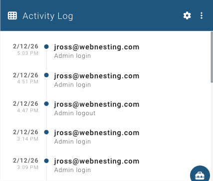

# Activity Logs

**Last verified:** 2026-09-05 3:40pm

Activity logs keep a record of everything that happens on your site. Every time someone makes a change -- whether it is editing a page, updating settings, or managing team members -- it is recorded in the activity log.

The Activity Log shows recent actions taken in your site's dashboard, including page edits, setting changes, and content updates.

---

## What Activity Logs Track

Your activity log captures actions taken by you and your team members in the dashboard. This includes things like:

- Creating, editing, or deleting pages
- Uploading or removing media files
- Changing site settings
- Creating or editing articles, products, events, or other content
- Adding or removing team members
- Changing roles and permissions
- Enabling or disabling modules

Each log entry includes what happened, who did it, and when it occurred.

---

## Viewing Your Site's Activity Log

To view your site's activity log:

1. Go to your **Dashboard**.
2. Look for the **Activity Log** widget. It shows a timeline of recent actions on your site.
3. Each entry shows what was changed, who made the change (identified by their email address), and the time it happened.

The most recent activity appears at the top, so you can quickly see what has been happening on your site.

> **Tip:** If the Activity Log widget is not on your dashboard, click the **Add Widget** button and select "Activity Log" from the list.

---

## Types of Logs Available

WebNesting tracks different types of activity across your site.

### Site Activity

This is the main activity log that records content and configuration changes. It covers:

- Page creation, edits, and deletions
- Media uploads and removals
- Content changes (articles, products, events, etc.)
- Settings changes
- Team member and permission changes
- Module changes

This is the log you will use most often.

### SSL Certificate Logs

SSL certificates keep your website secure (the padlock icon in your visitors' browsers). WebNesting manages your SSL certificates automatically, and logs are kept of certificate-related activity, such as:

- Certificate renewals
- Certificate status changes

You typically do not need to check these logs unless you are troubleshooting a security certificate issue with support.

### Billing Logs

Billing activity is tracked separately in your account area. This includes:

- Monthly bill generation
- Payments made
- Usage changes

You can view billing information in the **Billing** section of your account.

---

## Searching and Filtering Logs

The Activity Log widget on your dashboard shows the most recent entries. You can adjust how many entries are shown:

1. Open the Activity Log widget's settings by clicking the settings icon (the gear icon) on the widget.
2. Choose how many entries to display (10, 25, or 50).
3. You can also filter by type of activity (all activity, page edits only, or settings changes only).
4. Click **Save** to apply your preferences.

> **Tip:** If you are looking for a specific change, try filtering by type first. This narrows down the list and makes it easier to find what you need.

---

## Workspace Activity Log

If you manage multiple websites through a workspace, you have access to a workspace-level activity log that shows activity across all your sites and workspace-level changes in one place.

### What the Workspace Activity Log Tracks

The workspace activity log captures everything that happens at the workspace level, including:

- **Workspace settings** — Changes to workspace configuration
- **Site management** — Creating new sites
- **Team changes** — Inviting members, removing members, updating member details
- **Invitation activity** — Revoking pending invitations
- **Role management** — Creating, updating, or deleting permission roles
- **Permission changes** — Updating role permissions, member role assignments, permission overrides
- **Product changes** — Enabling or disabling workspace products (Marketing, Helpdesk, Tasks)

In addition to workspace-level events, the log also shows activity from all your individual sites, giving you a single view of everything happening across your workspace.

### Viewing the Workspace Activity Log

1. Go to your **Workspace** dashboard.
2. Click **Settings** at the bottom of the icon rail, then **Activity Log**.
3. You will see a chronological list of all activity across your workspace and sites.

Each entry shows:
- **When** the action occurred
- **What** happened (described in plain language)
- **Source** — Whether it was a workspace-level action or which site it occurred on
- **Resource** — The type of content or setting that was affected

Click on any entry to expand it and see additional details about the action.

### Filtering the Workspace Activity Log

The workspace activity log includes several filters to help you find specific activity:

- **Source** — Filter by workspace-level activity or activity from a specific site
- **Resource** — Filter by the type of content (for example, only show page changes or only show permission changes)
- **Date range** — Set a start and end date to narrow results to a specific time period
- **Search** — Type keywords to search across all activity entries

Filters apply the moment you pick them -- there is nothing to submit. If you use the same combination often, click **Save as view…** in the filter panel to keep it as a named view you can return to with one click.

> **Tip:** Use the source filter to quickly see all changes made to a specific site, or set it to "Workspace" to see only workspace-level management activity.

### Real-Time Updates

The workspace activity log updates in real time. When a team member makes a change anywhere in your workspace, the new entry appears automatically — you do not need to refresh the page.

---

## Notification Bell

Recent activity also appears in the notification bell at the top of your workspace dashboard. This gives you a quick glance at what has been happening without needing to open the full activity log.

Click the bell icon to see recent activity. Click on any notification to view more details.

The bell only shows what **other people** did (plus things that happen on their own, like an incoming ticket). Your own changes don't ring the bell -- you get a confirmation right where you made them -- but they are always in the full activity log.

> **Tip:** The notification bell shows activity from all sites you have permission to access. If you do not see activity from a particular site, check with your workspace owner about your permissions.

---

## Why Logs Are Useful

Activity logs serve several important purposes:

### Tracking Changes

When you or a team member makes a change to your site, the log records exactly what was done and when. This is helpful if you ever need to review what changes were made to a particular page or setting.

### Troubleshooting

If something on your site does not look right, the activity log can help you figure out what changed. Check the recent entries to see if a recent edit might be the cause.

### Accountability

When multiple people manage your site, the activity log shows who made each change. This makes it easy to follow up with the right person if you have questions about a particular update.

### Peace of Mind

Even if you manage your site alone, the activity log gives you a clear history of everything you have done. If you ever wonder "Did I publish that page?" or "When did I change that setting?", the log has the answer.

---

## How Long Logs Are Kept

WebNesting keeps your site activity logs for the lifetime of your site. You do not need to worry about logs being deleted or expiring.

Older log entries remain accessible, so you can always go back and review past activity regardless of when it happened.

> **Tip:** Make it a habit to glance at your activity log when you log in. It takes just a few seconds and helps you stay on top of what is happening on your site, especially if you have team members making changes.
