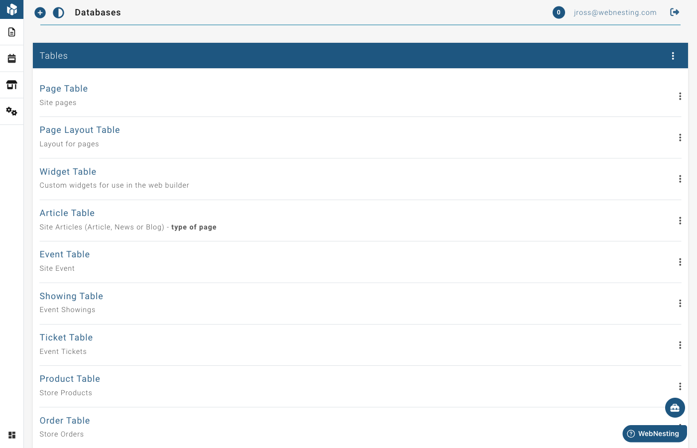

# Database Tables

**Last verified:** 2026-09-05 2:36pm

The **Database Tables** section (in your site menu, under **Settings**) is where you define the structure of your own custom content types. Think of it as creating a spreadsheet -- you choose what columns it has, what kind of information each column holds, and how different tables relate to each other.

This is different from the built-in content modules (like Articles or Events) that come ready to use. Database Tables lets you create something entirely new that is specific to your needs.

---

## When Would You Use This?

Most of the time, the built-in content modules will cover what you need. But sometimes your site requires a type of content that does not exist yet. Here are a few examples:

- A **team directory** with custom fields like department, phone number, and bio
- A **portfolio** with project descriptions, categories, and client names
- A **product catalog** with specifications, pricing tiers, and availability
- A **testimonials** collection with customer names, quotes, and ratings
- A **FAQ list** with questions, answers, and categories

If you can imagine it as a spreadsheet with rows and columns, you can build it as a database table.

---

## Viewing Your Tables

1. Open your WebNesting dashboard.
2. Look for **Database** in the navigation menu.
3. You will see a list of all the tables you have created.

Each table in the list shows its name, a short description, and whether it is related to another table. You can click on any table to view or edit its columns.

> **Tip:** If you do not see the Database option in your menu, you may need to ask your site administrator to grant you permission.

---

## Creating a New Table

Setting up a new table is straightforward. You will give it a name and some basic information, then add the columns (fields) that define what kind of data it holds.

### Step 1 -- Name Your Table

1. Go to **Settings → Database Tables** in your site menu.
2. Click **Create New Table**.
3. Fill in the following:
   - **Display Name** -- A friendly name for your table. This is what you will see in menus and lists. For example, "Team Members" or "Client Testimonials."
   - **Description** -- A short note about what this table is for. This is optional but helpful if you have many tables.
   - **Parent table** -- Use this when entries belong under another table -- for example, "Chapters" under "Books", or "Team Members" under "Departments". For most tables, leave this set to "None."
   - **Advanced → Internal name** -- You can leave this alone. It is generated from the display name and used behind the scenes (in code and the API). It can only contain letters and numbers, and it can't be changed after the table is created.
4. Set the **default permissions** for this table. These checkboxes control what team members with the default role can do:
   - **Browse** -- View the list of entries
   - **Read** -- View individual entries
   - **Edit** -- Change existing entries
   - **Add** -- Create new entries
   - **Delete** -- Remove entries
5. Click **Create Table**.

After creating the table, you will be taken to the columns page where you can start adding fields.

> **Tip:** Choose a clear and descriptive display name. This name will appear in your dashboard menus, so "Team Members" is much better than "TM Data" or "Table 3."

---

## Adding Columns (Fields)

Columns define what information each entry in your table contains. For example, a "Team Members" table might have columns for Name, Job Title, Email, Photo, and Bio.

### How to Add a Column

1. Open your table from the Database list.
2. If you are on the table settings page, click **Edit Columns** from the menu.
3. You will see a table showing all existing columns.
4. At the bottom of the list, you will find an empty row where you can add a new column.
5. Fill in the details for your new column (described below).
6. Click **Save** when you are done.

### Column Settings

Each column has several settings you can configure:

- **Display Name** -- The label that appears when adding or editing entries. For example, "Job Title" or "Phone Number."
- **Field Name** -- The internal name used by the system. This is generated automatically from the display name using lowercase letters and underscores.
- **Type** -- The kind of data this column holds (see "Column Types" below).
- **Default Value** -- A value that is filled in automatically when creating a new entry. Leave blank if you do not need a default.
- **Multiple** -- Check this box if the column should accept more than one value. For example, a "Tags" column might allow multiple selections.
- **Required** -- Check this box if every entry must have a value for this column. If checked, you will not be able to save an entry without filling in this field.
- **Unique** -- Check this box if no two entries can have the same value in this column. Useful for things like email addresses or employee IDs. If you mark a column as Unique, the system will prevent you from saving an entry with a duplicate value in that column.
- **Show In Lists** -- Check this box if you want this column's value to appear when browsing entries in a list view.

### Column Types Explained

When adding a column, you choose the type of data it will hold. Here is what each type means in plain terms:

**Text types:**

- **Input Text** -- A single line of text. Good for names, titles, short labels, and any brief piece of information.
- **Textarea** -- A larger text area for longer content. Good for descriptions, notes, or summaries.
- **Text Editor** -- A rich text field with formatting options like bold, italic, links, and lists. Best for content that needs formatting, like bios or detailed descriptions.
- **Markdown Editor** -- A text field that uses Markdown formatting. Similar to the text editor, but uses a different writing style.

**Image:**

- **Image** -- Lets you attach a picture from your files. Perfect for profile photos, product images, or logos.

**Component:**

- **Cards** -- A special component type for structured card-style content.

**Date and time types:**

- **Date** -- A calendar date, like a birthday or event date.
- **Date Time** -- A date and time together, like a meeting scheduled for a specific hour.
- **Timestamp** -- A precise moment in time. Useful for tracking when something happened.
- **Time** -- Just a time of day, without a date.
- **Year** -- Just a year, like 2025.

**Number:**

- **Number** -- A numeric value. Good for quantities, prices, ratings, or any countable item.

**Relationship:**

- **Related Table** -- Links this column to another table. See "Setting Up Relationships" below for details.

> **Tip:** If you are unsure which type to choose, "Input Text" works for most simple fields. You can always adjust your table structure later.

---

## Reordering Columns

You can change the order in which columns appear when adding or editing entries.

1. Open the columns page for your table.
2. Drag the sort handle (the icon on the left side of each row) up or down to rearrange columns.
3. Click **Save** to keep your new order.

---

## Editing Table Structure

You can change your table's settings or modify its columns at any time.

### Editing Table Settings

1. Go to **Settings → Database Tables** in your site menu.
2. Click on the table you want to change.
3. From the menu, select **Edit Table**.
4. Update the display name, description, or parent table.
5. Click **Save Table**.

### Editing Columns

1. Go to **Settings → Database Tables** in your site menu.
2. Click on the table you want to change.
3. You will see all columns listed with their current settings.
4. Update any column's display name, default value, required status, or list visibility.
5. Click **Save**.

Choose your column name and type carefully, as these cannot be changed after the column is created. You can always add new columns or delete unused ones. If you need a different type for an existing column, you will need to create a new column and delete the old one.

### Deleting a Column

1. Open the columns page for your table.
2. Find the column you want to remove.
3. Click the **trash icon** on the right side of that column's row.
4. The column and all of its data will be removed.

---

## Table Options

Each table has additional options that control how its entries are displayed and organized. To access these options:

1. Open your table from the Database list.
2. Click **Table Options** from the menu.

You can set the following:

- **Default Label** -- Which column's value is used as the main label when showing entries in lists and dropdowns.
- **Default Query Field** -- Which column is used by default when searching or filtering entries.
- **Paginate** -- How many entries to show per page when browsing. Leave blank to show all entries at once.
- **Group By** -- Organize entries into groups based on a specific column's value.
- **Group Direction** -- Whether groups are sorted in ascending (A to Z) or descending (Z to A) order.
- **Sort By** -- Which column is used to sort entries within each group.
- **Sort Direction** -- Whether entries are sorted ascending or descending.
- **Children Depth** -- If your table supports nested entries (parent/child), this controls how many levels deep the nesting goes.

Click **Save** to apply your changes.

> **Tip:** Setting a good "Default Label" is important. This is the value that shows up in dropdowns and lists throughout your site. For a "Team Members" table, you would want to set this to the "Name" column.

---

## Setting Up Relationships Between Tables

Relationships let you link one table to another. For example, you might want each blog article to be connected to an author from your "Team Members" table, or each product to belong to a category.

### How Relationships Work

When you add a column with the "Related Table" type, you are creating a link between two tables. There are two directions a relationship can go:

- **Has** -- This table contains items that belong to the related table. Think of it as "this table owns entries in the other table." For example, a "Category" table might "have" many products.
- **Belongs to** -- This table's entries are owned by entries in the related table. For example, a "Product" might "belong to" a category.

You can also choose whether the relationship allows one or many connections:

- **Has** + **Single** -- This table has one related entry (for example, a page has one author).
- **Has** + **Multiple** -- This table has many related entries (for example, a category has many products).
- **Belongs to** + **Single** -- This entry belongs to one item in the other table.
- **Belongs to** + **Multiple** -- This entry can belong to many items in the other table.

### Adding a Relationship

1. Open the columns page for your table.
2. Add a new column or edit an existing one.
3. Set the **Type** to "Related Table."
4. Choose which table you want to link to from the dropdown.
5. Select the relationship direction: **Has** or **Belongs to**.
6. Check the **Multiple** box if the relationship should allow many connections.
7. Click **Save**.

"Has" relationships will show an inline form when editing entries, letting you add related items directly. "Belongs to" relationships will show a dropdown selector where you pick from existing entries in the related table.

---

## Deleting and Restoring Tables

### Deleting a Table

1. Go to **Settings → Database Tables** in your site menu.
2. Find the table you want to delete.
3. Click the menu icon next to the table and select **Delete**.
4. The table will be moved to the trash.

Note that some tables cannot be deleted. Tables that are part of built-in modules are protected.

### Viewing Deleted Tables

1. Go to **Settings → Database Tables** in your site menu.
2. Click **View Deleted Tables** from the menu.
3. You will see a list of all tables that have been removed.

### Restoring a Deleted Table

1. Go to the **Deleted Tables** view.
2. Find the table you want to bring back.
3. Click **Restore Table**.
4. The table and all of its columns will be restored to your active table list.

### Permanently Deleting a Table

If you want to remove a table for good:

1. Go to the **Deleted Tables** view.
2. Find the table you want to permanently remove.
3. Click **Permanently Delete**.
4. This action cannot be undone. The table, its columns, and all of its data will be removed forever.

> **Tip:** Deleting a table sends it to the trash first. You can always restore it from there. Only use "Permanently Delete" when you are completely sure you no longer need the table or its data.

---

## How Database Tables Connect to Content Modules

Database tables and content modules work together. When you create a new table, it becomes available as a content type throughout your site. Here is what that means:

- **Your table appears in the dashboard menu** -- Once created, you can manage entries for your table just like you manage pages, articles, or any other content.
- **You can display table data on your pages** -- Use the Website Builder to add components that pull in and display data from your custom tables.
- **Relationships link everything together** -- By connecting tables to each other (and to built-in modules), you create a web of related content that keeps your site organized and flexible.

In other words, the Database section is where you design the structure. The content modules are where you fill in the actual content. And the Website Builder is where you display that content to your visitors.
