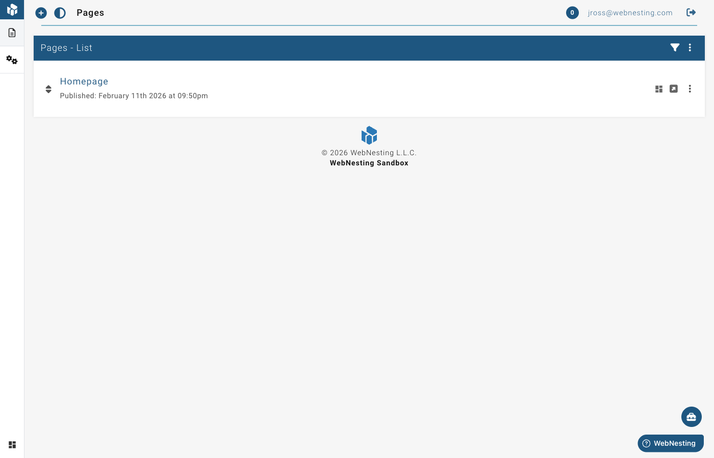

# Managing Pages

**Last verified:** 2026-09-06 4:12pm

Pages are the foundation of your website. Each page on your site has its own web address (URL) and contains the content your visitors see. This guide walks you through everything you need to know about creating, organizing, and managing your pages in WebNesting.

---

## Viewing All Your Pages

When you log in to your WebNesting dashboard, you can see all of your pages in one place.

1. Open your WebNesting dashboard.
2. Click **Pages** in the left sidebar.
3. You will see a list of all your pages, including their titles, URLs, and current status.

Each page in the list shows:

- **Title** -- The name of the page.
- **URL** -- The web address where the page lives.
- **Status** -- Whether the page is a draft or published.
- **Last Updated** -- When the page was last changed.

> **Tip:** If you have many pages, use the search bar at the top of the page list to quickly find the one you need.

---

## Creating a New Page

Adding a new page to your site takes just a few steps.

1. Go to the **Pages** section from the left sidebar.
2. Click the **New Page** button.
3. Enter a **Page Title**. This is the name visitors will see at the top of the page and in their browser tab.
4. Set the **URL Slug**. This is the part of the web address that comes after your domain name. For example, if your domain is `yoursite.com` and the slug is `about`, the page address will be `yoursite.com/about`.
5. Choose a **Layout**. Layouts control the overall structure of your page, such as whether it has a sidebar, a full-width design, or a specific header and footer style.
6. Click **Create Page**.

Your new page is now ready. It will start as a draft, so it will not be visible to the public until you publish it.

Every page needs its own slug. If you enter one that another page already uses, you'll see a message under the field and can pick a different one.

> **Tip:** Keep your URL slugs short and descriptive. Use lowercase letters and hyphens instead of spaces. For example, `our-team` is better than `Our Team Page 2024`. URL slugs should use lowercase letters and hyphens. Avoid special characters, spaces, or very long slugs.

---

## Editing a Page

You can update any page's basic information at any time.

1. Go to the **Pages** section.
2. Find the page you want to edit in the list.
3. Click on the page name, or click the **Edit** option next to it.
4. Update the page title, URL slug, layout, or any other settings.
5. Save your changes.

To edit the actual content of the page (text, images, sections), you will use the Website Builder. See the "Opening a Page in the Website Builder" section below.

---

## Draft vs. Published Pages

Every page has a status that controls whether your visitors can see it.

- **Draft** -- The page is only visible to you in the dashboard. Visitors to your website cannot see it. Use drafts when you are still working on a page and it is not ready yet.
- **Published** -- The page is live on your website and anyone can visit it.

### How to Change a Page's Status

1. Go to the **Pages** section.
2. Find the page you want to update.
3. Click the page to open its settings.
4. Change the status from **Draft** to **Published**, or from **Published** back to **Draft**.
5. Save your changes.

> **Tip:** If you need to make big changes to a live page, consider switching it to draft first. Make your updates, then publish it again when everything looks right.

---

## Organizing Pages with Parent and Child Hierarchy

As your website grows, you may want to group related pages together. WebNesting lets you create a parent-child structure, which means you can nest pages under other pages.

For example, you might have a top-level page called "Services" with child pages for each service you offer:

- Services
  - Web Design
  - SEO
  - Consulting

Child pages appear beneath their parent page in your site's navigation and in the page list.

### How to Set a Parent Page

1. Go to the **Pages** section.
2. Click on the page you want to nest under another page.
3. Look for the **Parent Page** setting.
4. Select the page you want to use as the parent.
5. Save your changes.

The child page's URL will update to reflect the hierarchy. For example, the "Web Design" page might have the address `yoursite.com/services/web-design`.

### How to Remove a Parent Page

1. Open the child page's settings.
2. Clear the **Parent Page** field or set it to "None."
3. Save your changes.

The page will move back to the top level.

---

## Reordering Pages

You can control the order in which your pages appear in navigation menus and the page list.

1. Go to the **Pages** section.
2. Drag and drop pages to rearrange them in your preferred order.
3. Your new order is saved automatically.

If a page has child pages, you can also reorder the children within their parent group using the same drag-and-drop method.

> **Tip:** The order you set here is often used in your site's navigation menu. Check your live site after reordering to make sure everything looks right.

---

## Searching and Filtering Pages

When you have many pages, searching and filtering makes it easy to find exactly what you need.

### Searching

1. Go to the **Pages** section.
2. Type a word or phrase into the **Search** bar at the top of the page list.
3. The list will update to show only pages that match your search.

### Filtering

1. Look for filter options near the search bar or at the top of the page list.
2. Filter by **Status** to see only draft pages or only published pages.
3. Filter by **Layout** to see pages that use a specific layout.
4. Combine filters to narrow your results further.

---

## Deleting a Page

If you no longer need a page, you can delete it.

1. Go to the **Pages** section.
2. Find the page you want to delete.
3. Click the **Delete** option next to the page (or open the page and look for a delete button).
4. Confirm that you want to delete the page.

The page will be removed from your page list and will no longer be visible on your site.

### Pages That Cannot Be Deleted or Moved

Some pages are essential to your site working properly -- your homepage, your "page not found" page, and other built-in pages. These are protected: you will not be able to delete or unpublish them, so they cannot be removed by accident.

Their web address is fixed as well. When you open one of these pages, the **Page URI** field shows its current value with a note that it can't be changed, and you can't nest the page under another page (which would change its address). Everything else about the page -- its title, layout, content, and search settings -- can still be edited as usual.

### Restoring a Deleted Page

Accidentally deleted a page? You may be able to bring it back.

1. In the **Pages** section, look for a **Trash** or **Deleted Pages** area.
2. Find the page you want to restore.
3. Click **Restore**.
4. The page will return to your page list as a draft.

> **Tip:** Deleted pages are kept, not purged on a timer, so you can restore one long after you removed it. If you are unsure about deleting a page, consider switching it to draft status instead -- that hides it from visitors while keeping it in your normal page list.

---

## Opening a Page in the Website Builder

The Website Builder is where you design and edit the actual content of your pages -- adding text, images, buttons, sections, and more.

1. In the site menu on the left, click **Website Builder** (at the bottom of the panel, next to **Widgets**).
2. Once the builder opens, click **Pages** in the icon rail on the right.
3. Click the page you want to design.
4. The page loads on the canvas, ready to edit.

From the builder, you can visually add and arrange content. When you are finished, save your work.

> **Tip:** You never need to come back here to switch pages -- the builder's Pages panel lets you jump between pages, and create new ones, without leaving it.
