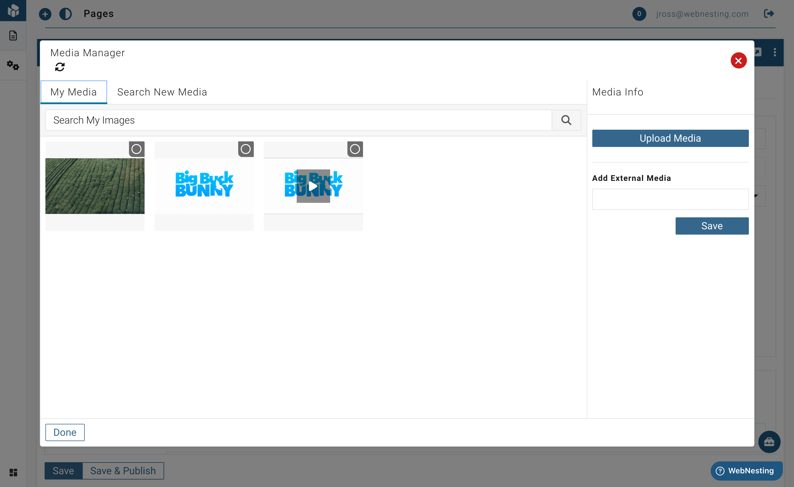

# Files (File Manager)

**Last verified:** 2026-08-31 12:10pm

The File Manager is where every file in your workspace lives — images, videos, documents, helpdesk email attachments, and files visitors upload through your forms. Think of it as your workspace's file cabinet: one place, organized in folders, just like the files on your computer.

---

## Where to Find Your Files

There are two ways to open the File Manager:

- **The Files button** — Click **Files** in the top bar of your workspace. It opens the File Manager from anywhere, for organizing, uploading, and cleaning up.
- **The picker** — Whenever you choose an image or file somewhere (in the website builder, in a page's settings, or when attaching files to a [Helpdesk](helpdesk.md) reply), the same File Manager opens so you can pick a file.

Both show the same files and folders.

---

## How Your Files Are Organized

Everything starts at **Root** — the top of your workspace's file tree. Inside it you'll see:

- **A folder for each of your sites** — files that belong to a specific website.
- **Your own folders** — create as many as you like, nested however you like.
- **Managed folders** (marked with a small lock) — folders WebNesting creates and manages for you:
  - **Helpdesk** — attachments from emails your customers send to your support inbox land here automatically.
  - **Form Uploads** — files visitors upload through your forms, organized by form.

Managed folders can't be renamed or deleted (files land in them automatically), but you can open them, download from them, and even store your own files in them.

---

## Uploading Files

1. Open **Files** from the top bar.
2. Navigate to the folder you want the files in (or stay at Root).
3. Click **Upload files** and choose one or more files — or simply drag files from your computer into the window.
4. Watch the progress bar; your files appear as soon as they finish.

> **Tip:** Files you upload into the Helpdesk or Form Uploads folders are automatically kept private, since those folders usually hold customer information.

---

## Working with Folders

- **Create a folder:** Click the **+** next to "Folders" in the sidebar. The new folder is created wherever you're currently browsing.
- **Rename a folder:** Hover over the folder in the sidebar and click the pencil. Everything inside moves with it.
- **Delete a folder:** Hover over the folder and click the ×. You'll be asked what should happen to the files inside:
  - **Keep files (move them up one level)** — the folder disappears, the files don't.
  - **Delete files too** — removes the folder and everything in it.

---

## Moving and Renaming Files

- **Drag and drop:** Drag any file onto a folder — either a folder tile in the main area or a folder in the sidebar tree. Select several files first to move them together.
- **The Move button:** Click a file, then click **Move** in the detail panel and pick a destination from the folder list.
- **Rename:** Click a file, then click the pencil next to its filename in the detail panel. Renaming changes how the file appears in your library — links to it keep working.

When you select more than one file, a bar appears above the grid with **Move to folder…** and **Delete** for the whole selection.

---

## Viewing File Details

Click any file to open its detail panel, showing:

- A preview of the file.
- Editable **Title**, **Alt Text**, and **Description** (changes save automatically).
- The file's name, size, type, and upload date.
- Where the file came from — for example "Email attachment (Helpdesk)" or "Form upload".
- Its virus-scan status.
- **Referenced by** — the helpdesk tickets or form submissions this file is attached to, with links to jump straight there.

> **Tip:** Always add alt text to your images. It makes your site more accessible to people using screen readers, and it can improve your search engine ranking.

---

## Private and Public Files

Every file is either **public** or **private**:

- **Public** files can appear on your published websites — page images, backgrounds, downloads.
- **Private** files (marked with a lock) are never publicly reachable. Helpdesk attachments and form uploads are always private; you can also make your own uploads private from the detail panel.

When you're picking a file for a public page (for example in the website builder), private files appear greyed out — they can't be placed on a public site.

---

## Virus Scanning

Every file is scanned for viruses, but the rules differ by where it came from:

- **Files from outside** — helpdesk email attachments and form uploads — stay locked until their scan comes back clean. While scanning (or if a scan flags a problem), they show a badge and can't be downloaded or picked.
- **Files you upload** are usable immediately — the scan runs in the background, and a file is only locked afterwards if something is found.

Either way, a flagged file is quarantined everywhere at once.

---

## Deleting Files

1. Click the file you want to delete.
2. Click **Delete** in the detail panel and confirm.

If the file is attached to a helpdesk ticket or a form submission, WebNesting keeps a small record so the ticket or submission can show "Attachment was deleted" instead of breaking — but the file itself (and its storage usage) is gone.

**Important:** If a file is used on a page of your site, deleting it will leave a broken image or missing file in its place. Check the file's "Referenced by" list first.

---

## Supported File Types

WebNesting supports a wide range of file types:

### Images
- JPEG / JPG
- PNG
- GIF
- SVG
- WebP

### Videos
- MP4
- WebM

### Documents
- PDF, Word, Excel, PowerPoint
- Plain text and CSV
- ZIP archives

> **Tip:** When in doubt, JPEG and PNG are the safest choices for images. Use JPEG for photographs and PNG for graphics with transparent backgrounds.

---

## Tips for Optimizing Images for the Web

Large, unoptimized images are one of the most common reasons websites load slowly. Here are some simple ways to keep your site fast:

### Resize Before Uploading

If your image is 4000 pixels wide but it only appears in a 600-pixel-wide space on your page, resize it before uploading. For most page images, 1200 pixels wide is a good target. Hero images and full-width banners may need to be 1600-1920 pixels wide.

### Choose the Right Format

- **JPEG** -- Best for photographs and complex images with many colors.
- **PNG** -- Best for graphics, logos, and images that need transparent backgrounds.
- **WebP** -- A modern format that offers excellent quality at smaller file sizes. WebNesting converts uploaded images to WebP automatically where possible.
- **SVG** -- Perfect for logos, icons, and simple graphics.

### Compress Your Images

Use a free online tool like TinyPNG or Squoosh to compress images before uploading.

### Use Descriptive File Names

Instead of `image1.jpg`, name your file something meaningful like `homepage-hero-banner.jpg`. Easier to search for, better for your ranking.

> **Tip:** Aim to keep most images under 300 KB. Hero images and full-width banners can be up to 500 KB.
