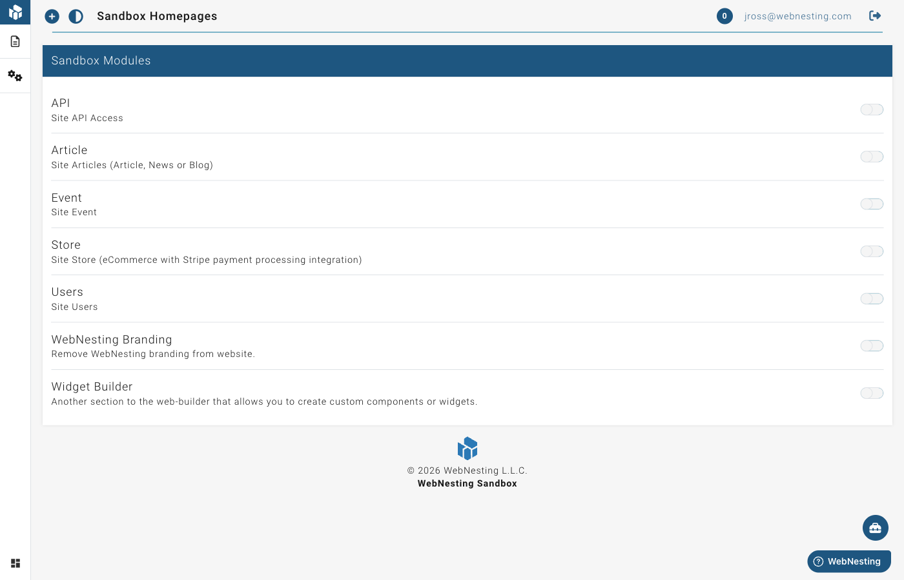

# Modules and Features

**Last verified:** 2026-08-31 12:10pm

Modules are add-on features you can turn on for your website. Think of them like apps you install on your phone -- each one adds new abilities to your site.

Your site starts with the basics: pages, media uploads, and user management. When you need more, you enable a module, and new tools appear in your dashboard right away.

---

## What Are Modules?

A module is a feature pack that adds a whole new section to your website. For example, the Articles module gives you everything you need to run a blog. The E-Commerce module lets you sell products online.

You only pay for the modules you actually use. If you do not need a blog, do not enable the Articles module -- and you will not be charged for it.

---

## Viewing Available Modules

To see all the modules you can add to your site:

1. Log in to your dashboard.
2. In the site menu on the left, open **Settings** and click **Modules**.
3. You will see a list of all available modules, showing which ones are currently turned on and which are off.

Each module shows its name, a short description of what it does, and its monthly cost.

---

## How to Enable a Module

Turning on a module takes just a few seconds:

1. Go to **Settings → Modules** in your site menu.
2. Find the module you want to enable.
3. Click the **Enable** button next to it.
4. The module will activate immediately.

Once a module is enabled, new menu items will appear in your dashboard. For example, enabling the Articles module adds an "Articles" section where you can create and manage blog posts.

> **Tip:** You can enable and disable modules at any time. There are no long-term commitments.

---

## How to Disable a Module

If you no longer need a module:

1. Go to **Settings → Modules** in your site menu.
2. Find the module you want to turn off.
3. Click the **Disable** button next to it.
4. The module will be deactivated.

When you disable a module, its menu items will disappear from your dashboard. Your content is not deleted -- if you re-enable the module later, everything will still be there.

> **Tip:** Disabling a module stops the monthly charge for it on your next billing cycle.

---

## Module Pricing

Modules use simple, predictable pricing. Each module has a flat monthly fee that is the same regardless of how much you use it.

Here is how it works:

- **You are only charged for modules you have enabled.** If a module is off, it costs nothing.
- **Charges are calculated based on how long a module is active.** If you enable a module halfway through the month, you only pay for the time it was on.
- **Module fees appear on your monthly bill.** You can see a breakdown of all charges in your billing section.

> **Tip:** Visit the **Billing** section of your account to see exactly what you are being charged for each month.

---

## Available Modules

Here is a summary of each module you can add to your site.

### Articles

**Monthly cost:** $5/month

The Articles module adds a full blogging and news section to your site. Use it to publish blog posts, company news, updates, or any written content you want to share with your visitors.

What you get when you enable it:
- An **Articles** section in your dashboard to create and manage posts
- A blog page on your published website where visitors can read your articles
- Tools for organizing articles with categories and tags

### E-Commerce (Store)

**Monthly cost:** $20/month

The E-Commerce module turns your website into an online store. Sell physical or digital products, manage orders, and track your sales.

What you get when you enable it:
- A **Store** section in your dashboard for managing products
- Product pages on your published website
- Order management tools
- Support for product details like pricing, descriptions, and images

### Events

**Monthly cost:** $5/month

The Events module lets you create and manage event listings on your site. Perfect for businesses that host classes, workshops, meetups, or any kind of gathering.

What you get when you enable it:
- An **Events** section in your dashboard
- Event pages on your published website
- Tools for adding event details like dates, times, and descriptions

### Event Showings and Ticketing

When you enable the Events module, you also get support for event showings and ticketing. This lets you:

- Set up multiple dates and times for the same event
- Manage ticket types and availability
- Track registrations

> **Tip:** Event showings and ticketing are included with the Events module at no extra cost.

### Email Marketing (Workspace Product)

**Monthly cost:** $20/month base + per-email pricing once you exceed the free allowance

Email marketing is a **workspace product**, not a site module. You enable it at the workspace level and it works across every site in the workspace.

What you get when you enable it:
- A **Marketing** section in your workspace sidebar for managing contacts, lists, tags, campaigns, templates, and settings
- An **Email Signup** component in the website builder for adding newsletter signup forms to any page
- Contact import from CSV files
- Double opt-in email confirmation
- Automatic unsubscribe handling

Your first **10,000 marketing emails each month are free**. After that, sending costs **$0.70 per 1,000 emails**. Workspace contacts are billed separately, once for the whole workspace, at $10 per 1,000 contacts per month (first 50 free).

> **Tip:** If you also have the Forms module enabled on your site, form submissions can automatically create workspace contacts -- no manual data entry needed. See the [Email Marketing guide](../content-modules/email-marketing.md) and [Workspace Products](workspace-products.md) for details.

### Forms

**Monthly cost:** $10/month

The Forms module lets you build custom forms for your website -- contact forms, surveys, registration forms, feedback forms, and more. Includes conditional logic, multi-page forms, file uploads, reCAPTCHA, webhooks, and submission management.

What you get when you enable it:
- A **Form** section in your dashboard for building and managing forms
- A **Form Embed** component in the website builder for adding forms to any page
- Submission tracking with filtering, status management, and CSV export
- Email notifications when forms are submitted
- Built-in form templates to get started quickly

> **Tip:** When both Forms and Email Marketing are enabled, form submissions automatically flow into your marketing contacts. This is one of the easiest ways to grow your email list.

### API & AI Access (Workspace Product)

**Monthly cost:** $10/month base + usage

API & AI Access is a **workspace product**, not a site module -- you enable it once at the workspace level and it covers every site in the workspace. It gives you access tokens for the REST API, so your own code and other systems can read and write your content programmatically.

What you can do with it:

- **Read content** -- Pull pages, articles, products, events, and other content from your sites into external applications.
- **Write content** -- Create or update content from external tools, such as syncing product information from an inventory system.
- **Integrate with other platforms** -- Connect WebNesting to CRM systems, marketing tools, custom mobile apps, or other business software.

Common use cases:

- Displaying your WebNesting content on a separate mobile app or kiosk
- Syncing product data between your online store and a point-of-sale system
- Automatically creating articles or events from an external content workflow

Beyond the base fee you are charged for API requests (first 50,000 each month free), data transfer (first 1 GB each month free), and active API tokens (first 5 free). Two optional add-ons are available: a higher rate limit and extended audit-log retention.

> **Tip:** Connecting an AI assistant (Claude, ChatGPT, Cursor, and similar) is a **separate, free** feature -- it does not need this product and is not metered. See [Connecting an AI Tool](connecting-ai-tools.md).

### Widget Builder

**Monthly cost:** $20/month

The Widget Builder lets you create custom, reusable components in the Website Builder. Once created, widgets can be dragged onto any page, making it easy to maintain consistent elements like call-to-action sections, testimonial blocks, or pricing cards across your site.

What you get when you enable it:
- A **Widget Builder** section in your dashboard
- Tools for designing and configuring custom widgets
- The ability to place widgets on any page of your site

### Remove Branding

**Monthly cost:** $5/month

The Remove Branding module removes WebNesting branding from your published website, giving it a fully custom, professional look.

---

## What Happens When You Enable a Module

When you turn on a module, a few things happen right away:

1. **New menu items appear.** You will see new sections in your dashboard sidebar for managing the module's content.
2. **New page types become available.** In the website builder, you can create pages that use the module's features (like product pages or blog post pages).
3. **Your billing is updated.** The module's monthly fee starts counting from the moment you enable it.

There is no setup process or waiting time. Modules are ready to use the instant you enable them.

> **Tip:** If you are not sure whether a module is right for you, enable it and try it out. You can always disable it later, and you will only be charged for the time it was active.
