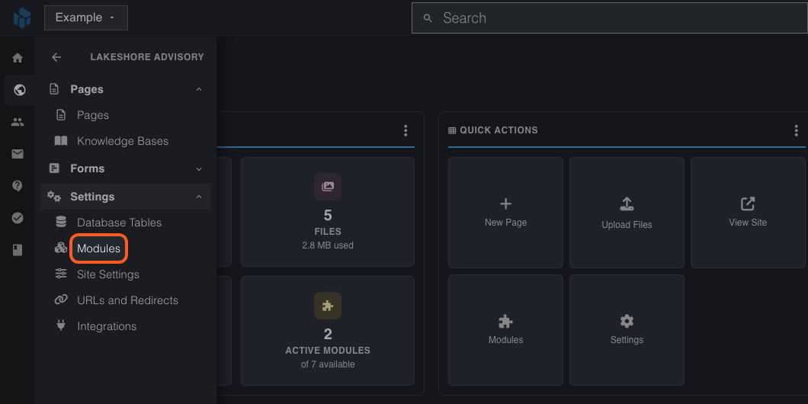
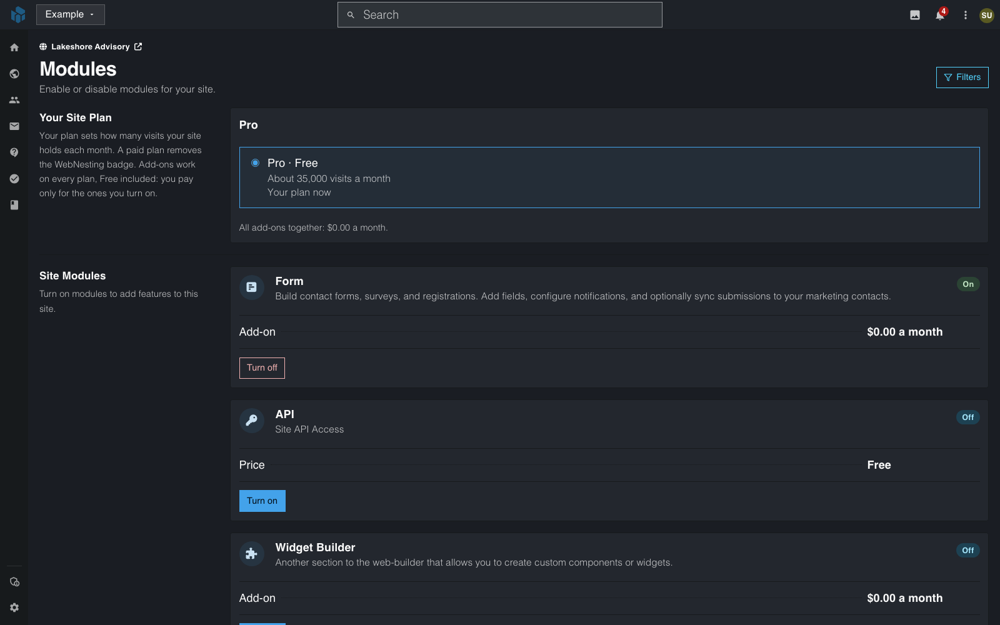
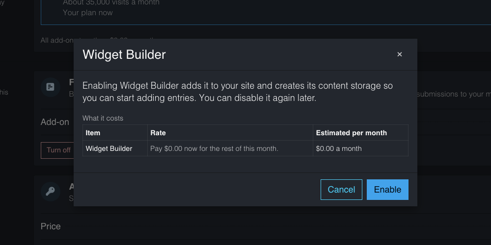

# Modules and Features

**Last verified:** 2026-11-07 10:33am

Modules are add-on features you can turn on for your website. Think of them like apps you install on your phone -- each one adds new abilities to your site.

Your site starts with the basics: pages, media uploads, and user management. When you need more, you enable a module, and new tools appear in your dashboard right away.

---

## What Are Modules?

A module is a feature pack that adds a whole new section to your website. For example, the Articles module gives you everything you need to run a blog. The E-Commerce module lets you sell products online.

You only pay for the modules you actually use. If you do not need a blog, do not enable the Articles module -- and you will not be charged for it.

---

## Viewing Available Modules

To see all the modules you can add to your site:

1. Log in to your dashboard.
2. In the site menu on the left, open **Settings** and select **Modules**.
3. You will see a list of all available modules, showing which ones are currently turned on and which are off.

At the top, **Your Site Plan** shows the plan this site is on and how many visits it holds each month. **All add-ons together** under it is what the site's add-ons cost a month. To change the plan, pick another plan card. The button under the cards says what will happen before you confirm. Prices in the picture read $0.00 because the Example workspace has its add-ons included. Your page shows your own prices.

Each module is shown as a card with its name, a short description of what it does, its **Off** or **On** state, and its price. The cards are **Form**, **API** (Site API Access), **Widget Builder**, **Article**, **Event**, **Store** and **Accounts**. A **Filters** button lets you narrow the list by status.

The "Powered by WebNesting" badge is not a module. A site on a paid Websites plan never shows it. A site on the Free plan shows it.

---

## How to Enable a Module

Turning on a module is a quick, two-step confirmation -- you see exactly what it costs before anything is turned on:

1. Go to **Settings** > **Modules** in your site menu.
2. Find the module you want to enable and select **Turn on**.
3. A window shows **What it costs** before anything happens.

4. Select **Enable** to confirm, or **Cancel** to back out. Once you confirm, the module activates right away.

Once a module is enabled, new menu items will appear in your dashboard. For example, enabling the Articles module adds an "Articles" section where you can create and manage blog posts.

> **Tip:** You can enable and disable modules at any time. There are no long-term commitments.

---

## How to Disable a Module

If you no longer need a module:

1. Go to **Settings → Modules** in your site menu.
2. Find the module you want to turn off and click **Turn off**.
3. A confirmation window explains exactly what will happen: how many entries are kept, the date they would be deleted, and that its pages come off your public site while it's off.
4. Click **Turn off** again to proceed, or **Keep it on** to change your mind.

The module's card then shows a banner counting down the days until its content is deleted, with **Turn back on** (restores the module and its content, as long as it's before the deletion date), **Download a copy** (we email you a link to a copy of the module's content and its pages, valid for 7 days) and **Delete now** (deletes the content right away -- you'll be asked to type your site's name, because this can't be undone). The card's own **Turn on** button does the same thing as **Turn back on**.

> **Important:** Disabling a module removes it from your site menu. Its content is **permanently deleted after 30 days** -- turn the module back on before then to keep it; turning it on after that starts it empty. (A capability like Accounts stores no content, so there is nothing to keep or delete.)

---

## Module Pricing

Site modules are add-ons with a flat monthly price for each site, the same however much you use them. Any site can turn an add-on on, a site on the Free plan too. A Free site stays on Free and pays only for its add-ons.

Here is how it works:

- **You are only charged for modules you have enabled.**
- **Turn one on partway through the month** and you pay only for the days left. After that it renews on the 1st with your other plans.
- **All add-ons together** cost $15 a month for each site. If a site has the pack, turning on another add-on costs nothing more.
- **Add-on prices appear on your plan invoice.**

> **Tip:** Visit the **Billing** section of your account to see exactly what you are being charged for each month.

**Website bandwidth comes with your Websites plan, not with modules.** It is the data one site sends to its visitors: pages, pictures, videos and files. Each site has its own included bandwidth. You do not turn it on or off. The **Usage** page shows it, with the files that sent the most. To lower it, embed long videos from YouTube or Vimeo. See [Website bandwidth](billing-and-usage.md#website-bandwidth).

---

## Available Modules

Here is a summary of each module you can add to your site.

### Articles

**Monthly cost:** $3/month for each site (the Blog add-on)

The Articles module adds a full blogging and news section to your site. Use it to publish blog posts, company news, updates, or any written content you want to share with your visitors.

What you get when you enable it:
- **Articles** under **Pages** in your site menu, to create and manage posts
- **Article List** and **Article Detail** blocks in the website builder, to show your posts on your site
- An article type for each post: **Article**, **News Article** or **Blog Posting**

### E-Commerce (Store)

**Monthly cost:** $10/month for each site

The E-Commerce module turns your website into an online store. Sell physical or digital products, manage orders, and track your sales.

What you get when you enable it:
- A **Store** section in your site menu, with **Products** and **Orders**
- **Product List** and **Product Detail** blocks in the website builder
- Product details like price, description, SKU, inventory and images
- A place to record orders yourself. Online checkout is not available yet.

### Events

**Monthly cost:** $3/month for each site

The Events module lets you create and manage event listings on your site. Perfect for businesses that host classes, workshops, meetups, or any kind of gathering.

What you get when you enable it:
- **Events** under **Pages** in your site menu
- **Event List** and **Event Detail** blocks in the website builder
- Tools for adding event details like dates, times, and descriptions

### Event Showings and Ticketing

When you enable the Events module, you also get support for event showings and ticketing. This lets you:

- Set up multiple dates and times for the same event
- Add ticket types, each with a title, a description, on-sale dates and a link where people can buy

> **Tip:** Event showings and ticketing are included with the Events module at no extra cost.

### How events look on your site

Events are laid out the way concert halls and venues show them, in your theme's colors, fonts and card style.

- **Event List** shows a grid of cards. Each card has the event's first picture, a calendar badge with the date, the title and tagline, a status such as **On sale now**, and **Buy tickets** and **More info** buttons.
- Choose which events a list shows with its **Show** setting: **Upcoming** (the start), **Past** or **All**. An upcoming event has a date still to come, or no date yet. For a "Past events" page, add an Event List block and set **Show** to **Past**. Past events are greyed out.
- **Views visitors can pick** sets how visitors see the events: **Grid** (cards), **List** (one row per event) and **Calendar** (a month at a time, with arrows to the months before and after). Pick two or more and visitors get a button for each. Pick one and no buttons show. **Opens in** picks the view a visitor sees first. That view always shows, even when you did not tick it, and then it gets a button too. On a phone, the calendar shows only the days that have events, as a list.
- **Events at a time** sets how many events show first (12 to start). **More events** sets how visitors see the rest: a **Load more events** button (the start), **Page numbers**, **Load as visitors scroll**, or **None** to show only the first ones.
- The list's **Theme color** (**Primary** or **Secondary**) changes the color of the dates, the buttons and the view buttons. It adds no background behind the cards.
- **Event Detail** shows the event's own page. It has a large picture, the dates, and a ticket box with the time and the **Buy tickets** button. Below them come the description, the rest of the pictures (click one to see it full size), and a list of every date with its own ticket buttons.
- A ticket with an on-sale date in the future shows **On sale** with that date until sales open. A ticket with no link shows **No ticket needed**, which suits a free event.
- Each event's page uses the **Event** layout. The Event Detail block is already on it, so a new event's page shows its details with nothing more to add. Set the page's **Layout** to **Event** to use it.

### Email Marketing (Workspace Product)

**Monthly cost:** $8, $29 or $59 a month, by the emails you send

Email marketing is a **workspace product**, not a site module. You enable it at the workspace level and it works across every site in the workspace.

What you get when you enable it:
- A **Marketing** section in your workspace sidebar for managing contacts, lists, tags, campaigns, templates, and settings
- An **Email Signup** component in the website builder for adding newsletter signup forms to any page
- Contact import from CSV files
- Automatic unsubscribe handling

**Starter includes 10,000 emails a month, Growth 50,000 and Pro 125,000.** The emails start over on the 1st. When they are used up, prepaid credits pay for more, at $0.90 per 1,000 emails. Contacts are unlimited on every plan. See [Usage and Billing](../account/usage-and-billing.md).

> **Tip:** If you also have the Forms module enabled on your site, a form can add everyone who fills it in to your workspace contacts once you turn on **Create Contact** for that form -- no manual data entry needed. See the [Email Marketing guide](../content-modules/email-marketing.md) and [Workspace Products](workspace-products.md) for details.

### Forms

**Monthly cost:** $3/month for each site

The Forms module lets you build custom forms for your website -- contact forms, surveys, registration forms, feedback forms, and more. Includes conditional logic, multi-page forms, file uploads, reCAPTCHA, webhooks, and submission management.

What you get when you enable it:
- A **Forms** section in your site menu for building and managing forms
- A **Form** block in the **Site modules** group of the website builder for adding forms to any page
- Submission tracking with filtering and status management. On a form's **Submissions** tab, click **Export CSV** to download the answers (newest first, with the labels your visitors saw) for Excel or Google Sheets
- Email notifications when forms are submitted, and an automatic reply to the person who filled in the form (up to 100 automatic replies a day per site; over that, the submission is still saved and you still get your own email)
- Built-in form templates to get started quickly
- An **Analytics** page for each form (the **Analytics** button on the form's **Submissions** tab) that shows which sources and campaigns bring you signups, such as "facebook · social" ([how to tag your links](analytics.md#tag-your-links-to-see-where-visitors-come-from))

> **Tip:** When both Forms and Email Marketing are enabled, form submissions automatically flow into your marketing contacts. This is one of the easiest ways to grow your email list.

### API Access (Workspace Product)

**Monthly cost:** Free, or $10, $29 or $89 a month by the requests and data you need

API Access is a **workspace product**, not a site module -- you enable it once at the workspace level and it covers every site in the workspace. It gives you access tokens for the REST API, so your own code and other systems can read and write your content programmatically.

What you can do with it:

- **Read content** -- Pull pages, articles, products, events, and other content from your sites into external applications.
- **Write content** -- Create or update content from external tools, such as syncing product information from an inventory system.
- **Integrate with other platforms** -- Connect WebNesting to CRM systems, marketing tools, custom mobile apps, or other business software.

Common use cases:

- Displaying your WebNesting content on a separate mobile app or kiosk
- Syncing product data between your online store and a point-of-sale system
- Automatically creating articles or events from an external content workflow

Any workspace with a paid plan can make 25,000 API requests a month with no API plan. Starter includes 100,000 requests and 10 GB of data a month, Growth 300,000 requests and 30 GB, and Pro 1,000,000 requests and 100 GB. Growth and Pro keep your audit log longer, and Pro has a higher rate limit. Past the included amount, prepaid credits pay for more. Active API tokens are unlimited.

> **Tip:** Connecting an AI assistant (Claude, ChatGPT, Cursor, and similar) is a **separate, free** feature -- it does not need this product and is not metered. See [Connecting an AI Tool](connecting-ai-tools.md).

### Widget Builder

**Monthly cost:** $5/month for each site

The Widget Builder lets you create custom, reusable components in the Website Builder. Once created, widgets can be dragged onto any page, making it easy to maintain consistent elements like call-to-action sections, testimonial blocks, or pricing cards across your site.

What you get when you enable it:
- **Widgets** at the bottom of your site menu, where you design and manage custom widgets
- Tools for designing and configuring custom widgets
- The ability to place widgets on any page of your site

### Accounts

**Monthly cost:** free

Accounts let visitors create an account on your site and sign in. It is off until you turn it on, so a site without it has no sign-up form at all.

What you get when you turn it on:
- Starter pages created for you with the forms already on them: **Login**, **Register**, **Forgot Password**, **Reset Password**, **Account** (security settings and leaving the site), and **Sign-in Code** (for two-factor sign-in)
- Every one of those forms is a **website builder component**, so you can move it to any page you like, rename the pages, and redesign everything — sign-in redirects and the links in confirmation emails follow your pages automatically. The sign-up form includes an email opt-in checkbox for your marketing
- The option to restrict any page to signed-in visitors only
- Everyone who signs up appears in your **Contacts**, alongside the people who fill in your forms

A few things worth knowing:
- **One account works across all your websites.** If you run several sites in the same workspace, a person signs up once and uses the same password everywhere -- but they still have to confirm by email before they can sign in to each additional site, so one site's audience never quietly becomes another's.
- **Sign-ups cost nothing.** People who sign up are contacts, and contacts are unlimited on every plan.
- **Turning it off leaves your pages alone.** Your Login and Register pages stay exactly as you designed them; visitors just can't sign in any more. Nobody is removed from your contacts.

---

## What Happens When You Enable a Module

When you turn on a module, a few things happen right away:

1. **New menu items appear.** You will see new items in your site menu for managing the module's content.
2. **New page types become available.** In the website builder, you can create pages that use the module's features (like product pages or blog post pages).
3. **Your billing is updated.** The add-on's price is charged for the days left in the month, then renews on the 1st.

There is no setup process or waiting time. Modules are ready to use the instant you enable them.

> **Tip:** If you are not sure whether a module is right for you, enable it and try it out. If it's not a fit, disable it -- just remember its content is permanently deleted after 30 days unless you turn it back on.
