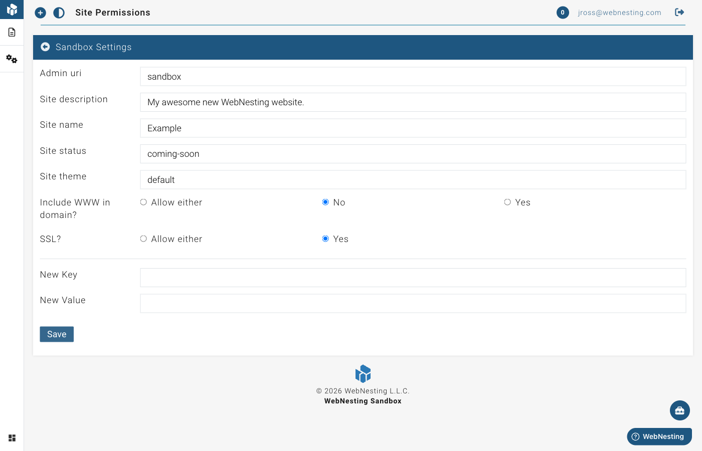

# Site Settings

**Last verified:** 2026-09-05 2:36pm

Site Settings is where you control the behind-the-scenes details of your website -- things like your logo, search engine preferences, analytics, and social media links. Most of these are "set it and forget it" options that you configure once when you build your site.

---

## Where to Find Site Settings

1. Open your WebNesting dashboard.
2. In the site menu, open **Settings** and click **Site Settings**.
3. You will see several sections organized by category. Click on any section to expand it and make changes.

---

## SEO Settings

SEO stands for Search Engine Optimization. These settings help search engines like Google understand your site and display it correctly in search results.

All of these live on the **SEO Defaults** page: go to **Site Settings** and click **SEO Defaults**.

### Title

This is the name that appears in browser tabs and in search engine results for pages that do not have their own custom title.

1. On the **SEO Defaults** page, find the **Title** field.
2. Enter a clear, descriptive title for your website. For example: "Smith & Co. Accounting -- Tax Services in Portland."
3. Save your changes.

You can insert your site's name or the current page's title automatically by typing `{{ site.name }}` or `{{ page.title }}`. For example, `{{ site.name }} | {{ page.title }}` shows as "Smith & Co. Accounting | About Us" on your About Us page.

> **Tip:** Keep your title under 60 characters so it does not get cut off in search results.

### Description

This is the short summary that appears below your site's title in search engine results. It helps visitors decide whether to click through to your site.

1. On the **SEO Defaults** page, find the **Description** field.
2. Write a brief, compelling description of your website (one to two sentences). The same `{{ site.name }}` and `{{ page.title }}` shortcuts work here.
3. Save your changes.

> **Tip:** Write a description between 120 and 160 characters. Include your most important keywords naturally -- do not stuff keywords in unnaturally.

### Image (social sharing image)

When someone shares a link to your site on social media (Facebook, LinkedIn, X, etc.), this image appears alongside the link for any page that has no image of its own. It is sometimes called an OG image (Open Graph image).

1. On the **SEO Defaults** page, find the **Image** setting.
2. Click to choose an image from your File Manager, or upload a new one.
3. Save your changes.

> **Tip:** Use an image that is at least 1200 x 630 pixels for the best results across all platforms.

### Hiding Your Site from Search Engines

If your site is not ready for the public yet (for example, if you are still building it), you can tell search engines not to list any of its pages.

1. On the **SEO Defaults** page, find **Hide site from search engines**.
2. Choose **Yes -- hide my whole site**. Because this affects every page, WebNesting asks you to confirm before it takes effect.
3. Save your changes.

While it is on, the setting shows a warning reminding you that the site is hidden, and your site tells search engines not to index it in two ways: its `robots.txt` file blocks everything, and every page carries a "noindex" instruction. Visitors can still open the site by typing its address.

**Important:** Remember to switch this back to **No** when your site is ready to launch. If you leave it on, people will not be able to find your site through Google or other search engines.

> **Tip:** This is a request that search engines honor, not a lock. Most major search engines respect it, but it is not a guarantee, and pages already listed can take a while to drop out of results.

### Sitemap Address Preferences

A sitemap is a file that lists all the pages on your site (at `yoursite.com/sitemap.xml`). Search engines use it to find and index your content more efficiently. WebNesting generates it for you automatically and keeps it up to date whenever you add, change, or remove pages.

Two settings control how the addresses inside it are written:

- **Sitemap urls with ssl enabled** -- choose **Yes** if your site uses a secure `https://` address (recommended once your custom domain has its certificate).
- **Sitemap urls with "www"** -- choose **Yes** if you want the listed addresses to start with `www.`

Pick the form that matches how visitors actually reach your site so search engines see one consistent address for every page.

---

## Google Settings

WebNesting makes it easy to connect your site to Google's tools for tracking visitors and understanding how people use your site. These settings are found under **Third Party Config Settings** in the Settings page.

### Connecting Google Analytics

Google Analytics shows you detailed information about your visitors -- how many people visit, where they come from, which pages they view, and more.

WebNesting supports two ways to connect Google Analytics:

**Option 1 -- Connect with a Google account (recommended).** This uses OAuth to authorize WebNesting to read your GA4 property data so it can show analytics charts directly in your site dashboard.

1. Go to **Site Settings** and open the **Third Party Config Settings** section, then click **Google Config Settings**.
2. Click the **Connect Google Account** button next to Google Analytics.
3. Sign in with the Google account that owns your GA4 property and approve the requested access.
4. Pick the GA4 property you want to connect from the list.

**Option 2 -- Add the tracking ID manually.** Use this if you only want WebNesting to inject the GA tracking snippet into your pages.

1. In the **Google Config Settings** screen, find the **Analytics Tracking ID** field.
2. Enter your Google Analytics tracking ID. The input shows a `UA-` prefix for legacy properties; for a modern GA4 property, your measurement ID looks like `G-XXXXXXXX`.
3. Save your changes.

If you do not have a Google Analytics account yet:

1. Go to [analytics.google.com](https://analytics.google.com).
2. Sign in with your Google account and follow the steps to create a new GA4 property for your website.
3. Copy the measurement ID and paste it into WebNesting, or use the **Connect Google Account** button to link it directly.

> **Tip:** It can take 24 to 48 hours for data to start appearing in your Google Analytics dashboard after you first connect it.

### Google Tag Manager Setup

Google Tag Manager lets you manage multiple tracking tools (like Google Analytics, Facebook Pixel, and others) from a single place, without needing to edit your website directly.

1. In the **Google Config Settings** section, find the **Tag Manager** field.
2. Enter your Tag Manager Container ID. It looks something like `GTM-XXXXXXX`.
3. Save your changes.

> **Tip:** If you are only using Google Analytics, you do not need Google Tag Manager. It is an optional tool for people who want to manage several tracking services at once.

### Enabling WebNesting's Built-In Analytics

WebNesting includes its own simple analytics tool that shows you visitor statistics right inside your dashboard -- no external accounts needed.

1. In the **Google Config Settings** section, find the **Built-In Analytics** toggle.
2. Turn it on.
3. Save your changes.

Once enabled, you will see visitor data directly on your WebNesting dashboard, including page views, visitor counts, and popular pages.

> **Tip:** You can use WebNesting's built-in analytics alongside Google Analytics. They work independently and will not interfere with each other.

---

## Social Media Profiles

Add your social media links so they can appear in your site's header, footer, or anywhere you use social media components.

### Adding Your Social Media Links

1. Go to **Site Settings** and open the **Third Party Config Settings** section, then click **Social Config Settings**.
2. You will see fields for each supported platform.
3. Paste the full URL of your profile for each platform. For example: `https://www.instagram.com/yourcompany`.
4. Save your changes.

### Default Platforms

WebNesting includes fields for the following social media platforms by default:

- Facebook
- Twitter
- YouTube
- Instagram
- Pinterest

You can also add additional social platforms using the custom entry form on the social settings page. You only need to fill in the platforms you use. Leave the rest blank.

> **Tip:** Make sure to enter the complete URL for each profile, including the `https://` part. For example, use `https://www.facebook.com/yourpage` rather than just `facebook.com/yourpage`.

---

## Site Images

These are the key images that represent your brand across your website. They live on the **Site Images** page, under **Content Items** in Site Settings. Each image on the page says where it appears, and the pictures are shown two to a row.

### Setting Your Logo

Your logo appears in your site's header and anywhere else your theme displays it.

1. Go to **Site Settings**, open **Content Items**, and click **Site Images**.
2. Find **Logo**.
3. Click to choose an image from your File Manager, or upload a new one.
4. Save your changes.

> **Tip:** Upload your logo as a PNG file with a transparent background. This ensures it looks good on any background color. SVG format also works well for logos.

### Setting Your Favicon

A favicon is the tiny icon that appears in browser tabs next to your page title. It also shows up in bookmark lists and on mobile home screens.

1. On the **Site Images** page, find **Favicon**.
2. Click to choose an image from your File Manager, or upload a new one.
3. Save your changes.

> **Tip:** Favicons should be square and simple. A good size is 512 x 512 pixels. Complex images will be hard to see at such a small size, so use a simple icon or the first letter of your brand name.

### Setting the Fallback Image

The **Fallback image** is used wherever something has no picture of its own -- an empty slideshow or gallery slot, for example.

1. On the **Site Images** page, find **Fallback image**.
2. Click to choose an image from your File Manager, or upload a new one.
3. Save your changes.

The image that appears when someone shares a link to your site on social media is a separate setting -- see **Image** under [SEO Settings](#seo-settings) above.

You can also add your own named images here with **Add** at the bottom of the page; your theme and content can then use them by name.

---

## Sandbox Settings

These settings control foundational aspects of how your website works -- its name, description, theme, status, and address preferences. They live on the **Sandbox Settings** page, under **Site Config** in Site Settings.

### Choosing a Theme

**Theme** is a picker of the designs installed on WebNesting. Pick one and save; your site's colors and fonts are then customized on the **Themes** page (see [Themes and Customization](themes-and-customization.md)).

### Secure (HTTPS) Addresses

A secure address starts with `https://` instead of `http://`, and visitors see a lock icon in their browser.

1. Go to **Site Settings**, open **Site Config**, and click **Sandbox Settings**.
2. Find **Always use a secure (https://) address?**
3. Choose **Yes -- always redirect to https://** once your domain's certificate is active. **Either works -- don't redirect** leaves both forms reachable.
4. Save your changes.

> **Tip:** Once your certificate is active, always redirect to https. It protects your visitors, builds trust, and is favored by search engines.

### WWW Preferences

You can choose whether your site address starts with "www." or not.

- **Yes -- always with www.:** `www.yoursite.com`
- **No -- always without www.:** `yoursite.com`
- **Either works -- don't redirect:** both versions work as typed

Most modern sites use the non-www version. Choose whichever you prefer and stick with it, so search engines do not see them as two different sites.

1. On the **Sandbox Settings** page, find **Should your address start with "www."?**
2. Pick one of the three options.
3. Save your changes.

If you choose Yes or No, WebNesting automatically redirects visitors who type the other form, so no one lands on the wrong one.

### All Settings (power-user view)

**All Settings**, also under Site Config, lists every raw setting on your site in one place. Values there are saved exactly as typed, with no checks -- so if a setting has its own page (SEO Defaults, Site Images, Social, Google), edit it there instead. Use All Settings for the custom values you have added yourself.

> **Tip:** After making changes to any settings, visit your live site in a new browser tab to confirm everything looks the way you expect.

---

## Custom Domain

By default, your website is available on a WebNesting subdomain (like `yoursite.webnesting.site`). If you want to use your own domain name (like `www.yourcompany.com`), you can connect it in your site settings.

### What Is a Custom Domain?

A custom domain is a web address you own, like `www.yourcompany.com`. Using your own domain makes your site look more professional and is easier for visitors to remember.

### How to Add a Custom Domain

1. Go to **Settings → Site Settings** in your site menu.
2. Open the **Domain** section.
3. Enter your custom domain name (for example, `www.yourcompany.com`).
4. Save your changes.

WebNesting will display the DNS records you need to set up with your domain provider.

### Setting Up DNS Records

After adding your domain in WebNesting, you need to update the DNS settings with your domain registrar (the company where you bought your domain, like GoDaddy, Namecheap, or Google Domains).

1. Log in to your domain registrar's website.
2. Find the DNS settings or DNS management area.
3. Add the records that WebNesting provided:
   - For a root domain (like `yourcompany.com`), add an **A record** pointing to the IP address shown in your WebNesting settings.
   - For a subdomain (like `www.yourcompany.com`), add a **CNAME record** pointing to the address shown in your WebNesting settings.
4. Save your DNS changes.

> **Tip:** DNS changes can take anywhere from a few minutes to 48 hours to take effect. This is normal and depends on your domain registrar.

### SSL Certificate (HTTPS)

Once your DNS records are set up and pointing to WebNesting, an SSL certificate will be automatically provisioned for your domain. This ensures your site uses `https://` and visitors see the secure lock icon in their browser.

SSL provisioning usually completes within a few minutes after DNS is connected, but it can take up to an hour in some cases.

### Troubleshooting Domain Issues

If your custom domain is not working after setup:

- **"Site not found" error** -- DNS records may not have propagated yet. Wait up to 48 hours and try again.
- **Security warning in browser** -- The SSL certificate may still be provisioning. Wait a few minutes and refresh.
- **Wrong site appears** -- Double-check that your DNS records point to the correct WebNesting addresses. Your DNS records should include a CNAME record pointing to your WebNesting site address (shown in Site Settings under Custom Domain).
- **Domain works without WWW but not with it (or vice versa)** -- Make sure you have set up DNS records for both versions, or configure your WWW preference in the General Settings section above.

If you are still having trouble after 48 hours, contact support with your domain name and a screenshot of your DNS settings.
