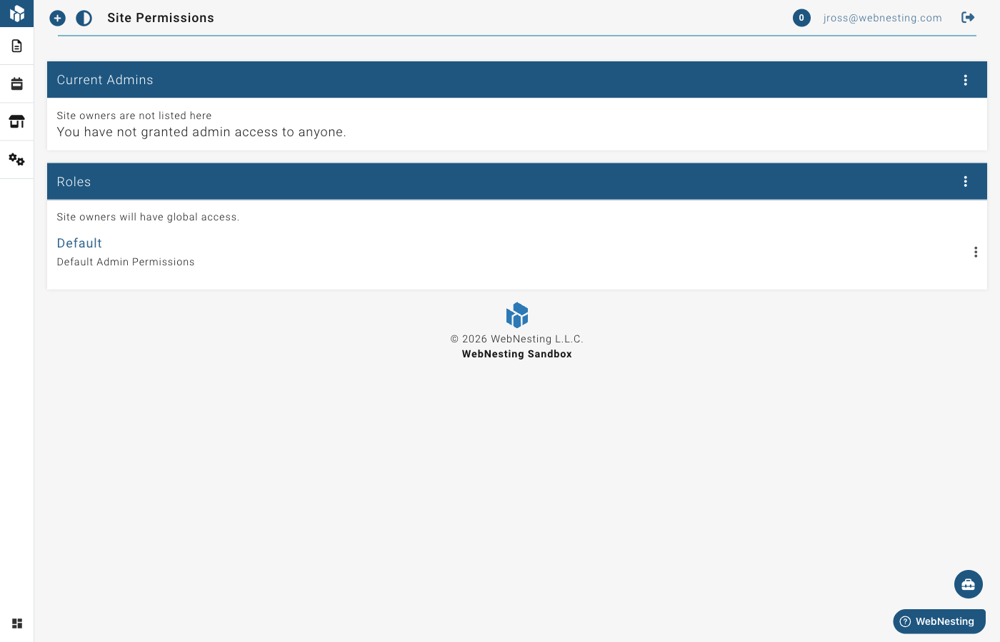

# Team and Permissions

**Last verified:** 2026-05-11 9:00am

WebNesting lets you invite other people to help manage your website. You control exactly what each person can see and do by assigning them roles with specific permissions.

---

## Inviting Team Members

You can give other people access to your site's dashboard by inviting them via email.

1. Go to **Permissions** in your dashboard menu.
2. Look for the **Grant Access** section.
3. Enter the person's email address.
4. Enter the same email address again to confirm it.
5. Click **Grant Access**.

The person will receive an email invitation with a link to join your site. The invitation is valid for one hour. If an invitation expires, you can invite the same person again by sending a new invitation.

> **Tip:** The person you invite will need a WebNesting account. If they do not have one yet, they can create one when they accept your invitation.

---

## Viewing Your Current Team Members

To see who currently has access to your site:

1. Go to **Permissions** in your dashboard menu.
2. You will see a list of all team members who have access to your site.
3. Any pending invitations (people who have not yet accepted) will also be shown.

---

## Removing Team Members

If you need to revoke someone's access to your site:

1. Go to **Permissions** in your dashboard menu.
2. Find the person you want to remove.
3. Click the **Revoke Access** button next to their name.
4. Their access will be removed immediately.

To cancel a pending invitation that has not been accepted yet:

1. Go to **Permissions** in your dashboard menu.
2. Find the pending invitation.
3. Click **Revoke** next to the pending email address.

> **Tip:** Removing someone's access does not delete any content they created. All pages, articles, and other content will remain on your site.

---

## Understanding Roles

Roles determine what a team member can do on your site. Each role comes with a set of permissions that control access to different areas.

### Site Owner

The site owner has full, unrestricted access to everything. This is the person who created the site. Owner access cannot be limited or revoked, and the owner does not need a role assigned -- full access is always granted automatically.

What the owner can do:
- Access all content, settings, and features
- Manage team members and permissions
- View billing information
- Enable and disable modules
- Everything else on the site

### Admin

Admins can manage content and site configuration based on their assigned permissions. This is the default role for team members you invite.

What admins can typically do:
- Create, edit, and manage content (pages, articles, products, etc.)
- Upload and manage media files
- Access the website builder
- View site activity

What admins typically cannot do (unless given extra permissions):
- Manage other team members
- Change billing settings
- Enable or disable modules

### Custom Roles

You can create your own roles with exactly the permissions you need. This is helpful when you want to give different team members different levels of access.

For example, you might create:
- An "Editor" role that can only create and edit content
- A "Viewer" role that can only view content without making changes
- A "Content Manager" role that can manage articles but not site settings

---

## Creating Custom Roles

To create a new role:

1. Go to **Permissions** in your dashboard menu.
2. Click the **Create Role** button.
3. Give your role a name (for example, "Editor" or "Content Reviewer").
4. Add a description so you remember what this role is for.
5. Click **Save**.

After creating the role, you will be taken to the permissions editor where you can set exactly what this role is allowed to do.

---

## Setting Permissions for a Role

Permissions control what actions a role can perform on each type of content on your site. Each content type (like Pages, Articles, Files, etc.) has five permission levels:

### Browse

Allows the person to view lists of items. For example, Browse permission on Pages lets them see the list of all pages on your site.

### Read

Allows the person to view the details of individual items. For example, Read permission on Pages lets them open and read any page.

### Create

Allows the person to add new items. For example, Create permission on Articles lets them write new blog posts.

### Update

Allows the person to edit existing items. For example, Update permission on Pages lets them make changes to pages that already exist.

### Delete

Allows the person to remove items. For example, Delete permission on Files lets them delete uploaded files.

### How to Set Permissions

1. Go to **Permissions** in your dashboard menu.
2. Click on the role you want to edit.
3. You will see a grid showing every content type on your site along the left side, and the five permission levels across the top.
4. Check the boxes to grant permission, or uncheck them to remove permission.
5. Click **Save** when you are finished.

> **Tip:** Start with fewer permissions and add more as needed. It is safer to give someone limited access and expand it later than to give them too much access from the start.

---

## Assigning Roles to Team Members

After you invite someone to your site, you can assign them one or more roles:

1. Go to **Permissions** in your dashboard menu.
2. Find the team member in the list.
3. Click the **Edit Roles** button next to their name.
4. You will see a list of all available roles. Check the roles you want to assign to this person.
5. Click **Save**.

A team member can have multiple roles. Their permissions are combined -- they get all the permissions from every role assigned to them.

> **Tip:** If you have not created any custom roles yet, new team members will be assigned the default Admin role. You can change this at any time.

---

## Workspace-Level Team Management

If you manage multiple websites through a workspace, you can invite team members at the workspace level. Workspace members can access all sites within the workspace based on their permissions.

### Inviting Workspace Members

1. Go to your **Workspace** dashboard.
2. Click **Permissions** in the workspace menu.
3. Enter the person's email address in the invite form.
4. Optionally, select one or more permission roles to assign to them.
5. Click **Send Invitation**.

The person will receive an email invitation that is valid for 7 days. If the invitation expires, you can send a new one.

> **Tip:** If the person does not have a WebNesting account yet, they can create one when they accept the invitation.

### Workspace Roles

Workspace members have one of three membership levels:

- **Owner** — The person who created the workspace. Has full, unrestricted access to everything. Cannot be removed or restricted.
- **Admin** — Can manage workspace settings and most features. Access can be customized with permission roles.
- **Member** — Standard team member. Access is controlled entirely by their assigned permission roles.

### Accepting or Declining Invitations

When you receive a workspace invitation:
- Click the link in the invitation email
- You will be taken to the workspace where you can **Accept** or **Decline**
- If you accept, you will immediately have access based on the roles assigned to you
- If you decline, the invitation is removed and you will not have access

### Pending Invitations

Workspace owners and admins can see all pending invitations in the Permissions page. From there, you can:
- See which invitations are still waiting to be accepted
- **Revoke** an invitation if you change your mind before the person accepts

---

## Permission Matrix

The permission matrix gives you fine-grained control over what each role can do. Each row represents a feature area, and each column represents an action level.

### Permission Levels

| Level | What It Allows |
|-------|---------------|
| Browse | View lists of items (e.g., see all pages) |
| Read | View details of individual items |
| Edit | Modify existing items |
| Add | Create new items |
| Delete | Remove items |

### Editing Role Permissions

1. Go to **Permissions** in your workspace.
2. Click on the role you want to configure.
3. You will see the permission matrix with all feature areas listed.
4. Check or uncheck boxes to grant or remove specific permissions.
5. Click **Save** to apply changes.

### Site-Specific Permissions

Permissions can be set at two levels:

- **Workspace-wide** — Applies across all sites in your workspace (default)
- **Per-site** — Applies only to a specific site

When editing permissions for a role, use the site selector to switch between workspace-wide permissions and site-specific permissions. This is useful when you want a team member to have full access to one site but limited access to another.

---

## Member Permission Overrides

Sometimes you need to give a specific person different access than their role allows. Permission overrides let you do this without creating a new role.

### How Overrides Work

Each permission for a member can be set to one of three states:

- **Inherit** — Use the permission from their assigned roles (default)
- **Allow** — Explicitly grant this permission, even if their roles do not include it
- **Deny** — Explicitly block this permission, even if their roles include it

### Setting Overrides for a Member

1. Go to **Permissions** in your workspace.
2. Find the team member in the members list.
3. Click **Edit Overrides**.
4. For each feature area, choose Allow, Deny, or Inherit for each action level.
5. Click **Save**.

> **Tip:** Overrides are useful for temporary access changes. For example, you might temporarily allow a team member to manage billing during a transition, without changing the role for everyone.

---

## Tips for Managing Team Access Securely

Here are some best practices for keeping your site safe when working with a team:

- **Give the minimum access needed.** Only grant permissions that a person actually needs to do their job. An editor who writes blog posts does not need access to billing or site settings.

- **Use custom roles.** Instead of giving everyone the Admin role, create specific roles for different responsibilities. This makes it clear who can do what.

- **Review your team regularly.** Check your team member list from time to time. Remove access for anyone who no longer needs it, such as former employees or contractors whose projects are complete.

- **Be careful with Delete permissions.** Deleting content is permanent. Only give Delete permissions to team members you trust to make those decisions.

- **Remove access promptly.** When someone leaves your team, revoke their access right away. Do not wait until later.

- **Use workspace-level roles for multi-site teams.** If your team works across multiple sites, set permissions at the workspace level so you only need to manage access in one place.

- **Use overrides sparingly.** Permission overrides are powerful but can make it harder to understand who has access to what. Prefer creating a role when multiple people need the same access.

> **Tip:** The activity log in your dashboard shows what changes each team member makes. This can help you keep track of who did what and when. See the [Activity Logs](activity-logs.md) guide for more details.
