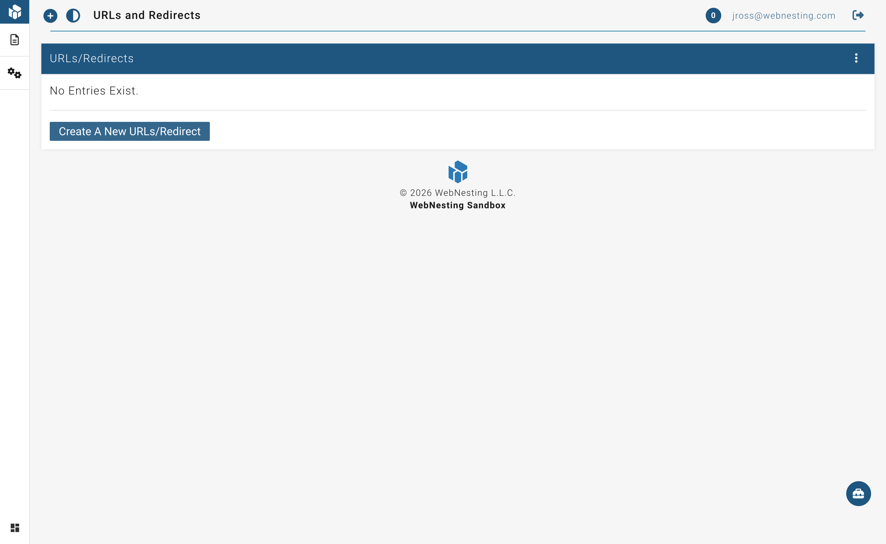

# URL Redirects

**Last verified:** 2026-08-31 12:10pm

Sometimes you need to change a page's web address, or you want to point an old address to a new one. Redirects make sure that anyone who visits the old address is automatically sent to the right place -- no dead ends, no error pages.

---

## What Redirects Are and Why You Would Use Them

A redirect is like a forwarding address for a web page. When someone visits the old address, they are automatically sent to the new one. This happens instantly and silently -- the visitor may not even notice.

Here are some common reasons to use redirects:

- **You renamed or moved a page.** If you changed a page's URL from `yoursite.com/services` to `yoursite.com/what-we-do`, a redirect ensures visitors and search engines can still find it.
- **You deleted a page but want to send visitors somewhere useful.** Instead of showing an error page, send them to a related page or your homepage.
- **You changed your site structure.** If you reorganized your pages, redirects keep all your old links working.
- **Someone linked to your site with the wrong URL.** If another website linked to a page that does not exist, you can redirect that address to the correct page.
- **You are protecting your search engine ranking.** Search engines remember your old page addresses. Redirects tell them "this page moved here" so you do not lose the ranking you built up.

---

## Viewing Existing Redirects

You can see all the redirects currently set up on your site.

1. Open your WebNesting dashboard.
2. In the site menu, open **Settings** and click **URLs and Redirects**.
3. You will see a list of all your current redirects, showing:
   - **Source URL** -- The old address that visitors might try to visit.
   - **Destination** -- Where they will be sent instead.
   - **Type** -- Whether the redirect is permanent or temporary.

---

## Creating a New Redirect

Setting up a new redirect takes just a minute.

1. Go to the **Redirects** section.
2. Click the **New Redirect** button.
3. Fill in the following fields:

### Setting the Source URL (Old Address)

This is the address you want to redirect away from -- the old or incorrect URL.

1. In the **Source URL** field, enter the path of the old page. You only need the part after your domain name. For example, if the full address was `yoursite.com/old-page`, just enter `/old-page`.

> **Tip:** Always start the source URL with a forward slash (`/`). For example: `/about-us`, `/services/consulting`, `/blog/old-post-title`.

### Setting the Destination (New Address)

This is where visitors will be sent when they visit the source URL.

1. In the **Destination** field, enter the new address. You have two options:
   - **A page on your site:** Enter the path, like `/new-page` or `/about`.
   - **An external website:** Enter the full web address, like `https://www.example.com/page`.

### Choosing the Redirect Type

WebNesting offers two types of redirects. Here is what each one means in plain terms:

- **Permanent (301)** -- Use this when a page has moved for good and will not be coming back to the old address. This tells search engines to update their records and transfer the old page's search ranking to the new page. **This is the right choice most of the time.**

- **Temporary (302)** -- Use this when the change is only for a short while. For example, if you are redesigning a page and want to send visitors somewhere else during the update, a temporary redirect is appropriate. Search engines will keep the old address in their records.

1. Select either **Permanent (301)** or **Temporary (302)**.

### Saving the Redirect

1. After filling in all the fields, click **Save** or **Create Redirect**.
2. The redirect takes effect immediately.

> **Tip:** After creating a redirect, test it by typing the old address into your browser. You should be automatically sent to the new destination. If the redirect does not appear to work right away, you may need to clear your browser cache or wait a few minutes before the redirect takes effect.

---

## Editing a Redirect

You can change any redirect at any time.

1. Go to the **Redirects** section.
2. Find the redirect you want to change in the list.
3. Click on it, or click the **Edit** button next to it.
4. Update the source URL, destination, or redirect type as needed.
5. Save your changes.

The updated redirect takes effect immediately.

---

## Deleting a Redirect

If a redirect is no longer needed, you can remove it.

1. Go to the **Redirects** section.
2. Find the redirect you want to remove.
3. Click the **Delete** button next to it.
4. Confirm that you want to delete it.

Once deleted, visitors who go to the old source URL will no longer be redirected. They will see your site's standard "Page Not Found" message instead.

> **Tip:** Before deleting a redirect, make sure no one is still using the old URL. Check your analytics to see if the old address is still getting visitors.

---

## Common Use Cases and Tips

### Renamed a Page

**Situation:** You changed your "About Us" page URL from `/about-us` to `/about`.

**What to do:** Create a permanent (301) redirect from `/about-us` to `/about`.

---

### Deleted a Page

**Situation:** You removed your "Promotions" page but do not want visitors to hit a dead end.

**What to do:** Create a permanent (301) redirect from `/promotions` to a related page, like `/services` or your homepage (`/`).

---

### Moved Content to a Different Website

**Situation:** Your blog now lives on a separate site at `https://blog.yoursite.com`.

**What to do:** Create a permanent (301) redirect from `/blog` to `https://blog.yoursite.com`.

---

### Temporary Maintenance

**Situation:** You are redesigning your "Services" page and want to send visitors to a temporary "Coming Soon" page.

**What to do:** Create a temporary (302) redirect from `/services` to `/coming-soon`. Remove or update the redirect once the new page is ready.

---

### General Tips

- **Use permanent redirects unless you have a specific reason not to.** Permanent redirects are better for search engine ranking and are the correct choice in the vast majority of cases.
- **Do not create redirect chains.** A redirect chain is when URL A redirects to URL B, which redirects to URL C. This slows things down and can confuse search engines. Always point the source directly to the final destination.
- **Review your redirects periodically.** Over time, you may accumulate redirects that are no longer needed. Clean them up to keep things tidy.
- **Test after creating a redirect.** Open a new browser tab, type the old address, and confirm you end up in the right place.

> **Tip:** If you are ever unsure whether you need a redirect, the safe answer is yes. It is always better to redirect an old address than to leave visitors staring at a "Page Not Found" error.
