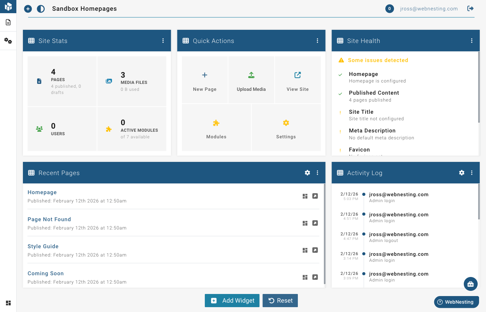

# Navigating the Dashboard

**Last verified:** 2026-09-05 4:58pm

The Dashboard is your home base for managing one site in WebNesting. It is where you handle that site's pages, settings, content, and analytics. (Workspace-level features like billing, team members, helpdesk, marketing, and tasks live in your workspace -- see the **Workspaces** card in your account portal.)

This guide will walk you through every part of the site Dashboard so you always know where to find what you need.

---

## The Dashboard Home Screen

When you log in, the first thing you see is the Dashboard home screen. It shows a collection of **widgets** -- small panels that each display a different piece of useful information about your site.

### What the Widgets Show

Here are the types of widgets you may see on your home screen:

- **Site Stats** -- A quick snapshot of your site's activity, like page views and visitor counts
- **Recent Pages** -- A list of pages you have recently created or edited, with quick links to open them
- **Site Health** -- A checkup on your site's status, letting you know if anything needs attention
- **News & Updates** -- Announcements and tips from WebNesting

### Customizing Your Dashboard

You can personalize which widgets appear and how they are arranged:

1. **Add widgets** -- Click **Add Widget** to browse every available widget and add one to your dashboard. Widgets marked **Per site** show one site's data; if you have more than one site, the picker asks which site before the widget appears. Anything you remove can always be added back from the same list.
2. **Remove widgets** -- Each widget has options to remove it if you do not need it.
3. **Rearrange widgets** -- Drag and drop widgets to put them in the order that works best for you.
4. **Resize widgets** -- Some widgets can be made wider or narrower to fit your preference.
5. **Widget settings** -- Some widgets have a settings option that lets you adjust what they display (for example, how many items to show in a list).

> **Tip:** You can always reset your dashboard back to the default layout if you want to start fresh.

---

## The Top Toolbar

The toolbar runs across the top of every page. It holds the controls you reach for most.

### On the left

- **WebNesting logo and name** -- Takes you back to your workspace home.
- **Workspace button** -- Shows the name of the workspace you are in. Click it to switch to a different workspace.

### In the middle

- **Search** -- Searches across your workspace: pages, content records, tickets, tasks, contacts, and more.

### On the right

- **Files** -- Opens the File Manager, where you can browse everything your workspace stores.
- **Notification bell** -- Shows what needs your attention. Click through to your activity feed.
- **⋮ menu** -- Quick links to **Billing**, **Usage**, **Workspace settings**, plus documentation and support.
- **Your avatar** -- Opens a menu with **Manage Account**, an out-of-office setting, a **Dark mode** switch, and **Sign out**.

> **Tip:** Dark mode lives in the avatar menu on the far right. It is not just a style preference -- if you work in a dimly lit room, dark mode can be easier on your eyes. Your choice is remembered.

---

## The Left Sidebar Navigation

The left sidebar is your main way to get around the Dashboard. It contains links to every section of your site management tools.

### How the Sidebar Works

The sidebar has two parts: a narrow **icon rail** that is always visible, and a **panel** that opens beside it with the links for whichever area you are in.

- **Hover** a rail icon to peek at its panel.
- **Click** a rail icon to pin its panel open, so the page content makes room for it.
- **Click the pinned icon again** to go back to peeking.

On phones and tablets, tap a rail icon to open its panel, then tap a link or tap outside the panel to close it.

### What Is on the Rail

- **Home** -- Your workspace overview, recent activity, and account links
- **Sites** -- Every site in the workspace; expand one to reach that site's own menu
- **Contacts** -- Your workspace contact database
- **Marketing**, **Helpdesk**, **Tasks** -- These appear only if the matching workspace product is enabled
- **Settings** (pinned at the bottom) -- Workspace settings, database, members and permissions, teams, activity log, integrations, and your billing and usage pages

---

## Dashboard Sections at a Glance

### Pages

This is where you manage all the pages on your website.

- **View your pages** -- See a list of every page on your site
- **Create new pages** -- Add a new page and give it a title and URL
- **Edit page settings** -- Change a page's title, URL, visibility, and SEO information
- **Design your pages** -- Open the **Website Builder** from the bottom of the site menu, then pick any page from its Pages panel
- **Delete pages** -- Remove pages you no longer need
- **View deleted pages** -- Access a list of pages you have deleted, with the option to restore them

> **Tip:** Every page has its own SEO settings for title and description. Filling these in for each page helps search engines understand what each page is about.

---

### Website Builder

The Website Builder is where you visually design your pages. Clicking this link opens the full-screen page editor.

In the Website Builder, you can:

- **Drag and drop components** onto your page (text, images, buttons, cards, dividers, and more)
- **Click on any element** to edit its content directly
- **Style elements** by adjusting colors, spacing, fonts, borders, and more
- **Preview your page** on different screen sizes to make sure it looks great on phones, tablets, and desktops
- **Save your work** as a draft without publishing
- **Publish your changes** to make them live on your site

The Website Builder has its own toolbar with Save, Publish, Preview, undo/redo, and device-size controls, plus a panel rail down the right side for adding components, styling them, and managing pages.

> **Tip:** The Website Builder uses a draft-and-publish system. This means you can make changes and save them without visitors seeing anything until you click Publish. Take your time getting things right.

---

### Settings

The Settings section is where you configure how your site works and looks. Settings are organized into groups, and you may see some or all of the following:

- **Site Config** -- Your site name, admin path, SSL, and other foundational settings. Also includes SEO defaults (fallback title and description for pages that do not have their own)
- **Content Items** -- Images that represent your brand, including your logo, favicon, and social sharing image. Also includes ad-hoc messages and HTML content blocks
- **Third Party** -- Google Analytics tracking, Google Tag Manager, and social media profile links

To change a setting:

1. Open the **Settings** section from the sidebar.
2. Click on the specific settings group you want to edit.
3. Make your changes.
4. Click **Save** to apply them.

---

### Files

Your files live at the workspace level, shared by every site. Click **Files** in the top bar to open the File Manager.

- **Browse your files** -- A folder tree covering your uploads, helpdesk email attachments, and files visitors submit through your forms
- **Upload new files** -- Drag files from your computer, or upload into any folder
- **Organize** -- Drag files between folders, rename files and folders, and select several at once to move or delete
- **Search and filter** -- Find files quickly by name or type
- **Use in your pages** -- When editing a page in the Builder, you can pull images directly from your files

> **Tip:** Upload your images before you start building pages. That way, they are ready to use when you need them in the Builder.

---

### Modules

Modules are add-on features that extend what your site can do. Think of them as apps you can turn on or off depending on what you need.

Examples of modules include:

- **Article** -- Add articles, news posts, or blog entries with categories and tags
- **Event** -- Create events with dates, showings, and ticket options
- **Store** -- Set up products and an online shop
- **Form** -- Build custom forms for contact, registration, and feedback
- **Marketing** -- A workspace product for collecting and managing email subscribers, mailing lists, and campaigns
- And more, depending on your plan

To manage modules:

1. Open the **Modules** section from the sidebar.
2. Browse available modules.
3. Enable or disable the ones you want.

When you enable a module, it creates its own section in the sidebar. For example, enabling the Article module adds an "Article" section where you can create and manage articles.

Each module may also add components to the Website Builder, letting you display that module's content on your pages (like an article list or a product grid).

---

### Permissions

The Permissions section lets you control who can do what on your site. If you have team members, collaborators, or employees who need access to the Dashboard, this is where you manage their access levels.

- **View users** -- See everyone who has access to your Dashboard
- **Edit permissions** -- Control what each person can see and do (for example, allow someone to edit pages but not change settings)

> **Tip:** If you are the only person managing your site, you do not need to worry about permissions. This section becomes important when you start adding team members.

---

### Redirects

Redirects let you send visitors from one URL to another. This is useful when you:

- Rename a page and want the old address to still work
- Move content from one page to another
- Link a short, memorable URL to a longer page address

To create a redirect:

1. Open the **Redirects** section.
2. Click the button to add a new redirect.
3. Enter the **old URL** (where someone might go).
4. Enter the **new URL** (where they should end up).
5. Save your redirect.

---

### Analytics

The Analytics section shows you how your site is performing. You can see:

- **Visitor counts** -- How many people are visiting your site
- **Page views** -- Which pages get the most traffic
- **Traffic sources** -- Where your visitors are coming from
- **Device breakdown** -- Whether visitors are using phones, tablets, or computers
- **Trends over time** -- How your traffic is changing day by day or week by week

> **Tip:** Check your analytics regularly. It helps you understand what your visitors care about, so you can focus on improving the content and pages that matter most.

---

### Logs

The Logs section provides a record of activity on your site. It can show you:

- **Recent actions** -- What has been changed on your site and when
- **System events** -- Technical events like errors or warnings

This section is mainly useful for troubleshooting if something does not seem right, or for keeping track of changes when multiple people are managing the site.

---

## Switching Between Sections

Moving between sections is straightforward:

1. Click any item in the **left sidebar** to go to that section.
2. If a section has sub-items (shown by a small arrow), click the section name to expand it, then click the specific item you want.
3. To go back to the Dashboard home screen, click the **WebNesting logo or name** at the top of the sidebar.

You can also navigate using any links within the page content. For example, clicking a page name in the Pages section will open that page's settings.

---

## Quick Reference: Finding What You Need

| I want to... | Go to... |
|--------------|----------|
| See my site stats | Dashboard home screen |
| Create or edit a page | Pages |
| Design my page visually | Website Builder |
| Build a reusable content block | Widgets |
| Upload or organize files | **Files** in the top bar |
| Change my site name or logo | Settings > Site Config / Content Items |
| Change my theme or colors | Settings > Theme |
| Add a blog or other feature | Modules |
| See who is visiting my site | Analytics |
| Set up a URL redirect | Redirects |
| Manage team access | Settings > Members & Permissions |
| See my bill or usage | Settings > Plans & Billing / Usage |
| Check recent activity | Settings > Activity Log |
| Switch to dark mode | Avatar menu (top right) > Dark mode |
| Log out | Avatar menu (top right) > Sign out |

---

## Next Steps

Now that you know your way around the Dashboard, you are ready to start building. Here are some suggestions:

- **Go to Pages** and review the pages that were created by your starter template. Open one in the Builder to see how it is put together.
- **Click Files** in the top bar and upload your logo, photos, and any other images you want to use on your site.
- **Go to Settings** and make sure your site name, logo, and SEO information are set the way you want.
- **Open the Website Builder** and start making the site your own. Replace the sample text and images with your real content.

> **Tip:** You do not have to do everything at once. Start with one page, get it looking the way you want, and then move on to the next. Building a website is a step-by-step process, and WebNesting is designed to let you work at your own pace.
