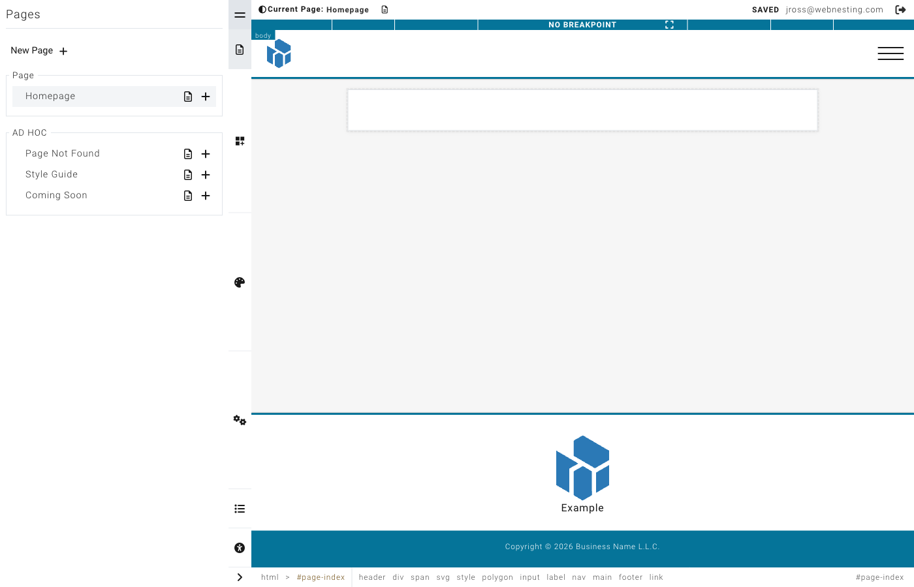

# Quick Start Guide

**Last verified:** 2026-08-31 12:10pm

Welcome to WebNesting! This guide will get you up and running in about 10 minutes. Follow these steps to set up your site, make your first edits, and publish your changes.

---

## Step 1: Log In and Complete Setup

1. Sign in to the WebNesting app with your email and password, open your **workspace**, and click your site in the **Sites** list to open its dashboard.
2. If you have two-factor authentication turned on, enter your verification code when prompted.
3. If this is your first time, a welcome wizard will appear. Fill in your site name, pick a starter template, and choose your theme and colors.
4. Once setup is complete, you will land on your dashboard -- the home base for managing your site.

> **Tip:** Do not worry about getting everything perfect during setup. You can change your theme, colors, and every other setting at any time.

---

## Step 2: Open the Website Builder

1. From your site menu, look for **Website Builder** at the bottom of the panel.
2. Click it to open the visual editor.
3. The Website Builder loads your homepage in the main editing area, with controls along the top and a panel rail down the right side.

> **Tip:** The icon rail on the right opens panels for Pages, Add (components), Settings, Styles, Layers, and Audit. You will use these throughout this guide.

---

## Step 3: Edit Your Homepage

1. Click on any text on your page to select it. A cursor will appear and you can start typing to change the text.
2. To swap an image, click on the image you want to replace, then use the settings panel to choose a new image from your files.
3. To update a link, click on the linked text or button, then look for the link settings in the editing panel.
4. Explore the page and make a few changes to get comfortable with the editor.

> **Tip:** Your changes are saved automatically a couple of seconds after you stop editing. The save pill in the toolbar shows whether you are Saved, Unsaved, or Saving.

---

## Step 4: Add a New Page

1. In the builder, click the **Pages** icon in the rail on the right (it looks like a small document).
2. Click the **New page** button at the top of the pages panel.
3. Enter a title for your page (for example, "About Us" or "Contact"), set the URL slug, and choose a layout.
4. Save the page. It will appear in your pages list and you can start adding content to it right away.

---

## Step 5: Add Your Logo and Favicon

1. Go back to your dashboard by clicking your site name in the builder's main menu, or by navigating to your admin address.
2. Open **Settings** from the navigation menu.
3. Under **Content Items**, click **Image**.
4. Upload your logo and favicon (the small icon that appears in browser tabs) by clicking the image areas and selecting files from your files.
5. Save your changes.

> **Tip:** For the best results, use a logo image with a transparent background. Favicons should be square and at least 32x32 pixels.

---

## Step 6: Set Up SEO Basics

1. From the dashboard, go to **Settings**.
2. Click **SEO Defaults**.
3. Fill in the **Title** field with your site name or brand name. This appears in search engine results.
4. Write a short **Description** that tells people what your site is about. Keep it under 160 characters.
5. Save your changes.

You can also set SEO details for each individual page. Open any page's properties in the builder and look for the "Search Engine Optimization" section.

> **Tip:** Your SEO title and description are what people see in Google before they click on your link. Make them clear and inviting.

---

## Step 7: Preview Your Site

1. In the builder, click the **Save** option from the main menu (the logo icon in the top-left corner).
2. Click the **preview icon** (the eye icon) next to the Save or Publish button.
3. A preview of your site will open, showing exactly what your visitors will see.
4. Check that your text reads well, images look good, and links work correctly.

You can also use the responsive size controls in the top toolbar to preview your site at different screen sizes -- desktop, tablet, and mobile.

---

## Step 8: Publish Your Changes

1. In the builder, click the **logo icon** in the top-left corner to open the main menu.
2. Click **Publish**.
3. All of your saved changes will go live. Your visitors will now see the updated version of your site.

Until you publish, your changes are saved as drafts that only you can see. This means you can make as many edits as you want without affecting the live site, then publish everything at once when you are ready.

> **Tip:** You can save your work at any time without publishing. This lets you work on changes across multiple sessions before making them live.

---

## Step 9: Next Steps

You have set up your site, made your first edits, and published your changes. Here are some things to explore next:

- **Explore modules** -- Enable content modules like Articles, Events, or a Store from the **Modules** section in your dashboard. These give your site powerful built-in features.
- **Check your analytics** -- Once your site has some visitors, visit the dashboard to see how your site is performing.
- **Invite your team** -- Go to **Permissions** in your dashboard settings to add team members and control what they can access.
- **Add more pages** -- Build out your site with additional pages. Use the pages panel in the builder to create and organize them.
- **Customize your design** -- Open the **Styles** panel in the builder to fine-tune your colors, fonts, spacing, and more.
- **Set up redirects** -- If you are replacing an old site, use the **Redirects** section to point old URLs to your new pages.
- **Configure social links** -- Go to **Settings** and then **Social Settings** to add links to your social media profiles.

For detailed guidance on any of these topics, check the other guides in our help center. You are off to a great start!
