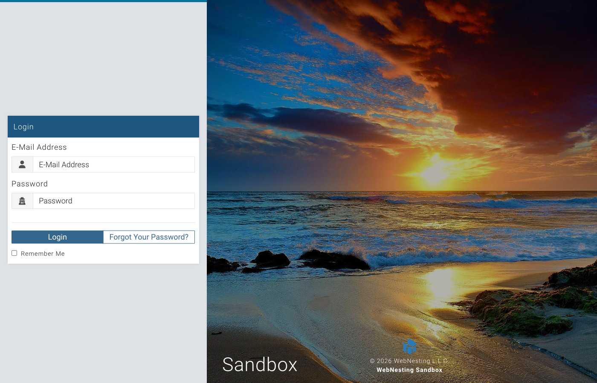

# Welcome to WebNesting

**Last verified:** 2026-08-31 12:10pm

Thanks for choosing WebNesting! This guide will help you get comfortable with the platform and show you everything you need to know to start building your website.

---

## What Is WebNesting?

WebNesting is a platform that lets you build, design, and manage professional websites -- all from your browser. No need to write code, install software, or deal with hosting. Everything is handled for you.

Whether you are creating a website for your business, your portfolio, or a personal project, WebNesting gives you the tools to get it done.

---

## What Can You Do with WebNesting?

Here is a quick look at what the platform offers:

- **Create your website** -- Start from a pre-made template or build from scratch
- **Add and manage pages** -- Create as many pages as you need (Home, About, Contact, Services, and more)
- **Design your pages visually** -- Drag and drop components onto your page and arrange them however you like
- **Customize your look** -- Choose a theme, pick your colors, and add your logo
- **Edit text and images directly** -- Click on any text or image on your page and change it right there
- **Manage your content** -- Organize blog posts, team members, products, and other content types using built-in modules
- **Upload and organize media** -- Store your images and files in the built-in File Manager
- **Control who has access** -- Set permissions for team members who help manage your site
- **Track how your site is doing** -- View visitor stats and site health from your dashboard
- **Publish when you are ready** -- Preview your changes first, then publish them live with one click

---

## The Two Main Areas

WebNesting has two main workspaces. Each one is designed for a different part of managing your site.

### The Dashboard

The Dashboard is your home base. Think of it as the control room for your website. This is where you:

- See an overview of your site's activity and health
- Manage your pages, content, and media files
- Adjust your site settings (name, logo, colors, and more)
- Set up content modules (like a blog or team directory)
- Manage user permissions
- View analytics and logs

You will spend time here when you need to organize, configure, or review your site.

### The Website Builder

The Website Builder is where the creative work happens. This is a visual editor that lets you design your pages by dragging and dropping components directly onto the page. You can:

- Add components like text blocks, images, buttons, cards, and more
- Rearrange sections by dragging them around
- Edit text and images by clicking directly on them
- Style individual elements (colors, spacing, fonts, and more)
- Preview your page on different screen sizes (phone, tablet, desktop)
- Save drafts and publish when you are ready

The Builder opens in its own view so you can focus entirely on designing your page.

---

## How to Log In

1. Open your browser and go to the WebNesting app and sign in with your **email address** and **password**.
2. Once you're signed in, open the **workspace** that contains your site.
3. From the workspace's **Sites** list, click your site to open its dashboard. All of your sites are managed from the same place once you're signed in -- you no longer go to a separate per-site web address to log in.

4. Click the **Login** button.
5. If you have two-factor authentication turned on, you will be asked to enter a verification code. Check your authenticator app or email for the code, then enter it on the screen. You can set up two-factor authentication from the Security card in your account portal.

> **Tip:** Check the "Remember Me" box on the login page if you want to stay logged in on this device. This saves you from typing your password every time.

If you have forgotten your password, click **Forgot Password** on the login screen. You will receive an email with a link to create a new one.

---

## What to Expect on Your First Visit

The very first time you log in to a new site, WebNesting will walk you through a quick setup process. Here is what happens:

### Step 1 -- Set Up Your Site Details

A welcome window will appear. You will be asked to fill in some basic information:

- **Site Name** -- The name of your website
- **Business Name** -- Your business or organization name
- **SEO Title and Description** -- A short title and description that search engines will show when people find your site (you can always change these later)

### Step 2 -- Choose a Starter Template

Next, you will pick a template to give your site a head start. Templates come with pre-built pages and sample content so you do not have to start from a blank page. Options include:

- **Business** -- Great for companies and service providers
- **Portfolio** -- Perfect for showcasing your work
- **Personal** -- Ideal for personal websites and blogs
- **Blank** -- Start with just the essentials if you want full creative control

### Step 3 -- Choose a Theme and Colors

After your template is applied, you will pick a visual theme and color palette for your site. You will see a live preview of your site as you browse options, so you can see exactly how each choice looks before committing.

Once setup is complete, you will land on your Dashboard, ready to start building.

> **Tip:** Do not worry about making perfect choices during setup. You can change your theme, colors, template content, and every other setting at any time.

---

## Where to Go from Here

Now that you know the basics, here are some great next steps:

- **[Setting Up Your Site](setting-up-your-site.md)** -- A detailed walkthrough of the setup wizard and your first site configuration
- **[Navigating the Dashboard](navigating-the-dashboard.md)** -- Learn your way around the Dashboard and what each section does

You can create multiple websites from a single WebNesting account, so if you ever need another site, you are already set up.

Welcome aboard. You are going to build something great.
