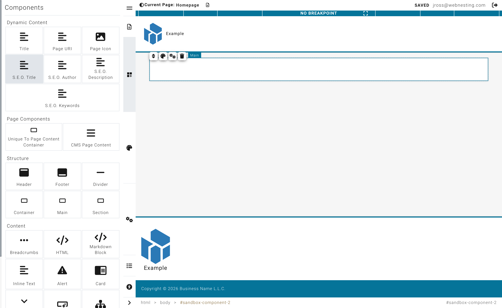

# Adding Components to Your Page

**Last verified:** 2026-05-11 9:00am

Components are the building blocks of your website. Every piece of content on your page -- text, images, buttons, sections, and more -- is a component. This guide shows you how to find, add, arrange, and manage components in the Website Builder.

---

## What Are Components?

Think of components like pieces of furniture in a room. Each one serves a purpose and can be placed wherever you need it. A text component holds your words. An image component shows a picture. A button component gives visitors something to click.

You combine these components to create complete pages. A typical page might have a header at the top, some text and images in the middle, and a footer at the bottom -- each one is a separate component.

---

## How to Add a Component

1. Open the **Website Builder** for the page you want to edit.
2. Look at the **left sidebar** (the Component Palette). You will see a list of components organized into categories.
3. Find the component you want to add.
4. **Click and hold** on the component, then **drag it** onto the Canvas (the main area showing your page).
5. Drop it where you want it to appear. You will see a visual guide showing you where the component will land.
6. Release your mouse button to place it.

The component will appear on your page immediately. You can now click on it to edit its content or style it using the right panel.

> **Tip:** If you are not sure which component to use, try adding one and see how it looks. You can always delete it or move it later.

---

## Component Categories

Components are organized into categories in the left sidebar. Here is what you will find in each one.

### Structure

Layout components help you organize and structure your page. They are containers that hold other components.

- **Section** -- A full-width area that acts as a major division of your page. Use sections to separate different parts of your content (like a hero area, a features section, and a contact section).
- **Container** -- A box that holds other components inside it. Useful for grouping related content together and controlling its width.
- **Divider** -- A horizontal line that visually separates content on your page.
- **Main** -- A primary content area, typically used once per page for the main body content.

### Content

These components are for adding written and interactive content to your page.

- **Text Block** -- A flexible area for paragraphs, headings, and formatted text. This is the component you will use most often for writing content.
- **Alert** -- A highlighted message box, great for important notices, warnings, or tips.
- **Card** -- A self-contained block that combines an image, a heading, description text, and a button. Cards are great for team members, services, features, or any content that benefits from a visual summary.
- **Accordion** -- Expandable sections that visitors can open and close by clicking. Perfect for FAQs, product details, or any content you want to keep organized without taking up too much space.
- **Button** -- A clickable button that can link to another page, a section of your site, or an external website. You can customize the button text, color, size, and style.
- **Header** -- The top section of your page, usually containing your logo and navigation menu. Typically used once per layout.
- **Footer** -- The bottom section of your page, often containing contact information, links, and copyright text. Typically used once per layout.
- **Breadcrumbs** -- A trail of links showing where the visitor is on your site (for example: Home > Services > Web Design). Helps visitors navigate back to previous pages.
- **Sitemap** -- An automatically generated list of all the pages on your site.
- **HTML Block** -- A container where you can write raw HTML code. Useful for embedding third-party widgets or custom content.
- **Markdown Block** -- A text area that uses Markdown formatting. Useful if you prefer writing content in Markdown syntax.

### Media

These components let you add visual content to your page.

- **Image** -- A single image. Click it to choose a picture from your media library or upload a new one.
- **Slideshow** -- A rotating set of images that automatically transitions between slides. Great for showcasing multiple photos in one space.

### Module Driven Items

These components display content from your site's built-in modules. They only appear if you have the related module enabled on your site.

- **Article List / Article Detail** -- Displays articles from your Articles module. The list shows multiple articles, and the detail shows a single full article.
- **Event List / Event Detail** -- Displays events from your Events module. The list shows upcoming events, and the detail shows a single event with all its information.
- **Product List / Product Detail** -- Displays products from your Products module. The list shows multiple products, and the detail shows a single product page.
- **Form Embed** -- Embeds a form from your Forms module on the page. Requires the Forms module to be enabled.
- **Marketing Signup** -- A newsletter signup form for collecting email subscribers. Requires the Email Marketing module to be enabled.

> **Tip:** If you do not see these components, it means the related module is not enabled for your site. You can enable modules from the Dashboard under Modules.

### Plugins

- **Google Maps** -- An embedded, interactive map that shows a specific location on your page. Google Maps is ideal for contact pages, store locators, or any page where visitors need to find a physical address. When you add a Google Maps component, you can configure the location by entering an address or coordinates. The map will display as an interactive, zoomable element that visitors can use to get directions. Your site may need a Google Maps API key configured by your administrator for the map to display properly.

- **Disqus Comments** -- A full-featured comments section powered by the Disqus platform. Adding a Disqus component to your page lets visitors leave comments, reply to each other, and engage in discussions. This is popular for blog posts, news articles, and community pages. To use Disqus, you need a Disqus account and a site shortname, which you configure in the component settings. Once set up, comments are managed through the Disqus moderation dashboard, where you can approve, remove, or respond to comments. Disqus handles spam filtering and user accounts automatically.

### My Widgets

This category contains any custom, reusable components you have created and saved. Widgets let you build something once and use it across multiple pages. If you have not created any widgets yet, this section will be empty.

---

## Moving Components Around

You can rearrange components on your page at any time.

1. Hover over the component you want to move. A border or highlight will appear around it.
2. **Click and hold** on the component.
3. **Drag it** to the new position on the page.
4. You will see visual guides showing you where the component will land.
5. **Release your mouse button** to drop it in the new spot.

Your component will snap into place and the rest of the page will adjust automatically.

---

## Nesting Components Inside Other Components

Some components can hold other components inside them. These are called **containers**. Sections, containers, and other layout components all work this way.

For example, you might:

- Put a text block and an image inside a section
- Place multiple cards inside a container to create a row of cards
- Add buttons and text blocks inside a card

To nest a component:

1. Drag the component from the left sidebar.
2. Drop it **inside** an existing container component on the Canvas.
3. You will see a visual guide indicating that the component will be placed inside the container (rather than above or below it).

This nesting is how you create structured, professional-looking page layouts.

Avoid nesting too many levels deep. Two or three levels (for example, Section > Container > Content) is usually enough for most layouts.

> **Tip:** Sections are the most common starting point. Add a section to your page first, then place your text, images, and other components inside it.

---

## Deleting a Component

If you want to remove something from your page:

1. Click on the component you want to delete to select it.
2. Look for the **delete option** that appears (usually a trash icon or a delete button near the selected component).
3. Click it to remove the component.

The component and its content will be removed from the page.

> **Tip:** If you accidentally delete something, use the **Undo** button in the top toolbar (or press Ctrl+Z on Windows, Cmd+Z on Mac) to bring it back.

---

## Duplicating a Component

If you want a copy of something that already exists on your page:

1. Click on the component you want to copy to select it.
2. Look for the **duplicate option** that appears near the selected component.
3. Click it to create an identical copy.

The copy will appear right next to the original. You can then drag it to a different position and edit its content independently.

---

## Tips for Building Good Page Layouts

Here are some suggestions to help you create pages that look great and are easy for visitors to use.

- **Start with sections.** Before adding text and images, lay out the major sections of your page first. Then fill in the details inside each section.
- **Keep it simple.** A clean page with clear sections is easier to read than a cluttered one. Do not try to fit too much into one area.
- **Use headings to organize.** Add heading text at the top of each section so visitors can quickly scan the page and find what they are looking for.
- **Mix content types.** Combine text with images, cards, and buttons to keep things visually interesting. A page full of only text can feel overwhelming.
- **Think about flow.** Arrange your content in a logical order. Lead with the most important information and end with a clear next step (like a button or a contact section).
- **Save often.** As you build, save your progress frequently. This protects your work in case anything unexpected happens.

---

## Next Steps

- **[Editing Content](editing-content.md)** -- Learn how to edit text, images, buttons, and other content you have added to your page
- **[Website Builder Overview](builder-overview.md)** -- Go back to the interface overview to review the Builder layout and controls
