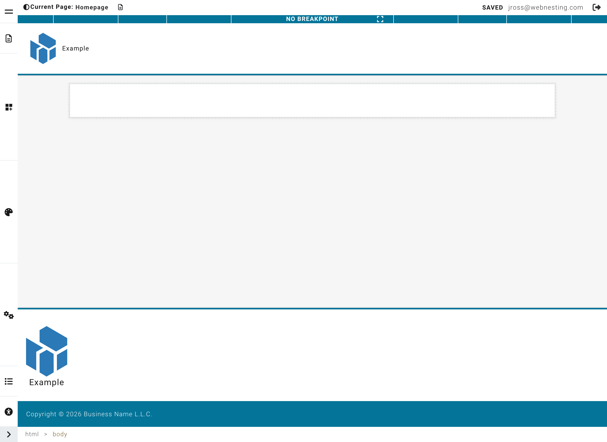

# Website Builder Overview

**Last verified:** 2026-05-11 9:00am

The Website Builder is where you design and create your web pages. It is a visual editor -- meaning you can see exactly how your page will look as you build it. No coding required.

---

## Opening the Website Builder

1. Log in to your WebNesting Dashboard.
2. Go to the **Pages** section in the left menu.
3. Find the page you want to edit.
4. Click the **Edit in Builder** button next to that page.

The Builder will open in a new view, giving you a full workspace to design your page.

> **Tip:** You can also open the Builder by clicking **Builder** in the top navigation bar of your Dashboard.

---

## Tour of the Interface

When the Builder opens, you will see four main areas on your screen. Here is what each one does.

### The Canvas (Center)

The large area in the center of the screen is called the **Canvas**. This is a live preview of your page. Whatever you see on the Canvas is what your visitors will see when they visit your site.

You can:

- Click on any element to select it
- Click on text to start editing it
- Drag components from the sidebar onto the Canvas to add them

The Canvas updates instantly as you make changes, so you always know exactly what your page looks like.

### The Top Toolbar

The toolbar along the top of the screen gives you quick access to important actions:

- **Page selector** -- Switch between different pages on your site without leaving the Builder
- **Save button** -- Save your work as a draft (your visitors will not see the changes yet)
- **Publish button** -- Make your changes live so visitors can see them
- **Undo and Redo** -- Step backward or forward through your recent changes

Press Ctrl+Z (Cmd+Z on Mac) to undo and Ctrl+Shift+Z (Cmd+Shift+Z on Mac) to redo.

### The Left Sidebar (Component Palette)

The panel on the left side of the screen is your **Component Palette**. This is where you find all the building blocks you can add to your page -- things like text blocks, images, buttons, cards, and more.

Components are organized into categories to make them easy to find. To add something to your page, simply drag it from this panel onto the Canvas.

### The Right Sidebar (Styler)

The panel on the right side of the screen is the **Styler**. When you select something on your page (by clicking on it), the Styler shows you all the options for customizing how that item looks.

From here you can change things like:

- Colors and backgrounds
- Spacing and sizing
- Fonts and text appearance
- Borders and shadows
- Layout and alignment

> **Tip:** The Styler only shows options when you have something selected on the Canvas. If the right panel looks empty, click on an element on your page first.

---

## How the Builder Works

Building a page follows a simple pattern. Here is the basic workflow:

1. **Pick a component** from the left sidebar. Browse the categories to find what you need (a text block, an image, a button, and so on).
2. **Drag it onto your page.** Drop it wherever you want it to appear on the Canvas.
3. **Click to select and edit.** Click on the component you just added. If it has text, click the text to start typing. If it is an image, click it to change the picture.
4. **Style it using the right panel.** With the component selected, use the Styler on the right to adjust colors, spacing, fonts, and other visual settings.
5. **Save and publish.** When you are happy with your changes, click **Save** to store your work. When you are ready for the world to see it, click **Publish**.

That is the entire process. Pick, place, edit, style, publish.

---

## Switching Between Pages

You do not need to leave the Builder to work on a different page.

1. Look at the **top toolbar** at the top of the screen.
2. Click on the **page selector** (it shows the name of the page you are currently editing).
3. A dropdown will appear showing all the pages on your site.
4. Click the page you want to switch to.

The Builder will load that page so you can start editing it right away.

> **Tip:** Make sure to save your work on the current page before switching to another one. If you try to leave the builder with unsaved changes, you will see a warning asking if you want to save first.

---

## Saving vs. Publishing

There is an important difference between saving and publishing:

### Saving (Draft)

- When you click **Save**, your changes are stored safely but are **not visible to your website visitors**.
- Think of it as saving a draft. You can come back later, make more changes, and save again as many times as you like.
- Saving is a great way to protect your work in progress.

### Publishing (Live)

- When you click **Publish**, your changes go live. **Your visitors will see the updated page** on your website.
- Only publish when you are confident your page looks the way you want.
- You can save many times before you publish. Publishing takes everything you have saved and makes it visible to the world.

> **Tip:** Get into the habit of saving often while you work. You can always publish later when everything is ready.

---

## Next Steps

Now that you know your way around the Builder, here are some good places to go next:

- **[Adding Components to Your Page](adding-components.md)** -- Learn about all the different building blocks you can add to your pages
- **[Editing Content](editing-content.md)** -- Learn how to edit text, images, buttons, and other content on your page
