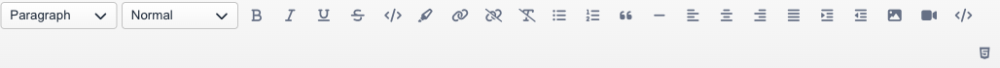

# Editing Content

**Last verified:** 2026-05-11 9:00am

Once you have added components to your page, the next step is to fill them with your own content. This guide covers how to edit text, images, buttons, and every other type of content in the Website Builder.

---

## How to Select a Component

Before you can edit anything, you need to select it.

1. Move your mouse over the component on the Canvas. A border or highlight will appear to show what you are about to select.
2. **Click once** on the component.
3. The component is now selected. You will see a visual indicator around it, and the right sidebar (Styler) will show styling options for that component.

Once a component is selected, you can edit its content, move it, delete it, or style it.

---

## Editing Text

Text blocks are the most common component on any page. Here is how to work with them.

### Start Typing

1. Click on any text component on the Canvas.
2. Click directly on the text itself. A text cursor will appear.
3. Start typing to replace or add to the text.

It works just like a word processor. You can select text by clicking and dragging, use your keyboard shortcuts for copy and paste, and move your cursor with the arrow keys.

### The Text Editor Toolbar

When you click into a text area, a **formatting toolbar** will appear near the text. This toolbar gives you controls for formatting your content. Here is what each option does:

#### Bold, Italic, Underline, and Strikethrough

- **Bold** -- Makes selected text thicker and heavier. Use it to emphasize important words.
- **Italic** -- Slants selected text. Use it for emphasis or for titles of books and articles.
- **Underline** -- Adds a line under selected text.
- **Strikethrough** -- Adds a line through the middle of selected text. Useful for showing corrections or removed items.

To use any of these:

1. Select the text you want to format (click and drag across it).
2. Click the formatting button in the toolbar.
3. To remove the formatting, select the text again and click the same button.

#### Block Type (Paragraphs and Headings)

The **Block** dropdown lets you change the type of text block. Options include:

- **Paragraph** -- Normal body text. This is the default.
- **Heading 1** through **Heading 6** -- Different heading levels, from the largest (Heading 1) to the smallest (Heading 6). Use headings to create titles and section headers on your page.

To change a block type:

1. Click into the text you want to change.
2. Open the **Block** dropdown in the toolbar.
3. Select the option you want (for example, Heading 2).

The text will immediately change to the new style.

> **Tip:** Use Heading 1 for your main page title, Heading 2 for major sections, and Heading 3 for subsections. This structure helps both visitors and search engines understand your content.

#### Font Size

The **Size** dropdown lets you adjust how large or small your text appears:

- **XS** -- Extra small
- **Small** -- Smaller than normal
- **Normal** -- The default size
- **Large** -- Larger than normal
- **XL** -- Extra large

To change the size:

1. Select the text you want to resize.
2. Open the **Size** dropdown.
3. Choose the size you want.

#### Text Alignment

These buttons control how your text lines up on the page:

- **Align Left** -- Text lines up along the left edge (this is the default and most common choice).
- **Align Center** -- Text is centered in the middle of the container.
- **Align Right** -- Text lines up along the right edge.
- **Justify** -- Text stretches to fill the full width, with even spacing between words.

To change alignment:

1. Click into the text you want to align.
2. Click the alignment button you want in the toolbar.

#### Lists

You can turn text into a bulleted or numbered list:

- **Bulleted List** -- Creates a list with dots (bullets) next to each item. Good for unordered items.
- **Numbered List** -- Creates a list with numbers next to each item. Good for steps or ranked items.

To create a list:

1. Click into the text you want to turn into a list.
2. Click either the **bullet list** or **numbered list** button in the toolbar.
3. Each line of text becomes a list item.
4. Press **Enter** to add a new item to the list.
5. To stop the list, click the list button again.

#### Links

Links let visitors click on text to go to another page or website.

**To add a link:**

1. Select the text you want to turn into a link (click and drag across it).
2. Click the **link button** in the toolbar.
3. A prompt will appear asking you to enter a web address (URL).
4. Type or paste the address (for example, https://www.example.com).
5. Click OK. The selected text is now a clickable link.

**To remove a link:**

1. Select the linked text.
2. Click the **remove link** button in the toolbar.

#### Blockquotes

A blockquote is a styled block of text that stands out from the rest of the content. It is commonly used for quotes, important callouts, or excerpts.

1. Click into the text you want to format as a blockquote.
2. Click the **blockquote button** in the toolbar.
3. To remove the blockquote formatting, click the button again.

#### Indentation

You can increase or decrease the indentation of text:

- **Indent** -- Moves the text further to the right.
- **Outdent** -- Moves the text back to the left.

These are useful for creating visual hierarchy or nesting content within lists.

#### Clear Formatting

If your text has gotten messy with too many styles applied, you can start fresh:

1. Select the text you want to clean up.
2. Click the **clear formatting** button in the toolbar.
3. All bold, italic, underline, and other inline formatting will be removed, leaving you with plain text.

### Pasting Content

When pasting text from other applications like Microsoft Word or Google Docs, the builder will try to preserve basic formatting like bold, italic, and links. For best results, paste plain text and then apply formatting in the builder.

You can undo any content change by pressing Ctrl+Z (Cmd+Z on Mac).

### Tips for Writing Good Web Content

- **Keep paragraphs short.** Two to three sentences per paragraph works well on the web. Long blocks of text are hard to read on screens.
- **Use headings.** Break your content into sections with clear headings so visitors can scan the page quickly.
- **Write for your audience.** Use language your visitors will understand. Avoid jargon unless your audience expects it.
- **Front-load important information.** Put the most important point at the beginning of each section.
- **Use lists.** Bullet points and numbered lists are easier to scan than long paragraphs.

---

## Working with Images

### Selecting or Changing an Image

1. Click on the image component on the Canvas.
2. The **media picker** will open, showing your media library.
3. Choose an image from your library, or upload a new one.
4. The image on your page will update immediately.

### Adding Alt Text

When you select an image, you will see a settings panel with an **Alt** field. Alt text is a short description of your image.

Why it matters:

- **Accessibility** -- Screen readers read alt text aloud to visitors who cannot see the image. This makes your site usable for everyone.
- **Search engines** -- Search engines use alt text to understand what your image shows, which can help your site appear in image search results.

To add alt text:

1. Click on the image to select it.
2. Find the **Alt** field in the settings.
3. Type a brief, descriptive phrase (for example: "Team photo at annual company picnic").

> **Tip:** Write alt text that describes what the image shows, not just what it is. "A smiling woman holding a coffee cup in a cafe" is better than "photo1.jpg".

### Image Display Options

When you select an image, you may see display options that control how the image fills its container:

- **Cover** -- The image fills the entire space, cropping if needed to maintain proportions. Best for background-style images where full coverage matters more than seeing every edge.
- **Contain** -- The entire image is visible within the space, with empty areas on the sides if the proportions do not match. Best when you need to show the complete image.
- **Fill** -- The image stretches to fill the entire space, which may distort it. Use this sparingly.

You can also control the **position** of the image within its container (top, center, bottom, left, right) to focus on the most important part of the picture.

---

## Working with Buttons

Buttons are one of the most important elements on your page. They guide visitors toward taking action -- like contacting you, buying a product, or learning more.

### Setting Button Text

1. Click on the button component to select it.
2. Click directly on the button text.
3. Type your new button label (for example: "Get Started", "Contact Us", "Learn More").

### Setting the Link Destination

Every button needs a destination -- the page or website visitors go to when they click it.

1. Click on the button to select it.
2. **Double-click** on the button to open its settings panel.
3. Find the **Link** field.
4. Enter the web address (URL) where you want the button to go (for example, https://www.example.com/contact or a page on your own site).

### Styling Button Appearance

When you double-click a button, you will see several styling options:

**Size:**

- Normal, Small, Large, or XL

**Color Theme:**

- Primary, Secondary, Success, Info, Warning, Danger, Dark, or Light. Each uses colors from your site's theme.

**Style:**

- **Filled** -- A solid-colored button (the default look)
- **Outline** -- A button with just a border and no fill
- **Link** -- A button that looks like a text link

**Alignment:**

- Start (left), Center, or End (right)

> **Tip:** Use your site's Primary color for the most important button on a page (your main call to action) and Secondary or lighter styles for less important actions.

---

## Working with Accordions

Accordions are expandable sections that visitors can open and close by clicking. They are perfect for FAQs, detailed information, or any content you want to keep organized.

### Adding Accordion Items

When you add an accordion component, it starts with one item. To add more:

1. Select the accordion on the Canvas.
2. Look for the **add** or **duplicate** option near the component.
3. Click it to add a new accordion item.
4. Repeat to add as many items as you need.

### Setting Titles and Content

Each accordion item has two parts -- a **title** (the part visitors see and click) and the **body** (the content that appears when the item is opened).

1. Click on the accordion item title to edit it. Type your question or section heading.
2. Click on the body area below the title to edit the content that appears when the item expands.

### Accordion Settings

When you select an accordion group, you can adjust these options in the settings panel:

- **Collapse Others** -- When turned on, opening one section automatically closes the others. When turned off, visitors can have multiple sections open at the same time.
- **Load Opened** -- When turned on, accordion sections start in the open position when the page loads.

---

## Working with Slideshows

### Adding Multiple Images

1. Click on the slideshow component on the Canvas.
2. The media picker will open. Select multiple images from your library, or upload new ones.
3. The images will appear in the slideshow.

You can reorder images by dragging them into the order you prefer.

### Slideshow Settings

When you select a slideshow, you will find these options in the settings panel:

- **Bullets** -- Show small dots below the slideshow that let visitors jump to a specific slide.
- **Arrows** -- Show left and right arrows for manual navigation between slides.
- **Show Thumbnails** -- Display small preview images below the slideshow.
- **Pause on Mouse Over** -- The slideshow pauses when a visitor hovers their mouse over it.
- **Transition Speed** -- How fast the slides change (a lower number means faster transitions).
- **Transition Delay** -- How long each slide stays visible before moving to the next one.
- **Slide Transition** -- The animation style used when changing slides. Options include Fade, Slide, Slide Reverse, Slide Vertical, Flip, and more.
- **Aspect Preset** -- Controls the height of the slideshow. You can choose from options like tallest image, shortest image, or a percentage of the screen height. Or choose Manual to set a custom aspect ratio.

> **Tip:** For a smooth, professional look, the "Fade" transition with a 5-second delay works well for most slideshows.

---

## Working with Cards

Cards are versatile components that combine an image, heading, description, and button into one neat block. They are great for showcasing services, team members, features, or products.

### Setting Card Content

Each card has several parts you can edit:

1. **Image** -- Click on the image area of the card to open the media picker and choose a picture.
2. **Title** -- Click on the title text in the card and type your heading.
3. **Description** -- Click on the description text to write your content.
4. **Button** -- Click on the button to edit its text and link (see the Working with Buttons section above).

### Card Layout Options

When you select a card, the settings panel gives you layout choices:

- **No Image** -- A card with only text and a button (no image area).
- **Image 25, 50, or 75** -- Controls how much of the card width the image takes up, with the text beside it.
- **Stacked** -- The image appears above the text content (full width).
- **Absolute** -- The text overlays the image.

You can also control:

- **Text alignment** -- Left, center, or right
- **Content position** -- Where the text content sits within the card (top-left, center, bottom-right, and so on)
- **Alternate** -- Reverses the layout direction for cards placed side by side, creating a zigzag pattern

> **Tip:** Use cards in a group for a consistent, professional look. Add multiple cards inside a section, and they will line up side by side automatically.

---

## Working with Embedded Content

### Adding Video

You can add video to your pages within a text block:

1. Click into a text block.
2. Use the **video insert** button in the text toolbar.
3. Enter the video URL and (optionally) a poster image URL.

Videos from YouTube, Vimeo, and other major platforms will embed automatically when you paste the video URL. The video will display as a responsive player that adjusts to fit the available space, so it looks good on all screen sizes.

You can also embed videos using the **HTML Block** component by pasting an embed code from YouTube, Vimeo, or any other video platform.

> **Tip:** For the best viewing experience, use videos hosted on YouTube or Vimeo. These platforms handle video streaming and quality adjustment automatically, so your visitors always get smooth playback.

### Adding Maps

1. Add a **Google Maps** component from the Plugins category in the left sidebar.
2. Drag it to where you want the map to appear on your page.
3. Configure the location in the component settings.

### Using the HTML Block

The HTML Block is a powerful tool for adding third-party content to your page. Any service that provides an embed code can be added using an HTML Block.

1. Add an **HTML Block** from the Code category in the left sidebar.
2. Paste the embed code provided by the third-party service.

Common uses for the HTML Block include:

- **Social media feeds** -- Embed your Instagram feed, X (Twitter) timeline, or Facebook page feed.
- **Booking and scheduling widgets** -- Add appointment booking tools like Calendly or Acuity.
- **Third-party forms** -- Embed contact forms, surveys, or signup forms from services like Google Forms, Typeform, or Mailchimp.
- **Payment buttons** -- Add PayPal buttons or other payment widgets.
- **Chat widgets** -- Embed live chat tools for customer support.

To get an embed code, visit the third-party service and look for a "Share" or "Embed" option. Copy the code they provide and paste it directly into the HTML Block.

> **Tip:** If an embedded element does not look right, check that you copied the complete embed code. Most embed codes start with `<iframe` or `<script` -- make sure you have the entire snippet.

### Using the Markdown Block

The Markdown Block lets you write content using Markdown syntax -- a simple way to format text using plain characters.

1. Add a **Markdown Block** from the Code category in the left sidebar.
2. Type or paste your Markdown-formatted content.

Markdown is useful when you have pre-written content in Markdown format (for example, from a README file or documentation tool) and want to paste it directly into your page without reformatting.

Basic Markdown formatting:

- `**bold text**` for **bold**
- `*italic text*` for *italics*
- `# Heading 1`, `## Heading 2`, `### Heading 3` for headings
- `- item` for bullet lists
- `1. item` for numbered lists
- `[link text](URL)` for links

> **Tip:** Most users will find the regular Text Block easier to work with, since it has a visual toolbar for formatting. The Markdown Block is best for people who are already familiar with Markdown syntax.

---

## General Editing Tips

- **Click to select, click again to edit.** The first click selects a component. Clicking on the text or content inside it lets you edit.
- **Use Undo freely.** Made a mistake? Press Ctrl+Z (Windows) or Cmd+Z (Mac) to undo your last change. You can undo multiple times to step back through your changes.
- **Save often.** Click the Save button frequently while working. This protects your progress without making changes visible to visitors.
- **Preview on different devices.** Use the device preview options to see how your content looks on phones, tablets, and desktops. What looks great on a wide screen might need adjusting for mobile.

---

## Next Steps

- **[Adding Components to Your Page](adding-components.md)** -- Review the full list of components you can add to your pages
- **[Website Builder Overview](builder-overview.md)** -- Go back to the interface overview to review the Builder layout and tools
