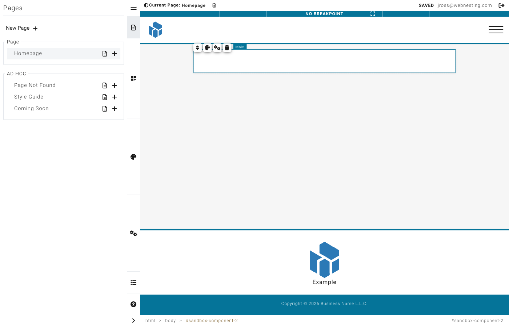

# Page Layouts and Structure

**Last verified:** 2026-05-11 9:00am

A great website is built on a solid structure. Before you add text, images, and buttons, you need to set up the framework that holds everything in place. This guide explains how pages are organized in WebNesting and how to build clean, well-structured layouts.

---

## How Pages Are Structured

Every page in WebNesting is made up of layers, like a sandwich:

- **Header** -- The top of your page. This usually holds your logo, navigation menu, and any content that should appear at the very top of every page.
- **Main Content** -- The middle section where most of your page content lives. This is where you add sections, text, images, and other components.
- **Footer** -- The bottom of your page. This typically holds contact information, links, copyright notices, and social media icons.

The header and footer usually stay the same across all pages on your site. The main content area is where each page gets its own unique content.

The Main component represents the primary content area of your page. Most pages use one Main component between the header and footer. Layouts typically include a Main component by default.

---

## Choosing a Page Layout

When you create a new page (or edit an existing one), you choose a **layout**. The layout determines the overall structure of the page -- where the header, footer, and main content area are placed, and whether there are sidebars or other structural elements.

Your layout acts like a blueprint. Once you choose it, you fill in the main content area with your own components.

> **Tip:** If you are unsure which layout to use, start with a simple full-width layout. You can always change it later.

---

## Structure Components

Structure components are the building blocks you use to organize content within the main content area. Think of them as invisible containers that hold and arrange your visible content.

### Sections

A **Section** is a full-width horizontal band that stretches across your page. Think of sections as chapters in a book -- each one covers a different topic or area of your page.

Common uses for sections:
- A hero area at the top of your page with a big headline and image
- A features section showcasing what you offer
- A testimonials section with customer quotes
- A contact section with your information and a form

#### Adding a Section

1. In the builder, open the component panel on the left.
2. Look under **Structure** for the Section component.
3. Drag it onto your page where you want it.
4. The section will appear as an empty area, ready for you to add content inside it.

> **Tip:** Build your page by stacking sections from top to bottom. Each section should focus on one idea or purpose. This keeps your page organized and easy for visitors to scan.

### Groups and Containers

A **Container** (also called an "empty container" in the component panel) is a box that holds other elements together. While a section spans the full width of your page, containers are used inside sections to group related content.

Think of a container like a box on a shelf. You might have one box for photos, another for documents, and another for supplies. Each container groups related items together.

#### Adding a Container

1. Open the component panel.
2. Under **Structure**, find the Container component.
3. Drag it into a section on your page.
4. Now you can drag other components (text, images, buttons) into the container.

### Dividers

A **Divider** is a simple horizontal line that separates content visually. Use dividers when you want to create a visual break between two areas without starting a whole new section.

#### Adding a Divider

1. Open the component panel.
2. Under **Structure**, find the Divider component.
3. Drag it between the elements you want to separate.

> **Tip:** Use dividers sparingly. Too many dividers can make your page look cluttered. Often, adding spacing (padding or margin) between sections is a cleaner alternative.

---

## Creating Multi-Column Layouts

One of the most common things you will want to do is place content side by side -- like text next to an image, or three feature cards in a row.

### Method 1: Side-by-Side (Flex) Layout

The easiest way to put items next to each other is to use a Flex layout on a container.

1. Add a **Container** (or Section) to your page.
2. Add the items you want side by side inside the container. For example, drag in two text blocks or a text block and an image.
3. Select the container (not the items inside it).
4. In the Styler on the right, find the **Layout** section.
5. Click the **Flex** button.
6. The items inside will now appear next to each other.

You can further adjust the layout:
- Click the gear icon next to "Flex" to set direction, wrapping, and alignment.
- Set the direction to **Row** (items go left to right) or **Column** (items stack top to bottom).

### Method 2: Grid Layout

For evenly spaced columns, use the Grid layout.

1. Add a **Container** to your page.
2. Add the items you want in the grid inside the container.
3. Select the container.
4. In the Styler, find the **Layout** section.
5. Click the **Grid** button.
6. Click the gear icon to set the number of columns and rows.

### Common Layout Examples

#### Two-Column: Text + Image

This is perfect for an "About" section or a feature highlight.

1. Add a Section to your page.
2. Add a Container inside the section.
3. Add a Text component and an Image component inside the container.
4. Select the container and set its display to **Flex**.
5. Both items will sit side by side -- text on the left, image on the right.

> **Tip:** To control how much space each item takes, select each item individually and set its width to a percentage. For example, set the text to 60% and the image to 40%.

#### Three-Column Features

Great for showcasing services, features, or team members.

1. Add a Section to your page.
2. Add a Container inside the section.
3. Add three child containers or card components inside.
4. Select the parent container and set its display to **Grid**.
5. Click the gear icon and set the columns to 3.
6. Each item will take up one-third of the width.

#### Card Grid

For a gallery of cards, product listings, or a portfolio.

1. Add a Section to your page.
2. Add a Container inside the section.
3. Add as many cards or child containers as you need.
4. Select the parent container and set its display to **Grid**.
5. Set the columns to 2, 3, or 4 depending on how many cards you want per row.
6. Set the **Gap** to add space between the cards (16 or 24 pixels works well).

---

## Nesting: Putting Components Inside Other Components

Nesting is when you place one component inside another. This is how you build complex layouts.

For example:
- A **Section** contains a **Container**.
- That Container contains a **Text block** and an **Image**.
- Or that Container contains two more **Containers**, each with their own content.

You can nest components several levels deep. The structure works like a family tree -- each component can have children, and those children can have their own children.

### How to Nest Components

1. Drag a component from the component panel.
2. Drop it on top of (or inside) a container or section on your page.
3. The container will highlight to show it is ready to receive the new component.
4. Release to drop it inside.

### Moving Components Between Containers

1. Click and hold the component you want to move.
2. Drag it to a different container.
3. Drop it when the target container highlights.

> **Tip:** If you are having trouble dropping a component inside a container, make sure the container is set to accept children (nestable). Sections and containers are nestable by default, but some components (like dividers) are not.

---

## When to Use Sections vs. Containers

| Use a Section When... | Use a Container When... |
|----------------------|------------------------|
| You want a full-width band across the page | You want to group items within a section |
| You are starting a new "chapter" of your page | You need to arrange items side by side |
| You want a distinct background color or image for an area | You want to control the width of a group of items |
| You are separating major areas (hero, features, contact) | You are nesting content inside a section |

**Rule of thumb:** Sections are the big horizontal slices of your page. Containers go inside sections to organize the content within each slice.

---

## Common Layout Patterns

Here are some popular page layouts you can build with sections and containers.

### Hero Section

A large, eye-catching area at the top of your page.

1. Add a **Section** at the top of your page.
2. Inside, add a **Container** with a text block for your headline and a button.
3. Style the section with a background color or image.
4. Add generous padding (60-100 pixels top and bottom) to give it height.
5. Set the container to Flex with centered alignment to center the content.

### Features Grid

Showcase 3-6 features or services in a grid.

1. Add a **Section**.
2. Inside, add a heading text block and a **Container** below it.
3. Inside the container, add cards or containers for each feature.
4. Set the outer container to Grid with 3 columns.
5. Add a gap of 24 pixels between the items.

### Two-Column With Sidebar

Content on the left, sidebar on the right.

1. Add a **Section**.
2. Inside, add a **Container** and set it to Flex.
3. Add two child containers inside.
4. Set the left container width to 70% and the right container width to 30%.
5. Add your main content to the left container and sidebar content to the right.

### Contact Section

A section with contact information and a call-to-action.

1. Add a **Section** near the bottom of your page.
2. Give it a contrasting background color.
3. Inside, add a **Container** set to Flex.
4. Add your contact information on one side and a button or form on the other.

### Full-Width Image Banner

A dramatic full-width image with text overlay.

1. Add a **Section**.
2. Set the section's background to your image.
3. Add a **Container** inside with a text block.
4. Center the text using Flex alignment.
5. Add padding to give the section height.

---

## Tips for Clean, Organized Page Structures

1. **Plan before you build.** Sketch out your page structure on paper first. Decide what sections you need and what content goes in each one.

2. **Keep nesting shallow.** Try not to nest more than 3-4 levels deep. Deep nesting makes your page harder to manage and can cause unexpected layout issues.

3. **Name your sections mentally.** As you build, think of each section as having a name: "Hero," "Features," "Testimonials," "Contact." This helps you stay organized.

4. **Use consistent widths.** If you create a two-column layout in one section, use the same column proportions in other sections for a cohesive look.

5. **Start simple.** Begin with one section at a time. Get each section looking good before adding the next one.

6. **Use the component hierarchy.** The builder shows you a tree view of all your components. Use it to check your structure and make sure everything is nested correctly.
