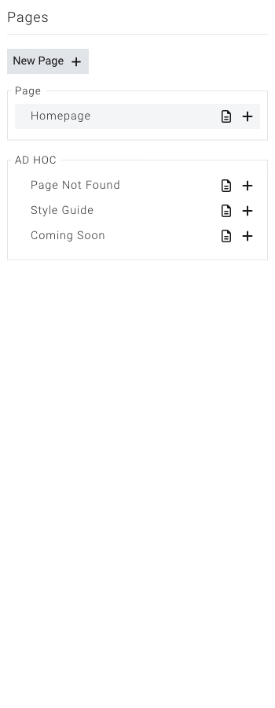

# Managing Pages in the Builder

**Last verified:** 2026-09-05 2:17pm

The Website Builder is where you design and edit your pages visually. But it is also where you can switch between pages, create new ones, and manage how they are organized -- all without leaving the builder. This guide covers everything you need to know about working with pages inside the builder.

---

## The Pages Panel

The pages panel is your home base for navigating between pages while you work in the builder. It lives in the panel rail down the **right** side of the screen.

### Opening the Pages Panel

1. Open the Website Builder.
2. Look at the column of icons down the right side. 
3. Click the **Pages** icon (it looks like a small document).
4. The pages panel opens, showing a list of all your pages. Click the icon again to pin the panel open so it stays put while you work.

The panel shows your pages organized into groups. Pages are grouped by their content type -- for example, your main site pages will be in one group, and blog articles or other module-based pages will be in their own groups. You will also see a **System pages** group for the built-in pages every site needs (like the 404 "page not found" page) -- these can be edited but not deleted.

---

## Switching Between Pages

You can jump to any page on your site directly from the builder.

1. Open the **Pages** panel.
2. Browse the list of pages.
3. Click the name of the page you want to edit.
4. The builder will load that page in the main editing area.

The page you are currently editing is highlighted in the list so you always know which one you are working on.

> **Tip:** In Canvas View you can skip switching altogether -- add several pages as frames and edit them side by side on one canvas.

---

## Viewing the Page Hierarchy

If your site has parent and child pages (for example, a "Services" page with sub-pages like "Web Design" and "Consulting"), the pages panel shows this structure visually.

### Expanding Child Pages

1. Open the **Pages** panel.
2. Look for pages that have a small arrow or expand button next to their name. These pages have child pages beneath them.
3. Click the **expand button** to reveal the child pages.
4. Click it again to collapse the list.

Child pages are indented beneath their parent, making it easy to see how your site is organized. You can expand multiple levels to see deeply nested pages.

If you delete a page that has child pages, the child pages will move up to the top level of your page hierarchy.

> **Tip:** If a page has a lot of child pages, they load on demand when you expand the parent. This keeps the pages panel fast and responsive even on large sites.

---

## Creating a New Page from the Builder

You do not need to go back to the dashboard to add a page. You can create one right from within the builder.

### Creating a Top-Level Page

1. Open the **Pages** panel.
2. Click the **New page** button at the top of the panel.
3. A form will appear where you can set the page details (title, URL, layout, and more).
4. Fill in the information and save.
5. Any unsaved canvas work is saved first, then you land straight on the new page, ready to edit.

### Creating a Child Page (Sub-Page)

1. Open the **Pages** panel.
2. Find the page that you want to be the parent.
3. Click the **plus icon** next to that page's name.
4. A form will appear with the parent page already selected.
5. Fill in the page details and save.
6. The new child page will appear nested under the parent in the list.

### Duplicating a Page

To duplicate a page, use the page options in the Pages panel. The duplicate will include all the content and settings from the original page.

---

## Editing Page Properties

Each page has a set of properties that control its title, URL, layout, and other settings. You can edit these properties without leaving the builder.

### How to Open Page Properties

1. Open the **Pages** panel.
2. Find the page you want to edit.
3. Click the **settings icon** next to the page name.
4. A window will open showing all of the page's settings.

### Page Title

The page title is the name that appears in browser tabs, search results, and your site's navigation menus. Keep it clear and descriptive.

1. Open the page properties.
2. Find the **Title** field.
3. Type the new title.
4. Save your changes.

### Page URL (Slug)

The URL slug is the part of the web address that comes after your domain. For example, if your site is `yoursite.com` and the slug is `about-us`, the full address will be `yoursite.com/about-us`.

1. Open the page properties.
2. Find the **Page URI** field.
3. Enter the slug you want.
4. Save your changes.

> **Tip:** Keep URL slugs short, lowercase, and use hyphens instead of spaces. A slug like `our-services` is clearer and more search-friendly than `Our_Services_Page`.

### Choosing a Layout

Layouts control the overall structure of your page -- where the header appears, where the main content goes, and what the footer looks like. Every page is assigned a layout.

1. Open the page properties.
2. Find the **Layout** field. It is searchable, so you can type to filter a long list.
3. Browse the available layouts. Layouts are organized into groups.
4. Select the layout you want. As you pick, the page behind the window previews under the new layout so you can see the change before committing.
5. Click **Save** to make it real, or **Cancel** to put everything back exactly as it was.

> **Tip:** If the layout you want does not exist yet, just type a new name into the Layout picker -- it will be created for you when you save.

### Menu Visibility

You can control which navigation menus include a link to this page.

1. Open the page properties.
2. Find the **Menu Visibility** checkboxes.
3. Check or uncheck the menus where you want this page to appear:
   - **Header** -- The main navigation at the top of your site
   - **Header Secondary** -- A secondary navigation area in the header
   - **Footer** -- The navigation in your site's footer
   - **Footer Secondary** -- A secondary footer navigation area
   - **Footer Important** -- A highlighted footer section
   - **Include on Sitemap** -- Whether this page appears in your sitemap for search engines
4. Save your changes.

### Page Icon

You can assign an icon image to a page. This icon may appear in navigation menus or other areas of your site depending on your theme.

1. Open the page properties.
2. Find the **Page Icon** field.
3. Click to open the file picker and select an image.
4. Save your changes.

### Lock Page

If you want to restrict who can see a page, you can lock it so only logged-in administrators can access it.

1. Open the page properties.
2. Find the **Lock Page** setting.
3. Check **Site Admin** to require admin login to view the page.
4. Save your changes.

---

## Planning Your Site Navigation

Your site's navigation menus are built automatically from your pages. Understanding how this works helps you create a clear, organized site that visitors can navigate easily.

### How Header Navigation Is Generated

The main navigation menu at the top of your site is generated from your pages list. Any page with the **Header** menu visibility checkbox turned on will appear in the header navigation.

1. Open the **Pages** panel in the builder.
2. Click the **settings icon** next to a page to open its properties.
3. Under **Menu Visibility**, check or uncheck **Header** to control whether the page appears in the main navigation.

Pages appear in the navigation in the same order they appear in your pages list. To change the order of your navigation items, rearrange your pages in the dashboard.

### Creating Dropdown Menus with Page Hierarchy

When you create child pages under a parent page, the child pages automatically appear as a dropdown menu under the parent in the header navigation.

For example, if you have a "Services" page with child pages "Web Design," "Branding," and "Consulting," visitors will see a "Services" dropdown in the navigation with those three options underneath.

1. Create a parent page (like "Services").
2. Create child pages under it (see "Creating a Child Page" above).
3. Make sure both the parent and child pages have the **Header** menu visibility turned on.

> **Tip:** Keep dropdown menus to one or two levels deep. Deeply nested menus are hard to use, especially on mobile devices.

### Footer Navigation Strategy

Footer navigation serves a different purpose than header navigation. While the header holds your main pages, the footer is a good place for:

- Legal pages (Privacy Policy, Terms of Service)
- Contact information
- Sitemap links
- Secondary pages that do not need to be in the main menu

Use the **Footer**, **Footer Secondary**, and **Footer Important** menu visibility checkboxes to control which pages appear in each footer area.

> **Tip:** Keep your header navigation focused on your most important pages (7 items or fewer is ideal). Move less critical pages to the footer to keep the main menu clean and easy to use.

---

## Search Engine Optimization (SEO)

Each page has its own SEO settings that help search engines understand and display your page in search results. These settings are found in the page properties under the "Search Engine Optimization" section.

### Available SEO Fields

- **Show on search engines** -- Choose "Yes" to let search engines find and list this page, or "No" to hide it.
- **Title (S.E.O.)** -- The title that appears in search engine results. If left blank, your page title is used.
- **Author (S.E.O.)** -- The author name shown in search results for this page.
- **Description (S.E.O.)** -- A short summary of the page that appears below the title in search results. Keep it under 160 characters for best results.
- **Keywords (S.E.O.)** -- Words and phrases related to the page's content that help search engines categorize it.

> **Tip:** The SEO description is what people see in Google or other search engines before they click on your link. Write a clear, inviting summary that tells visitors what the page is about.

---

## Page vs. Widget Editing Mode

The builder supports two different editing modes. Most of the time you will be working in page mode, but it is good to know the difference.

### Page Mode

This is the standard editing mode. When you open the builder or click on a page in the pages panel, you are in page mode. You see the full page with its layout, header, content area, and footer. You can add components, edit text, and style elements.

### Widget Mode

Widgets are reusable content blocks that can appear on multiple pages. When you edit a widget, you are working on that block in isolation -- separate from any specific page. Changes to a widget will update everywhere that widget is used.

If the Widget Builder module is enabled on your site, you will see a **Widgets** section in the pages panel. Click on any widget to switch to widget editing mode.

To return to page editing, simply click on any page in the pages panel.

---

## Working with Page Layouts

Layouts define the structural framework of your pages. They determine where the header, content area, footer, and any sidebars are placed.

### What Layouts Are

Think of a layout as a blueprint. While the page content (text, images, components) is different on every page, the layout defines the "skeleton" that holds that content. For example:

- A **full-width layout** might have a header at the top, a wide content area in the middle, and a footer at the bottom.
- A **sidebar layout** might have the same header and footer, but split the middle section into a main content area and a sidebar.
- A **landing page layout** might remove the header and footer entirely, giving you a clean canvas.

Your site can have as many layouts as you need. Different types of pages can use different layouts.

### How to Change a Page's Layout

1. Open the **Pages** panel in the builder.
2. Click the **document icon** next to the page you want to change.
3. Find the **Layout** dropdown in the page properties.
4. Select a different layout.
5. Save your changes.

The page will reload with the new layout applied. Your content will be placed within the new layout structure.

### How Layouts Define the Structure

Each layout controls which areas appear on the page:

- **Header** -- The top section of your page, often containing your logo and navigation menu. This is shared across all pages that use the same layout.
- **Content Area** -- The main body of the page where your unique content goes. This is where you add and arrange your components.
- **Footer** -- The bottom section of your page, often containing links, contact information, and copyright text. Like the header, this is shared across pages using the same layout.

When you edit a page in the builder, you are mainly working in the content area. The header and footer come from the layout and are consistent across all pages that share it.

> **Tip:** If you want a page to have a completely unique look that is different from all your other pages, ask your site administrator about creating a new layout for it.

---

## The Top Toolbar

The top toolbar runs across the top of the builder and gives you quick access to important information and actions.

### What You Will See

- **Current page** -- The name of the page you are currently editing, displayed on the left side.
- **Autosave indicator** -- Shows whether your changes have been saved automatically or if there are unsaved changes.
- **Your account** -- Your email address and a link to your account settings on the right side.
- **Log out** -- A quick link to sign out of the builder.

### Responsive Preview

Below the top toolbar, you will see a row of size controls. These let you preview how your page looks at different screen sizes:

- **Extra Large** -- Desktop monitors and wide screens
- **Large** -- Standard laptops and smaller desktops
- **Medium** -- Tablets in landscape orientation
- **Small** -- Tablets in portrait orientation and large phones
- **Extra Small** -- Mobile phones

Click on any size to resize the editing area and see how your page adapts. This is a great way to make sure your site looks good on all devices.

> **Tip:** Always check your page at the smallest screen size before publishing. Mobile visitors often make up a large portion of your site traffic, so you want to make sure everything is easy to read and use on a phone.
