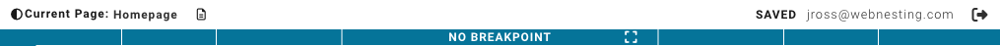

# Making Your Site Look Great on All Devices

**Last verified:** 2026-08-31 12:10pm

Your visitors will view your website on all kinds of screens -- large desktop monitors, tablets, and small phone screens. Responsive design means your site automatically adjusts to look good on every device. This guide explains how WebNesting helps you create a site that works everywhere.

---

## What Is Responsive Design?

Imagine a newspaper that could magically rearrange itself to fit perfectly on a small phone screen, with the text still readable and the images properly sized. That is what responsive design does for your website.

Without responsive design, a page designed for a large monitor would look tiny and hard to read on a phone. With responsive design, the layout adapts: columns stack on top of each other, text sizes adjust, and spacing changes so everything remains comfortable to read and use.

WebNesting handles much of this automatically, but you also have full control to fine-tune how your site looks on each device size.

---

## The Three Device Views

WebNesting lets you preview and customize your site for three device categories:

| View | Represents | Typical Screen Width |
|------|-----------|---------------------|
| Desktop | Computers and large screens | 1024 pixels and above |
| Tablet | Tablets and medium screens | 576 to 1023 pixels |
| Mobile | Phones and small screens | Up to 575 pixels |

### Switching Between Device Views

In the middle of the top toolbar you will find the device controls that resize your preview.

1. Look at the top toolbar of the builder.
2. You will see buttons for **Mobile**, **Tablet**, **Laptop**, **Desktop**, and **Auto**. Click one to jump straight to that device width. (**Auto** simply follows the space available on your screen.)
3. Next to them is a **breakpoint picker** for finer control, listing each band -- XS, SM, MD, LG, XL -- and whether the rule applies above or below that width. There is also a box for typing an exact width in pixels.
4. Your page will update to show how it looks at that size.
5. To go back to the full desktop view, click the auto/reset option.

The preview frame will resize to match the selected breakpoint, so you can see exactly what your visitors will see on that device.

> **Tip:** The breakpoint picker always shows which breakpoint you are currently authoring at, and the width box shows the exact pixel width of the preview.

---

## How Breakpoints Work

Breakpoints are the screen widths where your design changes. Think of them as thresholds: when the screen is wider than a breakpoint, one set of styles applies; when the screen is narrower, a different set kicks in.

Here are the exact screen widths for each size:

| Size | Label | Screen Width |
|------|-------|-------------|
| XS | Extra Small | 320px to 575px (phones in portrait) |
| SM | Small | 576px to 767px (phones in landscape) |
| MD | Medium | 768px to 1023px (tablets) |
| LG | Large | 1024px to 1399px (desktops) |
| XL | Extra Large | 1400px and up (large desktops) |

### The Cascade Rule

Here is the most important thing to understand: **styles cascade from desktop down to smaller screens.**

This means:
- Styles you set on the desktop view apply to all screen sizes by default.
- Styles you set on the tablet view override the desktop styles only on tablets and phones.
- Styles you set on the mobile view override everything, but only on phones.

In other words, start by designing for desktop. Then switch to the tablet view and adjust anything that does not look right. Finally, switch to the mobile view and make your final tweaks.

### Example

Let us say you set a heading to 48 pixels on desktop. If you do nothing else, that heading will be 48 pixels on every device. But 48 pixels might be too large for a phone screen. So you switch to the mobile view and change the heading to 28 pixels. Now:

- On desktop: 48 pixels (your original setting)
- On tablet: 48 pixels (inherits from desktop because you did not change it)
- On mobile: 28 pixels (your mobile-specific override)

---

## Setting Different Styles for Different Devices

You can customize almost any style property for each device size.

### Changing a Style for a Specific Device

1. Switch to the device view you want to customize (for example, mobile) using the device buttons.
2. Select the element you want to change.
3. In the **Styles** panel, change the property you want to adjust (font size, padding, width, etc.).
4. The change will only apply to that device size and smaller.

### Making Text Smaller on Mobile

1. Switch to the mobile view using the device buttons.
2. Select your heading or text element.
3. In the **Styles** panel, find the font size setting.
4. Reduce the font size to something that fits comfortably on a small screen.

### Stacking Columns on Narrow Screens

If you have items arranged side by side (using Flex), they might be too cramped on a phone. You can stack them vertically:

1. Switch to the mobile view.
2. Select the container that has its display set to Flex.
3. In the **Styles** panel, click the gear icon next to Flex.
4. Change the direction from **Row** (side by side) to **Column** (stacked vertically).

Now on phones, those items will stack on top of each other instead of being squeezed side by side.

### Hiding or Showing Elements on Specific Devices

Sometimes you want an element to appear on desktop but not on mobile, or vice versa. For example, you might want a large decorative image on desktop that would just clutter the mobile view.

1. Switch to the device view where you want to hide the element.
2. Select the element.
3. In the **Styles** panel, find the **Layout** section.
4. Set the display to **None**.

This hides the element on that device size without deleting it. It will still appear on other device sizes.

---

## The Breakpoint Indicator

When you are working in the **Styles** panel, you may notice small colored badges or dots next to certain properties. These are **breakpoint indicators**. They tell you that a property has custom values set for specific device sizes.

For example, if you see a badge on a font-size property, it means that font size has been customized for one or more breakpoints (like a different size on mobile).

### What the Indicators Mean

- A badge next to a property means custom styles exist for other device sizes.
- You can click on a badge label to switch to that breakpoint and see (or edit) the custom value.
- A clear button next to a badge lets you remove the custom value for that breakpoint.

> **Tip:** The breakpoint indicator is your friend. It helps you keep track of which properties have been customized for different devices, so you do not accidentally overlook something.

---

## Previewing Your Site on Different Screen Sizes

Beyond the device buttons in the builder, you should also preview your site in a real browser.

### Using the Device Buttons

1. Click through the different breakpoint sizes in the top toolbar.
2. Watch how your content reflows as the preview gets narrower or wider.
3. Pay attention to text readability, image sizing, and overall layout at each size.

### Previewing in Your Browser

1. Publish your site or use the preview feature.
2. Open your site in a web browser.
3. Resize the browser window by dragging the edge to make it narrower and wider.
4. Watch how your layout responds to different widths.

### Testing on Real Devices

Whenever possible, open your published site on an actual phone and tablet. What looks fine in a resized browser window might feel different when you are actually tapping and scrolling on a real device.

---

## Tips for Mobile-Friendly Design

### Keep Text Readable

- Body text should be at least 16 pixels on mobile. Anything smaller is hard to read on a phone.
- Headings can be smaller on mobile than on desktop, but they should still be clearly larger than the body text.
- Limit the number of different font sizes you use. Two or three sizes (heading, subheading, body) is usually enough.

### Make Buttons Large Enough to Tap

On a phone, people use their fingers, not a mouse cursor. Buttons and links should be:
- At least 44 pixels tall on mobile.
- Wide enough that they are easy to tap without accidentally hitting something else.
- Spaced apart so visitors do not accidentally tap the wrong one.

### Handle Images Carefully

- Set images to a maximum width of 100% so they never overflow the screen on narrow devices.
- Avoid very wide images that would force horizontal scrolling on mobile.
- Consider using smaller or cropped images on mobile to keep load times fast.

### Simplify Navigation on Mobile

- If your desktop navigation has many links, consider simplifying it on mobile.
- Stack navigation links vertically on small screens instead of trying to fit them in a horizontal row.

### Test, Test, Test

- Check your site at every breakpoint in the builder.
- Open it on your own phone.
- Ask a friend to open it on their phone or tablet.
- Look for text that overflows, buttons that are too small, or images that break the layout.

---

## Common Responsive Patterns

### Pattern: Full-Width on Mobile, Contained on Desktop

On desktop, your content sits in a centered container with margins on each side. On mobile, it stretches to fill the full screen width, giving you more room for content.

- Set the container's max-width to a specific pixel value (like 1200px) for desktop.
- On mobile, set the width to 100% and remove max-width restrictions.

### Pattern: Side-by-Side to Stacked

Content that sits in two or three columns on desktop stacks into a single column on mobile.

- Use Flex layout with Row direction on desktop.
- Switch to Column direction on the mobile breakpoint.

### Pattern: Larger Spacing on Desktop, Compact on Mobile

Desktop screens have more room, so you can use generous spacing. On mobile, reduce spacing to fit more content on screen.

- Set larger padding and margins on desktop (like 60px section padding).
- Reduce to smaller values on mobile (like 30px section padding).

### Pattern: Different Text Sizes per Device

Large, dramatic headlines on desktop, and more modest sizes on mobile.

- Set your desktop heading to a large size (36-60px).
- Switch to mobile view and reduce to a comfortable size (24-32px).
- Keep body text at 16px or larger across all devices.

---

## Quick Reference: Responsive Design Workflow

1. **Design for desktop first.** Get your layout, colors, and content looking great on a large screen.
2. **Switch to tablet view.** Check if anything looks too wide, too narrow, or out of place. Adjust as needed.
3. **Switch to mobile view.** Stack columns, reduce font sizes, increase button sizes, and simplify where needed.
4. **Preview at each size.** Use the device buttons and breakpoint picker to scan through all breakpoints and make sure transitions look smooth.
5. **Test on real devices.** Open your published site on a phone and tablet to confirm everything works as expected.
