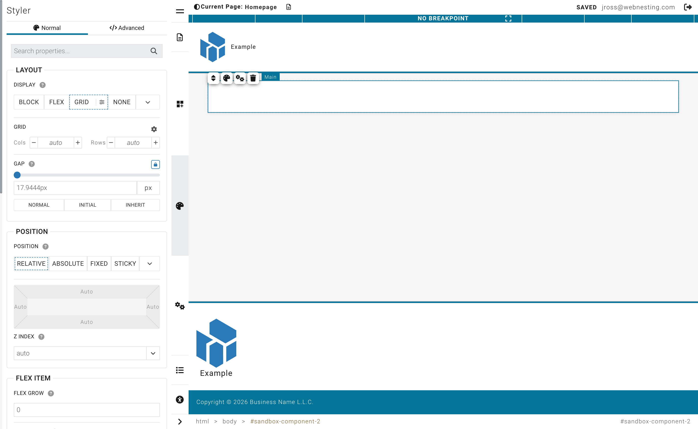

# Styling Your Page Elements

**Last verified:** 2026-05-11 9:00am

Every element on your page -- text, images, buttons, sections -- can be customized to look exactly the way you want. This guide walks you through the styling tools in WebNesting's Website Builder.

---

## What Is the Styler?

The Styler is the panel on the right side of the builder. It controls how things look -- colors, spacing, size, shadows, and more.

Think of the Styler as a set of dials and switches for each element on your page. Select something, and the Styler shows you all the ways you can customize it.

---

## How to Open the Styler

1. Open your page in the Website Builder.
2. Click on any element on your page (a heading, image, section, button, etc.).
3. The Styler panel appears on the right side of the screen.
4. You will see different sections you can expand, like Spacing, Layout, Position, and more.

> **Tip:** If you do not see the Styler, make sure you have clicked directly on an element. Clicking on empty space will deselect everything.

---

## Colors

You can change the background color and text color of most elements.

### Changing a Background Color

1. Select the element you want to change.
2. In the Styler, find the **Background** section.
3. Click the color swatch (the small colored square).
4. A color picker will appear. Choose your color by clicking in the color area, or type in a specific color code.
5. The change appears instantly on your page.

### Changing Text Color

1. Select the text element.
2. In the Styler, find the **Typography** section.
3. Click the color swatch next to **Color**.
4. Pick your color from the color picker.

### Color Contrast

When choosing text colors, make sure your text is easy to read against its background. Dark text on a light background or light text on a dark background works best. Avoid putting light gray text on a white background, for example -- your visitors will struggle to read it.

> **Tip:** If your text seems hard to read, try increasing the contrast. Use very dark colors (close to black) on light backgrounds, or very light colors (close to white) on dark backgrounds.

---

## Spacing

Spacing controls how much room an element has around and inside it. Think of it like the breathing room around your furniture in a room.

### Two Types of Spacing

- **Padding** is the space *inside* an element, between its edge and its content. Imagine the cushioning inside a picture frame -- it pushes the content away from the border.
- **Margin** is the space *outside* an element, between it and the things around it. Imagine the gap between two picture frames hanging on a wall.

### How to Adjust Spacing

1. Select the element you want to adjust.
2. In the Styler, find the **Spacing** section.
3. You will see a visual box diagram. The outer box represents the margin, and the inner box represents the padding.
4. Click on any value in the diagram (top, right, bottom, or left).
5. A small editor will appear where you can type a number, drag a slider, or choose a preset value.

### Quick Preset Values

When you click a spacing value, you will see preset buttons like 0, 10, 20, 40, 60, and 100. These let you quickly set common spacing amounts without typing.

> **Tip:** Start with even, consistent spacing. Using the same spacing values throughout your page (like 20 for small gaps and 40 for large gaps) creates a clean, professional look.

---

## Size

Size controls how wide and tall an element is.

### Width and Height

1. Select the element.
2. In the Styler, look for the **Width** and **Height** controls. These may appear in the Spacing or Size section.
3. Type a number or drag the slider to set the size.
4. Choose your unit from the dropdown next to the number.

### Understanding Units

- **Pixels (px)** -- An exact, fixed size. Use pixels when you want something to be a specific size no matter what. For example, "200px" will always be 200 pixels wide.
- **Percent (%)** -- A size relative to the parent container. If you set something to "50%", it will take up half of its parent's width. Great for flexible, responsive layouts.
- **Auto** -- Lets the browser decide the best size based on the content. This is often the default and works well in most cases.

### When to Use Each Unit

| Unit | Best For | Example |
|------|----------|---------|
| Pixels (px) | Icons, specific image sizes, exact spacing | A logo that should always be 150px wide |
| Percent (%) | Flexible layouts, columns, responsive elements | A sidebar that should always be 30% of the page width |
| Auto | Letting content determine the size naturally | A text block that grows with the amount of text |

> **Tip:** When in doubt, leave width and height on "auto." Elements usually size themselves correctly based on their content.

---

## Borders

You can also add borders to elements. In the Styler, look for the Border section where you can set the border width, style (solid, dashed, dotted), color, and corner radius for rounded corners.

---

## Opacity

The Opacity control lets you make elements partially transparent. A value of 1 is fully visible, and 0 is completely invisible.

---

## Shadows

Shadows add depth to your elements, making them look like they are lifted off the page. This is great for cards, buttons, and images.

### Adding a Shadow

1. Select the element.
2. In the Styler, find the **Box Shadow** section.
3. Adjust the shadow settings:
   - **X offset** -- How far the shadow moves left or right.
   - **Y offset** -- How far the shadow moves up or down.
   - **Blur** -- How soft or sharp the shadow edges are. Higher blur makes a softer shadow.
   - **Spread** -- How large the shadow is overall.
   - **Color** -- The color of the shadow (usually a semi-transparent black or gray).

### Shadow Tips

- A subtle shadow (small offset, moderate blur, light color) looks professional. Try something like X: 0, Y: 2, Blur: 8 for a gentle lift effect.
- Avoid very dark or very large shadows unless you want a dramatic effect.
- You can add multiple shadow layers for more complex effects.

---

## Display and Layout

The Display and Layout controls determine how an element arranges the items inside it. This is how you put things side by side, stack them vertically, or create grids.

### Display Options

In the Styler, the **Layout** section shows display buttons:

- **Block** -- The element takes up the full width available and stacks on top of the next element. This is the default behavior for most elements.
- **Flex** -- Items inside the element can be arranged side by side or with flexible spacing. Great for navigation bars, card rows, and any horizontal layout.
- **Grid** -- Items inside the element are arranged in a structured grid of rows and columns. Perfect for image galleries, feature grids, and evenly spaced layouts.
- **None** -- Hides the element completely.

### Using Flex Layout

When you choose Flex, a gear icon appears. Click it to open additional layout options:

1. **Direction** -- Choose whether items flow left-to-right (row) or top-to-bottom (column).
2. **Wrap** -- Choose whether items wrap to the next line when they run out of space, or if they squeeze together.
3. **Justify** -- Controls how items are spread out along the main direction (start, center, end, space between, etc.).
4. **Align** -- Controls how items line up in the other direction (top, center, bottom, stretch).

### Using Grid Layout

When you choose Grid, a gear icon appears with grid-specific options:

1. Set the number of columns.
2. Set the number of rows (optional).
3. The items inside will automatically fill the grid cells.

### Gap (Spacing Between Items)

When using Flex or Grid, you can set the **Gap** -- the space between each item. This is different from margin because it only adds space between items, not around the outside.

1. Find the **Gap** control in the Layout section.
2. Drag the slider or type a number.
3. Click the link icon to set different gaps for horizontal and vertical spacing, or keep them the same.

> **Tip:** Using Flex with "center" alignment and "space between" justification is a great way to create a navigation bar where the logo is on the left and the menu is on the right.

---

## Position

The Position controls determine where an element sits on the page.

### Position Types

Most of the time, you will not need to change an element's position. But when you do, here are the options:

- **Static** -- The default. The element flows naturally with the rest of the page content.
- **Relative** -- The element stays in its normal place but can be nudged up, down, left, or right from where it would normally be.
- **Absolute** -- The element is removed from the normal flow and placed at a specific spot within its parent container. Useful for overlays and badges.
- **Fixed** -- The element stays in the same spot on the screen even when the visitor scrolls. Useful for sticky headers or floating buttons.
- **Sticky** -- The element scrolls normally until it reaches a certain point, then sticks in place. Great for section headers that should remain visible.

### Anchor Presets

When you choose Absolute, Fixed, or Sticky, a set of nine anchor points appears in the Styler. These let you quickly position the element:

- Top-left, top-center, top-right
- Middle-left, center, middle-right
- Bottom-left, bottom-center, bottom-right

Click any anchor point to snap the element to that position.

---

## Clearing and Resetting Styles

If you have made changes and want to start fresh, you can clear individual style properties.

### Clearing a Single Property

1. Find the property you want to reset in the Styler.
2. Look for a clear button (an "x" icon) next to the property value.
3. Click it to remove your custom value and return to the default.

### Clearing Values from the Spacing Box

1. Click on the value you want to clear in the visual spacing diagram.
2. In the popover that appears, look for preset buttons.
3. Click the "0" preset to remove spacing, or use the clear button to reset the value entirely.

> **Tip:** Clearing a style does not delete the element -- it just removes your customization, letting the default or theme style show through.

---

## Breakpoint Indicators

Some properties in the Styler show small colored dots or badges. These tell you that the property has different values set for different screen sizes (desktop, tablet, mobile). You will learn more about this in the Responsive Design guide.

---

## Tips for Professional-Looking Design

1. **Be consistent.** Use the same colors, spacing, and fonts throughout your site. Consistency is the single biggest factor in making a site look professional.

2. **Use whitespace generously.** Do not crowd elements together. Give your content room to breathe by adding padding and margin.

3. **Limit your color palette.** Pick 2-3 main colors and stick with them. Too many colors looks cluttered.

4. **Use subtle shadows.** A gentle shadow can make cards and buttons feel more interactive without being distracting.

5. **Align everything.** Elements that line up with each other look intentional and polished. Use consistent margins and the same column widths to keep things aligned.

6. **Less is more.** When in doubt, simplify. Remove decorations, reduce the number of different font sizes, and keep your layouts clean.
